Plant_dnds_analysis
================
Tia Harrison
08/08/2022

## Load the packages

``` r
library(tidyverse)
```

    ## ── Attaching core tidyverse packages ──────────────────────── tidyverse 2.0.0 ──
    ## ✔ dplyr     1.1.4     ✔ readr     2.1.5
    ## ✔ forcats   1.0.0     ✔ stringr   1.5.1
    ## ✔ ggplot2   3.5.0     ✔ tibble    3.2.1
    ## ✔ lubridate 1.9.3     ✔ tidyr     1.3.1
    ## ✔ purrr     1.0.2     
    ## ── Conflicts ────────────────────────────────────────── tidyverse_conflicts() ──
    ## ✖ dplyr::filter() masks stats::filter()
    ## ✖ dplyr::lag()    masks stats::lag()
    ## ℹ Use the conflicted package (<http://conflicted.r-lib.org/>) to force all conflicts to become errors

``` r
library(multcomp)
```

    ## Loading required package: mvtnorm
    ## Loading required package: survival
    ## Loading required package: TH.data
    ## Loading required package: MASS
    ## 
    ## Attaching package: 'MASS'
    ## 
    ## The following object is masked from 'package:dplyr':
    ## 
    ##     select
    ## 
    ## 
    ## Attaching package: 'TH.data'
    ## 
    ## The following object is masked from 'package:MASS':
    ## 
    ##     geyser

``` r
library(tidyverse)
library(nationalparkcolors)
library(coin)
library(ggpubr)
library(rstatix)
```

    ## 
    ## Attaching package: 'rstatix'
    ## 
    ## The following objects are masked from 'package:coin':
    ## 
    ##     chisq_test, friedman_test, kruskal_test, sign_test, wilcox_test
    ## 
    ## The following object is masked from 'package:MASS':
    ## 
    ##     select
    ## 
    ## The following object is masked from 'package:stats':
    ## 
    ##     filter

``` r
library(phytools)
```

    ## Loading required package: ape
    ## 
    ## Attaching package: 'ape'
    ## 
    ## The following object is masked from 'package:ggpubr':
    ## 
    ##     rotate
    ## 
    ## The following object is masked from 'package:dplyr':
    ## 
    ##     where
    ## 
    ## Loading required package: maps
    ## 
    ## Attaching package: 'maps'
    ## 
    ## The following object is masked from 'package:purrr':
    ## 
    ##     map

``` r
library(geiger)
library(ape)
library(forcats)
library(ggh4x)
```

    ## 
    ## Attaching package: 'ggh4x'
    ## 
    ## The following object is masked from 'package:ggplot2':
    ## 
    ##     guide_axis_logticks

``` r
library(plotrix)
```

    ## 
    ## Attaching package: 'plotrix'
    ## 
    ## The following object is masked from 'package:phytools':
    ## 
    ##     rescale

``` r
library(qqman)
```

    ## 
    ## For example usage please run: vignette('qqman')
    ## 
    ## Citation appreciated but not required:
    ## Turner, (2018). qqman: an R package for visualizing GWAS results using Q-Q and manhattan plots. Journal of Open Source Software, 3(25), 731, https://doi.org/10.21105/joss.00731.

``` r
library(lsmeans)
```

    ## Loading required package: emmeans
    ## The 'lsmeans' package is now basically a front end for 'emmeans'.
    ## Users are encouraged to switch the rest of the way.
    ## See help('transition') for more information, including how to
    ## convert old 'lsmeans' objects and scripts to work with 'emmeans'.

``` r
library(lme4)
```

    ## Loading required package: Matrix
    ## 
    ## Attaching package: 'Matrix'
    ## 
    ## The following objects are masked from 'package:tidyr':
    ## 
    ##     expand, pack, unpack

``` r
library(ggsignif)
library(UpSetR)
library(ggtree)
```

    ## ggtree v3.10.1 For help: https://yulab-smu.top/treedata-book/
    ## 
    ## If you use the ggtree package suite in published research, please cite
    ## the appropriate paper(s):
    ## 
    ## Guangchuang Yu, David Smith, Huachen Zhu, Yi Guan, Tommy Tsan-Yuk Lam.
    ## ggtree: an R package for visualization and annotation of phylogenetic
    ## trees with their covariates and other associated data. Methods in
    ## Ecology and Evolution. 2017, 8(1):28-36. doi:10.1111/2041-210X.12628
    ## 
    ## G Yu. Data Integration, Manipulation and Visualization of Phylogenetic
    ## Trees (1st ed.). Chapman and Hall/CRC. 2022. ISBN: 9781032233574
    ## 
    ## Shuangbin Xu, Lin Li, Xiao Luo, Meijun Chen, Wenli Tang, Li Zhan, Zehan
    ## Dai, Tommy T. Lam, Yi Guan, Guangchuang Yu. Ggtree: A serialized data
    ## object for visualization of a phylogenetic tree and annotation data.
    ## iMeta 2022, 1(4):e56. doi:10.1002/imt2.56
    ## 
    ## Attaching package: 'ggtree'
    ## 
    ## The following object is masked from 'package:Matrix':
    ## 
    ##     expand
    ## 
    ## The following object is masked from 'package:ape':
    ## 
    ##     rotate
    ## 
    ## The following object is masked from 'package:ggpubr':
    ## 
    ##     rotate
    ## 
    ## The following object is masked from 'package:tidyr':
    ## 
    ##     expand

``` r
library(treeio)
```

    ## treeio v1.26.0 For help: https://yulab-smu.top/treedata-book/
    ## 
    ## If you use the ggtree package suite in published research, please cite
    ## the appropriate paper(s):
    ## 
    ## LG Wang, TTY Lam, S Xu, Z Dai, L Zhou, T Feng, P Guo, CW Dunn, BR
    ## Jones, T Bradley, H Zhu, Y Guan, Y Jiang, G Yu. treeio: an R package
    ## for phylogenetic tree input and output with richly annotated and
    ## associated data. Molecular Biology and Evolution. 2020, 37(2):599-603.
    ## doi: 10.1093/molbev/msz240
    ## 
    ## Guangchuang Yu, David Smith, Huachen Zhu, Yi Guan, Tommy Tsan-Yuk Lam.
    ## ggtree: an R package for visualization and annotation of phylogenetic
    ## trees with their covariates and other associated data. Methods in
    ## Ecology and Evolution. 2017, 8(1):28-36. doi:10.1111/2041-210X.12628
    ## 
    ## S Xu, Z Dai, P Guo, X Fu, S Liu, L Zhou, W Tang, T Feng, M Chen, L
    ## Zhan, T Wu, E Hu, Y Jiang, X Bo, G Yu. ggtreeExtra: Compact
    ## visualization of richly annotated phylogenetic data. Molecular Biology
    ## and Evolution. 2021, 38(9):4039-4042. doi: 10.1093/molbev/msab166
    ## 
    ## Attaching package: 'treeio'
    ## 
    ## The following object is masked from 'package:geiger':
    ## 
    ##     treedata
    ## 
    ## The following object is masked from 'package:phytools':
    ## 
    ##     read.newick

``` r
library(TDbook)
library(ggstar)
```

## Load the new dataset and explore

Data set has been cleaned up in the previous script. Some genes may have
to be removed later on if their dnds value is higher than expected. If
dnds value is higher than 10 remove that gene because probably an error
in assembly or annotation.

If the gene was over 10 for one of the species in the pair should it be
removed from the analysis for the other species in the pair? Depends on
the analysis

This data is based on single copy orthologs in the genomes. This would
be more conservative that taking in paralogs into the data. Harder to
figure out what to do with the paralogs anyways. Especially if you want
to get a genome wide average dnds rate.

``` r
# Colour palette for plants (darker orange)
mut_col<-park_palette("Denali") #4
non_col<-park_palette("ChannelIslands") # 2

# Load the data 
plant_dnds<-read_csv("Plant_PAML_results_NEW.csv")
```

    ## Rows: 22021 Columns: 7
    ## ── Column specification ────────────────────────────────────────────────────────
    ## Delimiter: ","
    ## chr (6): Code, Gene, Species, Mutualist, Pair, Transition
    ## dbl (1): dnds
    ## 
    ## ℹ Use `spec()` to retrieve the full column specification for this data.
    ## ℹ Specify the column types or set `show_col_types = FALSE` to quiet this message.

``` r
# Change the dnds ratio to a numeric value 
plant_dnds <- plant_dnds %>%
  mutate(dnds=as.numeric(dnds))

plant_dnds %>%
  group_by(Gene) %>%
  tally()
```

    ## # A tibble: 3,548 × 2
    ##    Gene          n
    ##    <chr>     <int>
    ##  1 OG0017031    12
    ##  2 OG0017034    12
    ##  3 OG0017084    12
    ##  4 OG0017089    12
    ##  5 OG0017091    12
    ##  6 OG0017095    12
    ##  7 OG0017099    12
    ##  8 OG0017100    12
    ##  9 OG0017101    12
    ## 10 OG0017112    12
    ## # ℹ 3,538 more rows

``` r
# 3,548 genes total 

# How many genes were above 1 
plant_dnds%>%
  filter(dnds>10) %>%
  distinct(Gene) # 1831 
```

    ## # A tibble: 1,831 × 1
    ##    Gene     
    ##    <chr>    
    ##  1 OG0019756
    ##  2 OG0020196
    ##  3 OG0020407
    ##  4 OG0020491
    ##  5 OG0020524
    ##  6 OG0020558
    ##  7 OG0020566
    ##  8 OG0020602
    ##  9 OG0020681
    ## 10 OG0020693
    ## # ℹ 1,821 more rows

``` r
# How many orthologs total
gene_no1<-plant_dnds %>%
  group_by(Gene) %>%
  tally()
# 3,548 genes total 
gene_no1
```

    ## # A tibble: 3,548 × 2
    ##    Gene          n
    ##    <chr>     <int>
    ##  1 OG0017031    12
    ##  2 OG0017034    12
    ##  3 OG0017084    12
    ##  4 OG0017089    12
    ##  5 OG0017091    12
    ##  6 OG0017095    12
    ##  7 OG0017099    12
    ##  8 OG0017100    12
    ##  9 OG0017101    12
    ## 10 OG0017112    12
    ## # ℹ 3,538 more rows

``` r
# How many found in all 12 species 
gene_no1 %>%
  filter(n==12) #389???  
```

    ## # A tibble: 389 × 2
    ##    Gene          n
    ##    <chr>     <int>
    ##  1 OG0017031    12
    ##  2 OG0017034    12
    ##  3 OG0017084    12
    ##  4 OG0017089    12
    ##  5 OG0017091    12
    ##  6 OG0017095    12
    ##  7 OG0017099    12
    ##  8 OG0017100    12
    ##  9 OG0017101    12
    ## 10 OG0017112    12
    ## # ℹ 379 more rows

``` r
# Before filtering for genes under 10 
# How many orthologs total
gene_no_test<-plant_dnds %>%
  group_by(Gene) %>%
  tally()
gene_no_test
```

    ## # A tibble: 3,548 × 2
    ##    Gene          n
    ##    <chr>     <int>
    ##  1 OG0017031    12
    ##  2 OG0017034    12
    ##  3 OG0017084    12
    ##  4 OG0017089    12
    ##  5 OG0017091    12
    ##  6 OG0017095    12
    ##  7 OG0017099    12
    ##  8 OG0017100    12
    ##  9 OG0017101    12
    ## 10 OG0017112    12
    ## # ℹ 3,538 more rows

``` r
# 3,548 genes total 

# How many found in all 12 species before filtering  
gene_no_test %>%
  filter(n==12) #389 genes 
```

    ## # A tibble: 389 × 2
    ##    Gene          n
    ##    <chr>     <int>
    ##  1 OG0017031    12
    ##  2 OG0017034    12
    ##  3 OG0017084    12
    ##  4 OG0017089    12
    ##  5 OG0017091    12
    ##  6 OG0017095    12
    ##  7 OG0017099    12
    ##  8 OG0017100    12
    ##  9 OG0017101    12
    ## 10 OG0017112    12
    ## # ℹ 379 more rows

``` r
# Remove abnormally high dnds values 
plant_dnds2<-plant_dnds%>%
  filter(dnds<10)
plant_dnds2 # 18,565  genes 
```

    ## # A tibble: 18,565 × 7
    ##    Code                            dnds Gene  Species Mutualist Pair  Transition
    ##    <chr>                          <dbl> <chr> <chr>   <chr>     <chr> <chr>     
    ##  1 Calliandra_eriophylla_NODE_1… 0.105  OG00… Callia… M         c     loss      
    ##  2 Calliandra_eriophylla_NODE_1… 0.361  OG00… Callia… M         c     loss      
    ##  3 Calliandra_eriophylla_NODE_1… 0.438  OG00… Callia… M         c     loss      
    ##  4 Calliandra_eriophylla_NODE_1… 0.0583 OG00… Callia… M         c     loss      
    ##  5 Calliandra_eriophylla_NODE_1… 0.160  OG00… Callia… M         c     loss      
    ##  6 Calliandra_eriophylla_NODE_1… 0.487  OG00… Callia… M         c     loss      
    ##  7 Calliandra_eriophylla_NODE_1… 0.135  OG00… Callia… M         c     loss      
    ##  8 Calliandra_eriophylla_NODE_1… 0.276  OG00… Callia… M         c     loss      
    ##  9 Calliandra_eriophylla_NODE_1… 0.0001 OG00… Callia… M         c     loss      
    ## 10 Calliandra_eriophylla_NODE_1… 0.0818 OG00… Callia… M         c     loss      
    ## # ℹ 18,555 more rows

``` r
# But this is just removing the gene from each individual species (and may want to remove for each species pairs later on) 

# See how many data points are in each pair
# This combines both species in the pair so it will be roughly double the number of genes 
plant_dnds2%>% 
  group_by(Pair)%>%
  tally()
```

    ## # A tibble: 6 × 2
    ##   Pair      n
    ##   <chr> <int>
    ## 1 a      3309
    ## 2 b      2423
    ## 3 c      3237
    ## 4 d      3560
    ## 5 e      3026
    ## 6 f      3010

``` r
# How many orthologs total
gene_no<-plant_dnds2 %>%
  group_by(Gene) %>%
  tally()
# 3,521 genes total 

# How many found in all 12 species 
gene_no %>%
  filter(n==12) #210 
```

    ## # A tibble: 210 × 2
    ##    Gene          n
    ##    <chr>     <int>
    ##  1 OG0017034    12
    ##  2 OG0017089    12
    ##  3 OG0017091    12
    ##  4 OG0017095    12
    ##  5 OG0017100    12
    ##  6 OG0017101    12
    ##  7 OG0017112    12
    ##  8 OG0017145    12
    ##  9 OG0017149    12
    ## 10 OG0017163    12
    ## # ℹ 200 more rows

## Add in the other data

Introduced ranges, ploidy, human uses etc.

``` r
# Range data 
plant_dnds2_meta<- plant_dnds2 %>% 
  mutate(Range=case_when(Species=="Mimosa_aculeaticarpa" ~ 0, 
                            Species=="Dalea_mollis" ~ 0, 
                            Species== "Senna_occidentalis" ~ 48,
                            Species=="Senna_didymobotrya" ~ 20,
                            Species=="Senna_italica" ~ 2,
                            Species=="Senna_barclayana" ~ 0,
                            Species=="Calliandra_eriophylla" ~ 0 ,
                            Species=="Dalea_mollissima" ~ 0,
                            Species=="Peltophorum_africanum" ~ 7,
                            Species=="Peltophorum_dubium" ~ 6 ,
                            Species=="Mimosa_grahamii" ~ 0 ,
                            Species=="Calliandra_humilis" ~ 0
                            )) 

# Human uses 
plant_dnds2_meta<- plant_dnds2_meta %>% 
  mutate(Human=case_when(Species=="Mimosa_aculeaticarpa" ~ 0, 
                            Species=="Dalea_mollis" ~ 1, 
                            Species== "Senna_occidentalis" ~ 6,
                            Species=="Senna_didymobotrya" ~ 5,
                            Species=="Senna_italica" ~ 1,
                            Species=="Senna_barclayana" ~ 0,
                            Species=="Calliandra_eriophylla" ~ 0 ,
                            Species=="Dalea_mollissima" ~ 1,
                            Species=="Peltophorum_africanum" ~ 3,
                            Species=="Peltophorum_dubium" ~ 3 ,
                            Species=="Mimosa_grahamii" ~ 0 ,
                            Species=="Calliandra_humilis" ~ 0
                            )) 

# Invasive category 
plant_dnds2_meta<- plant_dnds2_meta %>% 
  mutate(Invasive=case_when(Species=="Mimosa_aculeaticarpa" ~ "N", 
                            Species=="Dalea_mollis" ~ "N", 
                            Species== "Senna_occidentalis" ~ "Y",
                            Species=="Senna_didymobotrya" ~ "Y",
                            Species=="Senna_italica" ~ "Y",
                            Species=="Senna_barclayana" ~ "N",
                            Species=="Calliandra_eriophylla" ~ "N" ,
                            Species=="Dalea_mollissima" ~ "N",
                            Species=="Peltophorum_africanum" ~ "Y",
                            Species=="Peltophorum_dubium" ~ "Y" ,
                            Species=="Mimosa_grahamii" ~ "N" ,
                            Species=="Calliandra_humilis" ~ "N"
                            )) 

# Ploidy 
plant_dnds2_meta<- plant_dnds2_meta %>% 
  mutate(Ploidy=case_when(Species=="Mimosa_aculeaticarpa" ~ "P", 
                            Species=="Dalea_mollis" ~ "D", 
                            Species== "Senna_occidentalis" ~ "P",
                            Species=="Senna_didymobotrya" ~ "P",
                            Species=="Senna_italica" ~ "P",
                            Species=="Senna_barclayana" ~ NA,
                            Species=="Calliandra_eriophylla" ~ "D" ,
                            Species=="Dalea_mollissima" ~ "D",
                            Species=="Peltophorum_africanum" ~ "P",
                            Species=="Peltophorum_dubium" ~ "P" ,
                            Species=="Mimosa_grahamii" ~ NA ,
                            Species=="Calliandra_humilis" ~ NA
                            )) 
```

## Species pairs analysis

dN= nonsynonymous changes, these changes will change the overall protein
dS= synonymous changes, won’t change the protein and considered the
neutral rate dN/dS = how many site changes that matter to site changes
that don’t matter

dN/dS = 1 the sequence is evolving neutrally because the dS is
representative of neutral evolution dN/dS \> 1 positive selection 0
\<dN/dS \<1 negative selection, purifying selection

## Now go through all the pairs

Paired Wilcoxon tests on the free-ratios models in PAML.

``` r
# Make function for faster analysis 
will_function<- function(pair){
  
  # Subset each pair 
plantb<- plant_dnds2%>%
  filter(Pair==pair)
  
  # Make list of genes without missing data 
genesb<-plantb%>%
  filter(!is.na(dnds))%>%
  group_by(Gene)%>%
  tally() %>%
  filter(n==2)
  
genesb_list<-data.frame(Gene=genesb$Gene)

  # Keep only new genes 
plantb_new<- plantb%>%
  semi_join(genesb_list, by="Gene")

# Make into the right data format
plantb_new2<-plantb_new %>%
  select(Gene, Mutualist, dnds) %>%
  pivot_wider(names_from = Mutualist, values_from = dnds) 

# Run the paired test 
# In this example, the differences is calculated F-M
# And this is a mutualism gain so the direction is correct 
pairb_test<-wilcox.test(plantb_new2$M, plantb_new2$F, paired=TRUE)
return(pairb_test)

} 

gene_count<- function(pair){
    # Subset each pair 
plantb<- plant_dnds2%>%
  filter(Pair==pair)
  
  # Make list of genes without missing data 
genesb<-plantb%>%
  filter(!is.na(dnds))%>%
  group_by(Gene)%>%
  tally() %>%
  filter(n==2)
return(genesb)
}

# Run through all pairs 
# This comparison will be F-M 
will_function("a") # not sig
```

    ## 
    ##  Wilcoxon signed rank test with continuity correction
    ## 
    ## data:  plantb_new2$M and plantb_new2$F
    ## V = 164256, p-value = 0.5769
    ## alternative hypothesis: true location shift is not equal to 0

``` r
a_list<-gene_count("a") # 1077 genes
a_list2<-a_list$Gene

will_function("b") # not sig 
```

    ## 
    ##  Wilcoxon signed rank test with continuity correction
    ## 
    ## data:  plantb_new2$M and plantb_new2$F
    ## V = 95386, p-value = 0.1253
    ## alternative hypothesis: true location shift is not equal to 0

``` r
b_list<-gene_count("b") # 761 
b_list2<-b_list$Gene

will_function("c") # this one is significant!!! 
```

    ## 
    ##  Wilcoxon signed rank test with continuity correction
    ## 
    ## data:  plantb_new2$M and plantb_new2$F
    ## V = 329333, p-value = 0.008502
    ## alternative hypothesis: true location shift is not equal to 0

``` r
c_list<-gene_count("c") # 1191 
c_list2<-c_list$Gene

will_function("d") # not sig 
```

    ## 
    ##  Wilcoxon signed rank test with continuity correction
    ## 
    ## data:  plantb_new2$M and plantb_new2$F
    ## V = 84607, p-value = 0.216
    ## alternative hypothesis: true location shift is not equal to 0

``` r
d_list<-gene_count("d") # 1339 
d_list2<-d_list$Gene

will_function("e") # not sig
```

    ## 
    ##  Wilcoxon signed rank test with continuity correction
    ## 
    ## data:  plantb_new2$M and plantb_new2$F
    ## V = 174225, p-value = 0.4193
    ## alternative hypothesis: true location shift is not equal to 0

``` r
e_list<-gene_count("e") # 1003
e_list2<-e_list$Gene

will_function("f") # not sig 
```

    ## 
    ##  Wilcoxon signed rank test with continuity correction
    ## 
    ## data:  plantb_new2$M and plantb_new2$F
    ## V = 183639, p-value = 0.312
    ## alternative hypothesis: true location shift is not equal to 0

``` r
f_list<-gene_count("f") # 964 
f_list2<-f_list$Gene

# Which one is significant? Calliandra pair 
plant_sig<- plant_dnds2%>%
  filter(Pair=="c")
plant_sig
```

    ## # A tibble: 3,237 × 7
    ##    Code                            dnds Gene  Species Mutualist Pair  Transition
    ##    <chr>                          <dbl> <chr> <chr>   <chr>     <chr> <chr>     
    ##  1 Calliandra_eriophylla_NODE_1… 0.105  OG00… Callia… M         c     loss      
    ##  2 Calliandra_eriophylla_NODE_1… 0.361  OG00… Callia… M         c     loss      
    ##  3 Calliandra_eriophylla_NODE_1… 0.438  OG00… Callia… M         c     loss      
    ##  4 Calliandra_eriophylla_NODE_1… 0.0583 OG00… Callia… M         c     loss      
    ##  5 Calliandra_eriophylla_NODE_1… 0.160  OG00… Callia… M         c     loss      
    ##  6 Calliandra_eriophylla_NODE_1… 0.487  OG00… Callia… M         c     loss      
    ##  7 Calliandra_eriophylla_NODE_1… 0.135  OG00… Callia… M         c     loss      
    ##  8 Calliandra_eriophylla_NODE_1… 0.276  OG00… Callia… M         c     loss      
    ##  9 Calliandra_eriophylla_NODE_1… 0.0001 OG00… Callia… M         c     loss      
    ## 10 Calliandra_eriophylla_NODE_1… 0.0818 OG00… Callia… M         c     loss      
    ## # ℹ 3,227 more rows

``` r
# Dataset for plot 
plant_dnds4<-plant_dnds2%>%
  mutate(Pass=case_when(Pair=="a" & Gene %in% a_list2~"Y",
                        Pair=="b" & Gene %in% b_list2~"Y",
                        Pair=="c" & Gene %in% c_list2~"Y",
                        Pair=="d" & Gene %in% d_list2~"Y",
                        Pair=="e" & Gene %in% e_list2~"Y",
                        Pair=="f" & Gene %in% f_list2~"Y"))

plant_dnds5<-plant_dnds4%>%
  filter(Pass=="Y")
```

## Plot species pairs

Species pairs analysis on free-ratio test values. Asterisk represents
significance at Wilcoxon tests.

``` r
# Set the colour palette 
lifestyle<- park_palette("Saguaro")

# Change the _ to spaces for better reading in the the plot 
plant_dnds3<-plant_dnds5 %>%
  mutate_if(is.character, 
                str_replace_all, pattern = "_", replacement = " ")

# Make labels for the plot 
facet_labeller_pair <- function(variable, value) {
  c(
    "", 
    "",
    "*",
    "",
    "", 
    ""
  )
}


facet_labbler_test <- function(variable, value) {
  c(
    ""
  )
}

# Make level order for species for plotting 
level_order<-c("Peltophorum africanum", "Peltophorum dubium", "Senna barclayana", "Senna occidentalis", "Senna italica","Senna didymobotrya", "Mimosa aculeaticarpa", "Mimosa grahamii", "Dalea mollissima", "Dalea mollis", "Calliandra eriophylla", "Calliandra humilis")

# Make coordinates for plot 
label.df <- data.frame(Group = c("Calliandra eriophylla", "Calliandra humilis"),
                       Value = c(3.7, 3.7))

# Prepare dataset for plotting 
plant_plot_new<- plant_dnds3 %>%
  mutate(dummy="test") %>%
  mutate_at("Transition", str_replace, "gain", "mutualism gain") %>%
  mutate_at("Transition", str_replace, "loss", "mutualism loss")

ann_text1 <- tribble(
  ~Species, ~dnds,
  #--|--|--|----
  "Calliandra_humilis", 0.8
)

# Plot
bp_free_test<-ggplot(plant_plot_new, aes(x=factor(Species, level = level_order), y=dnds, fill=Mutualist))+ 
  geom_boxplot(outlier.shape=NA) + # To remove the outliers 
  (ylab("dN/dS ratio"))+
  (xlab(""))+
  scale_fill_manual(labels=c("non-mutualist", "mutualist"), values=c(non_col[2], mut_col[4]))+
  coord_flip(ylim=c(0, 1.3)) +
  facet_nested(Pair ~ dummy, scales = "free", space="free", labeller= labeller( Pair=as_labeller(facet_labeller_pair), dummy=as_labeller(facet_labbler_test))) +
  theme_classic() + 
  theme(axis.title = element_text(size=10), 
        axis.text.y= element_text(size=8, face="italic"), 
        axis.text.x= element_text(size=10), 
        legend.title = element_blank(), 
        legend.text=element_text(size=9),
        panel.border = element_blank(),
        panel.grid = element_blank(),
        legend.position="top",
        #strip.text.x = element_blank(),
        strip.text.y = element_text(size = 23),
        axis.line.x = element_line(color="grey", size = 0.5),
        axis.line.y = element_line(color="grey", size = 0.5),
        strip.background = element_blank()
        )
```

    ## Warning: The `size` argument of `element_line()` is deprecated as of ggplot2 3.4.0.
    ## ℹ Please use the `linewidth` argument instead.
    ## This warning is displayed once every 8 hours.
    ## Call `lifecycle::last_lifecycle_warnings()` to see where this warning was
    ## generated.

``` r
bp_free_test # This is the good plot for teh legume species pairs tests!
```

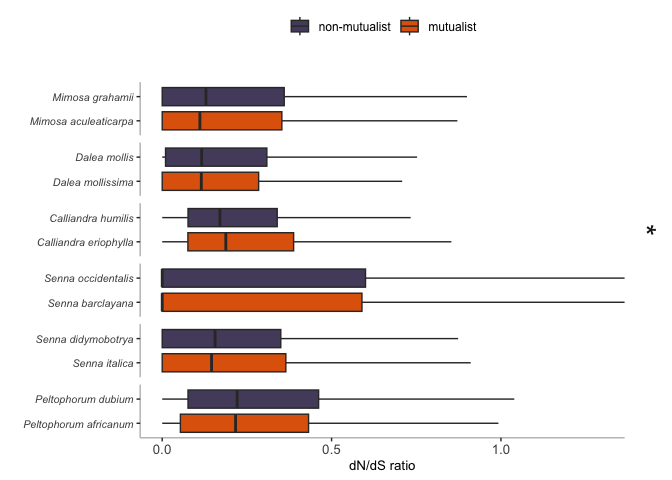<!-- -->

## Genes under positive selection

Here we are using the free-ration PAML values and looking at which ones
are under positive selection.

``` r
pos_genes_full<-plant_dnds2 %>%
  dplyr::select(Mutualist, Pair,Transition, Gene, dnds) %>%
  pivot_wider(names_from=Mutualist, values_from=dnds) %>%
  filter(M > 1 | F >1 ) %>%
  filter(M<7 & F<7) %>%
  mutate(minus=M-F) %>%
  mutate(Diff=abs(minus)) %>% 
  arrange(Diff) 

# A lot of genes under positive selection here 
pos_genes_full %>%
  distinct(Gene) # 797
```

    ## # A tibble: 797 × 1
    ##    Gene     
    ##    <chr>    
    ##  1 OG0035997
    ##  2 OG0036076
    ##  3 OG0029203
    ##  4 OG0020358
    ##  5 OG0029082
    ##  6 OG0033571
    ##  7 OG0028080
    ##  8 OG0028054
    ##  9 OG0019821
    ## 10 OG0028157
    ## # ℹ 787 more rows

``` r
# Plot the positive genes shared among species 
plant_dnds2_pos <- plant_dnds2 %>%
  mutate(Pos=ifelse(dnds>1, 1, 0)) %>%
  dplyr::select(Species, Gene, Pos) %>%
  pivot_wider(names_from=Species, values_from=Pos) 

plant_dnds2_pos2 <- plant_dnds2_pos[complete.cases(plant_dnds2_pos), ] # Remove NA
plant_dnds2_pos3 <-plant_dnds2_pos2[rowSums(plant_dnds2_pos2[-(1)]) !=0, ] # Remove 0s

plant_dnds2_pos3<-data.frame(plant_dnds2_pos3) # 18 genes under positive selection in at least one species 
plant_dnds2_pos3 # 78 genes 
```

    ##         Gene Calliandra_eriophylla Calliandra_humilis Dalea_mollis
    ## 1  OG0019780                     0                  0            1
    ## 2  OG0019818                     0                  0            0
    ## 3  OG0019849                     0                  0            0
    ## 4  OG0019859                     0                  0            0
    ## 5  OG0019877                     0                  0            0
    ## 6  OG0019962                     0                  0            0
    ## 7  OG0019971                     0                  0            0
    ## 8  OG0019972                     0                  0            0
    ## 9  OG0019978                     0                  0            0
    ## 10 OG0020007                     0                  0            0
    ## 11 OG0020025                     0                  0            0
    ## 12 OG0020037                     0                  0            0
    ## 13 OG0020052                     0                  0            0
    ## 14 OG0020058                     0                  0            0
    ## 15 OG0020060                     0                  0            0
    ## 16 OG0020066                     0                  0            0
    ## 17 OG0020087                     0                  0            1
    ## 18 OG0020093                     0                  0            0
    ## 19 OG0020097                     0                  0            0
    ## 20 OG0020101                     0                  0            0
    ## 21 OG0020102                     0                  0            0
    ## 22 OG0020105                     0                  0            0
    ## 23 OG0020114                     0                  0            0
    ## 24 OG0020116                     0                  0            0
    ## 25 OG0020122                     0                  0            0
    ## 26 OG0020145                     0                  0            0
    ## 27 OG0020151                     0                  0            0
    ## 28 OG0020157                     0                  0            0
    ## 29 OG0020158                     0                  0            0
    ## 30 OG0020162                     0                  0            0
    ## 31 OG0020170                     0                  0            0
    ## 32 OG0020190                     0                  0            0
    ## 33 OG0020194                     0                  0            0
    ## 34 OG0020207                     0                  0            0
    ## 35 OG0020217                     0                  0            1
    ## 36 OG0020240                     0                  0            0
    ## 37 OG0020256                     0                  0            0
    ## 38 OG0020260                     0                  0            0
    ## 39 OG0020276                     0                  0            0
    ## 40 OG0020277                     0                  0            0
    ## 41 OG0020291                     0                  0            0
    ## 42 OG0020318                     0                  0            0
    ## 43 OG0020331                     0                  0            0
    ## 44 OG0020344                     0                  0            0
    ## 45 OG0020353                     0                  0            1
    ## 46 OG0020358                     0                  0            0
    ## 47 OG0020360                     0                  0            0
    ## 48 OG0020361                     0                  0            0
    ## 49 OG0020406                     0                  0            0
    ## 50 OG0020417                     1                  0            0
    ## 51 OG0020422                     0                  0            0
    ## 52 OG0020432                     0                  0            0
    ## 53 OG0020440                     0                  0            0
    ## 54 OG0020449                     0                  0            0
    ## 55 OG0020464                     0                  0            0
    ## 56 OG0020468                     0                  0            0
    ## 57 OG0020492                     1                  0            0
    ## 58 OG0020513                     0                  1            0
    ## 59 OG0020553                     0                  0            0
    ## 60 OG0020579                     0                  0            0
    ## 61 OG0020601                     0                  0            0
    ## 62 OG0020624                     0                  0            0
    ## 63 OG0020688                     0                  0            0
    ## 64 OG0020700                     0                  0            0
    ## 65 OG0020744                     0                  0            0
    ## 66 OG0017145                     0                  0            0
    ## 67 OG0017163                     0                  0            0
    ## 68 OG0017172                     0                  0            0
    ## 69 OG0017197                     0                  0            0
    ## 70 OG0017233                     1                  0            0
    ## 71 OG0017254                     0                  0            0
    ## 72 OG0017291                     0                  0            0
    ## 73 OG0017314                     0                  0            0
    ## 74 OG0017451                     0                  0            0
    ## 75 OG0017583                     0                  0            0
    ## 76 OG0017637                     0                  0            0
    ## 77 OG0017646                     0                  0            0
    ## 78 OG0017668                     0                  0            0
    ##    Dalea_mollissima Mimosa_aculeaticarpa Mimosa_grahamii Peltophorum_africanum
    ## 1                 0                    0               0                     0
    ## 2                 0                    0               1                     0
    ## 3                 0                    0               0                     0
    ## 4                 0                    0               0                     0
    ## 5                 0                    0               0                     0
    ## 6                 0                    0               0                     0
    ## 7                 0                    0               0                     1
    ## 8                 0                    1               0                     0
    ## 9                 0                    0               0                     1
    ## 10                0                    0               0                     0
    ## 11                0                    0               0                     0
    ## 12                0                    1               0                     0
    ## 13                0                    0               0                     0
    ## 14                0                    0               0                     1
    ## 15                0                    0               0                     0
    ## 16                0                    0               0                     0
    ## 17                0                    0               0                     0
    ## 18                0                    0               0                     0
    ## 19                0                    0               0                     1
    ## 20                0                    1               0                     0
    ## 21                0                    0               0                     0
    ## 22                0                    0               1                     0
    ## 23                0                    0               0                     1
    ## 24                0                    0               0                     0
    ## 25                0                    0               1                     1
    ## 26                0                    0               0                     0
    ## 27                0                    0               0                     0
    ## 28                0                    0               1                     0
    ## 29                0                    0               0                     0
    ## 30                0                    0               0                     0
    ## 31                0                    0               1                     0
    ## 32                0                    0               0                     0
    ## 33                0                    0               0                     0
    ## 34                0                    0               0                     0
    ## 35                0                    0               0                     0
    ## 36                0                    0               0                     1
    ## 37                0                    1               0                     0
    ## 38                0                    0               0                     0
    ## 39                0                    0               0                     0
    ## 40                0                    0               1                     0
    ## 41                0                    1               0                     0
    ## 42                0                    0               0                     0
    ## 43                0                    0               0                     0
    ## 44                0                    0               0                     0
    ## 45                0                    0               0                     0
    ## 46                0                    0               0                     0
    ## 47                1                    0               0                     0
    ## 48                0                    1               0                     0
    ## 49                0                    0               0                     0
    ## 50                0                    0               0                     0
    ## 51                0                    0               1                     0
    ## 52                0                    0               0                     0
    ## 53                0                    0               0                     0
    ## 54                0                    0               1                     0
    ## 55                0                    0               0                     1
    ## 56                0                    0               1                     0
    ## 57                0                    1               0                     0
    ## 58                0                    0               0                     0
    ## 59                0                    0               0                     0
    ## 60                0                    0               0                     0
    ## 61                0                    0               0                     0
    ## 62                0                    0               0                     0
    ## 63                0                    0               0                     0
    ## 64                0                    0               0                     0
    ## 65                0                    0               1                     0
    ## 66                0                    0               0                     0
    ## 67                0                    0               0                     0
    ## 68                0                    0               0                     0
    ## 69                0                    0               0                     0
    ## 70                0                    0               0                     0
    ## 71                0                    0               0                     0
    ## 72                0                    0               0                     0
    ## 73                0                    0               1                     0
    ## 74                0                    0               0                     0
    ## 75                0                    0               0                     0
    ## 76                0                    0               0                     0
    ## 77                0                    0               0                     0
    ## 78                0                    0               1                     0
    ##    Peltophorum_dubium Senna_barclayana Senna_didymobotrya Senna_italica
    ## 1                   0                0                  1             0
    ## 2                   0                0                  0             0
    ## 3                   1                0                  0             0
    ## 4                   0                1                  0             0
    ## 5                   0                1                  0             0
    ## 6                   0                1                  0             0
    ## 7                   0                1                  0             0
    ## 8                   0                0                  0             0
    ## 9                   0                0                  0             0
    ## 10                  1                0                  0             0
    ## 11                  0                0                  0             0
    ## 12                  0                0                  0             0
    ## 13                  0                1                  0             0
    ## 14                  0                1                  0             0
    ## 15                  0                0                  0             0
    ## 16                  0                1                  0             0
    ## 17                  0                0                  0             0
    ## 18                  0                1                  0             0
    ## 19                  0                0                  0             0
    ## 20                  0                0                  0             0
    ## 21                  0                0                  1             0
    ## 22                  0                0                  0             0
    ## 23                  0                1                  0             0
    ## 24                  0                0                  0             0
    ## 25                  0                1                  0             0
    ## 26                  0                1                  0             0
    ## 27                  0                1                  0             0
    ## 28                  0                0                  0             0
    ## 29                  1                0                  0             0
    ## 30                  0                1                  0             0
    ## 31                  0                0                  0             0
    ## 32                  0                1                  0             0
    ## 33                  1                0                  0             0
    ## 34                  1                1                  0             0
    ## 35                  0                1                  0             0
    ## 36                  0                1                  0             0
    ## 37                  0                0                  0             0
    ## 38                  1                0                  0             0
    ## 39                  0                1                  0             0
    ## 40                  0                0                  0             0
    ## 41                  0                0                  0             0
    ## 42                  0                0                  0             0
    ## 43                  0                1                  0             0
    ## 44                  0                0                  1             0
    ## 45                  0                1                  0             0
    ## 46                  0                1                  1             0
    ## 47                  0                0                  1             1
    ## 48                  0                0                  0             1
    ## 49                  0                1                  0             0
    ## 50                  0                0                  0             0
    ## 51                  0                1                  0             0
    ## 52                  0                1                  0             0
    ## 53                  0                1                  0             0
    ## 54                  0                0                  0             0
    ## 55                  0                1                  0             0
    ## 56                  0                0                  0             0
    ## 57                  0                0                  0             0
    ## 58                  0                1                  0             0
    ## 59                  0                1                  0             0
    ## 60                  0                1                  0             0
    ## 61                  0                0                  0             0
    ## 62                  0                0                  0             0
    ## 63                  0                0                  0             0
    ## 64                  0                0                  1             0
    ## 65                  0                0                  0             0
    ## 66                  0                1                  0             0
    ## 67                  0                1                  0             0
    ## 68                  1                0                  0             0
    ## 69                  0                1                  0             0
    ## 70                  0                0                  0             1
    ## 71                  0                1                  0             0
    ## 72                  1                0                  0             0
    ## 73                  0                0                  0             0
    ## 74                  0                1                  0             0
    ## 75                  0                1                  0             0
    ## 76                  0                0                  1             0
    ## 77                  0                1                  0             0
    ## 78                  0                0                  0             0
    ##    Senna_occidentalis
    ## 1                   0
    ## 2                   0
    ## 3                   0
    ## 4                   1
    ## 5                   0
    ## 6                   1
    ## 7                   1
    ## 8                   0
    ## 9                   0
    ## 10                  0
    ## 11                  1
    ## 12                  0
    ## 13                  1
    ## 14                  0
    ## 15                  1
    ## 16                  0
    ## 17                  0
    ## 18                  0
    ## 19                  1
    ## 20                  0
    ## 21                  0
    ## 22                  0
    ## 23                  0
    ## 24                  1
    ## 25                  1
    ## 26                  1
    ## 27                  1
    ## 28                  0
    ## 29                  0
    ## 30                  0
    ## 31                  0
    ## 32                  1
    ## 33                  0
    ## 34                  0
    ## 35                  0
    ## 36                  1
    ## 37                  0
    ## 38                  1
    ## 39                  0
    ## 40                  0
    ## 41                  0
    ## 42                  1
    ## 43                  1
    ## 44                  0
    ## 45                  0
    ## 46                  1
    ## 47                  0
    ## 48                  0
    ## 49                  1
    ## 50                  0
    ## 51                  1
    ## 52                  0
    ## 53                  0
    ## 54                  0
    ## 55                  1
    ## 56                  0
    ## 57                  0
    ## 58                  1
    ## 59                  0
    ## 60                  1
    ## 61                  1
    ## 62                  1
    ## 63                  1
    ## 64                  0
    ## 65                  0
    ## 66                  1
    ## 67                  0
    ## 68                  0
    ## 69                  0
    ## 70                  1
    ## 71                  0
    ## 72                  0
    ## 73                  0
    ## 74                  1
    ## 75                  0
    ## 76                  0
    ## 77                  0
    ## 78                  0

``` r
# Customize plot  
upset(plant_dnds2_pos3,
    sets=c("Senna_occidentalis","Senna_barclayana", "Peltophorum_africanum","Peltophorum_dubium", "Mimosa_grahamii"), keep.order=TRUE, 
    sets.x.label = "Genes per Species", 
    mainbar.y.label = "",
    sets.bar.color = c(mut_col[4],non_col[2],mut_col[4], non_col[2], mut_col[4]), 
    main.bar.color= c(non_col[2],mut_col[4],mut_col[4], non_col[2], mut_col[4], "black","black","black","black", "black", "black", "black", "black")
    ) 
```

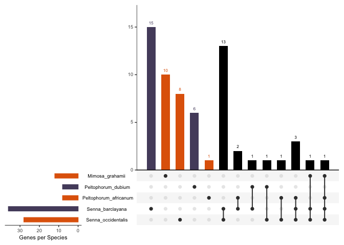<!-- -->

## Symbiosis genes

Now do the wilcoxon tests just for the genes that are symbiotic. These
genes were identified by mapping the symbiotic Roy genes to our
transcriptomes.

``` r
# Load the gene names by species 
roy_genes<-read_csv("MappedRoyGenes.csv")
```

    ## Rows: 1613 Columns: 1
    ## ── Column specification ────────────────────────────────────────────────────────
    ## Delimiter: ","
    ## chr (1): Gene_name
    ## 
    ## ℹ Use `spec()` to retrieve the full column specification for this data.
    ## ℹ Specify the column types or set `show_col_types = FALSE` to quiet this message.

``` r
roy_genes2<-roy_genes$Gene_name 

# Filter the original dataset  
plant_dnds_sym <- plant_dnds2 %>% # 3409 rows to start 
  filter(Code %in% roy_genes2)
plant_dnds_sym  %>% # 47 only!
  group_by(Mutualist, Species) %>%
  summarize()
```

    ## `summarise()` has grouped output by 'Mutualist'. You can override using the
    ## `.groups` argument.

    ## # A tibble: 6 × 2
    ## # Groups:   Mutualist [2]
    ##   Mutualist Species              
    ##   <chr>     <chr>                
    ## 1 F         Mimosa_grahamii      
    ## 2 M         Calliandra_eriophylla
    ## 3 M         Dalea_mollissima     
    ## 4 M         Peltophorum_africanum
    ## 5 M         Senna_barclayana     
    ## 6 M         Senna_italica

``` r
# Notes from single copy work: Ok I guess then the symbiotic genes were not good orthologs. This makes me think I do have to go back and find orthologs not in the full 12 species, sigh! 
# Also go back and map the other non-symbiotic species, maybe there will be more??? 

sym_genes <- plant_dnds_sym %>%
  distinct(Gene)
sym_genes # Only 17 genes that map!!!! 
```

    ## # A tibble: 17 × 1
    ##    Gene     
    ##    <chr>    
    ##  1 OG0019914
    ##  2 OG0020167
    ##  3 OG0020658
    ##  4 OG0019964
    ##  5 OG0020600
    ##  6 OG0017112
    ##  7 OG0017264
    ##  8 OG0021088
    ##  9 OG0022268
    ## 10 OG0026688
    ## 11 OG0028014
    ## 12 OG0029160
    ## 13 OG0031042
    ## 14 OG0032198
    ## 15 OG0035204
    ## 16 OG0035706
    ## 17 OG0037224

## Histograms of all genes vs. symbiosis genes

Distribution of dn/ds ratios at all genes and identify where the
symbiosis genes lie in that distribution.

``` r
# Id the symbiosis values in each pair
a<-plant_dnds2 %>% 
  filter(Pair=="a") %>% 
  filter(Code %in% roy_genes2) 
as<-a$dnds
an<-a$Gene
am<-mean(a$dnds)

b<-plant_dnds2 %>% 
  filter(Pair=="b") %>% 
  filter(Code %in% roy_genes2) 
bs<-b$dnds
bn<-b$Gene
bm<-mean(b$dnds)

c<-plant_dnds2 %>% 
  filter(Pair=="c") %>% 
  filter(Code %in% roy_genes2) 
cs<-c$dnds
cn<-c$Gene
cm<-mean(c$dnds)

d<-plant_dnds2 %>% 
  filter(Pair=="d") %>% 
  filter(Gene %in% sym_genes$Gene) 
ds<-d$dnds
dn<-d$Gene
dm<-mean(d$dnds)

e<-plant_dnds2 %>% 
  filter(Pair=="e") %>% 
  filter(Code %in% roy_genes2) 
es<-e$dnds
en<-e$Gene
em<-mean(e$dnds)

f<-plant_dnds2 %>% 
  filter(Pair=="f") %>% 
  filter(Code %in% roy_genes2) 
fs<-f$dnds
fn<-f$Gene
fm<-mean(f$dnds)

# Labels for plot 

pairlabs<-c("Mimosa", "Dalea", "Calliandra", "Senna1", "Senna2", "Peltophorum")
names(pairlabs)<-c("a", "b", "c", "d", "e", "f")

# Mean of the symbiosis genes plotted on top of the histrogam 
# This is the one to go with 
plant_dnds2 %>% 
  ggplot(., aes(x=dnds)) +
  facet_wrap(~Pair, scales="fixed", 
             labeller=labeller(Pair=pairlabs)) +
  geom_histogram() + 
  xlab("dN/dS ratio") + 
  #geom_vline(data=filter(plant_dnds2, Pair=="a"), xintercept=c(as), colour="red", linetype="dashed") +
  geom_vline(data=subset(plant_dnds2, Pair=="a"), aes(xintercept=c(am)), colour="red", linetype="dashed") +
  geom_vline(data=subset(plant_dnds2, Pair=="b"), aes(xintercept=c(bm)), colour="red", linetype="dashed") +
  geom_vline(data=subset(plant_dnds2, Pair=="c"), aes(xintercept=c(cm)), colour="red", linetype="dashed") +
  geom_vline(data=subset(plant_dnds2, Pair=="d"), aes(xintercept=c(dm)), colour="red", linetype="dashed") +
  geom_vline(data=subset(plant_dnds2, Pair=="e"), aes(xintercept=c(em)), colour="red", linetype="dashed") +
  geom_vline(data=subset(plant_dnds2, Pair=="f"), aes(xintercept=c(fm)), colour="red", linetype="dashed") +
  theme_classic() 
```

    ## `stat_bin()` using `bins = 30`. Pick better value with `binwidth`.

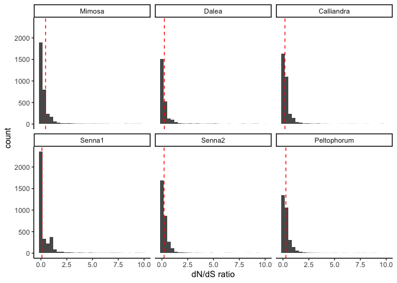<!-- -->

``` r
plant_dnds2 %>% 
  ggplot(., aes(x=dnds)) +
  facet_wrap(~Pair, scales="fixed", 
             labeller=labeller(Pair=pairlabs)) +
  geom_histogram() + 
  xlab("dN/dS ratio") + 
  geom_vline(data=subset(plant_dnds2, Pair=="a"), xintercept=c(as), colour="red", cex=0.1) +
  theme_classic() 
```

    ## Warning: `geom_vline()`: Ignoring `data` because `xintercept` was provided.

    ## Warning: Using `size` aesthetic for lines was deprecated in ggplot2 3.4.0.
    ## ℹ Please use `linewidth` instead.
    ## This warning is displayed once every 8 hours.
    ## Call `lifecycle::last_lifecycle_warnings()` to see where this warning was
    ## generated.

    ## `stat_bin()` using `bins = 30`. Pick better value with `binwidth`.

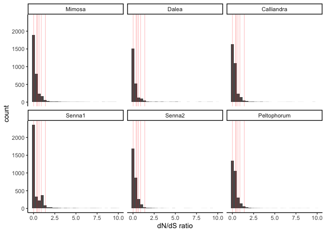<!-- -->

``` r
# Try a different way 
# First prep the data 
plant_dnds_sym2<-plant_dnds2 %>%
  mutate(SymbioticGene=case_when(Pair=="a" & Gene %in% an ~ "S", 
                                 Pair=="b" & Gene %in% bn ~ "S",
                                 Pair=="c" & Gene %in% cn ~ "S",
                                 Pair=="d" & Gene %in% en ~ "S",
                                 Pair=="e" & Gene %in% en ~ "S",
                                 Pair=="f" & Gene %in% fn ~ "S"
                                 )) %>%
  mutate(SymbioticGene=replace_na(SymbioticGene, "N")) 

# Try to highlight the symbiotic gene values 
plant_dnds_sym2 %>% 
  ggplot(., aes(x=dnds, fill=SymbioticGene)) +
  facet_wrap(~Pair, scales="fixed", 
             labeller=labeller(Pair=pairlabs)) +
  scale_fill_manual(labels=c("genome-wide", "symbiosis genes"), values=c("grey", "red"))+
  geom_histogram() + 
  xlab("dN/dS ratio") + 
  theme_classic() 
```

    ## `stat_bin()` using `bins = 30`. Pick better value with `binwidth`.

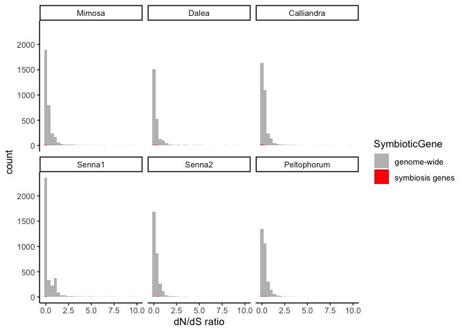<!-- -->

## Compare mean symbiosis to rest of the genome

Boxplots to show difference in overall symbiosis and other gene dnds
ratios

``` r
# Code the gene as symbiotic or not in the dataframe 
# But it has to be different for each species 

plant_dnds_sym2<-plant_dnds2 %>%
  mutate(SymbioticGene=case_when(Pair=="a" & Gene %in% an ~ "S", 
                                 Pair=="b" & Gene %in% bn ~ "S",
                                 Pair=="c" & Gene %in% cn ~ "S",
                                 Pair=="d" & Gene %in% en ~ "S",
                                 Pair=="e" & Gene %in% en ~ "S",
                                 Pair=="f" & Gene %in% fn ~ "S"
                                 )) %>%
  mutate(SymbioticGene=replace_na(SymbioticGene, "N"))

# Draw the boxplot 
plant_dnds_sym2 %>% 
  ggplot(., aes(x=Mutualist, y=dnds, fill=SymbioticGene)) +
  facet_wrap(~Pair, scale="free_x",
             labeller=labeller(Pair=pairlabs)) +
  scale_fill_manual(labels=c("genome-wide", "symbiosis genes"), values=c("grey", "white"))+
  scale_x_discrete(labels=c("F" = "non-mutualist", "M" = "mutualist")) +
  geom_boxplot(outlier.shape=NA) + 
  ylab("dN/dS ratio") +
  xlab("Genes") +
  ylim(0, 1) +
  theme_classic() + 
  theme(legend.title=element_blank())
```

    ## Warning: Removed 1556 rows containing non-finite outside the scale range
    ## (`stat_boxplot()`).

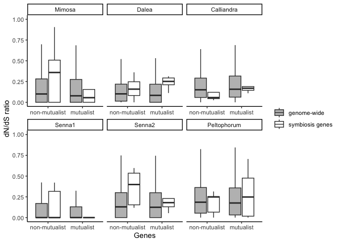<!-- -->

``` r
library(ggbreak)
```

    ## ggbreak v0.1.2
    ## 
    ## If you use ggbreak in published research, please cite the following
    ## paper:
    ## 
    ## S Xu, M Chen, T Feng, L Zhan, L Zhou, G Yu. Use ggbreak to effectively
    ## utilize plotting space to deal with large datasets and outliers.
    ## Frontiers in Genetics. 2021, 12:774846. doi: 10.3389/fgene.2021.774846

``` r
library(ggh4x)

# Make separate for each species and then combine at the end! 
# violin plots 
plant_dnds_sym2
```

    ## # A tibble: 18,565 × 8
    ##    Code              dnds Gene  Species Mutualist Pair  Transition SymbioticGene
    ##    <chr>            <dbl> <chr> <chr>   <chr>     <chr> <chr>      <chr>        
    ##  1 Calliandra_eri… 0.105  OG00… Callia… M         c     loss       N            
    ##  2 Calliandra_eri… 0.361  OG00… Callia… M         c     loss       N            
    ##  3 Calliandra_eri… 0.438  OG00… Callia… M         c     loss       N            
    ##  4 Calliandra_eri… 0.0583 OG00… Callia… M         c     loss       N            
    ##  5 Calliandra_eri… 0.160  OG00… Callia… M         c     loss       N            
    ##  6 Calliandra_eri… 0.487  OG00… Callia… M         c     loss       N            
    ##  7 Calliandra_eri… 0.135  OG00… Callia… M         c     loss       N            
    ##  8 Calliandra_eri… 0.276  OG00… Callia… M         c     loss       N            
    ##  9 Calliandra_eri… 0.0001 OG00… Callia… M         c     loss       N            
    ## 10 Calliandra_eri… 0.0818 OG00… Callia… M         c     loss       N            
    ## # ℹ 18,555 more rows

``` r
va<-plant_dnds_sym2 %>% 
  filter(Pair=="a") %>%
  ggplot(., aes(x=Mutualist, y=dnds, fill=SymbioticGene)) +
  scale_y_continuous(
    limits = c(0, 10),  # Set the limits of the y-axis
    breaks = seq(0, 10, by=0.5)  # Specify breaks for y-axis
  ) +
  ggbreak::scale_y_break(c(1.5, 9.5), space = 0.1) +
  #facet_wrap(~Pair,  scales = "fixed",
  #           labeller=labeller(Pair=pairlabs), 
  #           strip.position = "top") +
  scale_fill_manual(labels=c("genome-wide", "symbiosis genes"), values=c("grey", "white"))+
  scale_x_discrete(labels=c("F" = "non-mutualist", "M" = "mutualist")) +
  #geom_boxplot(outlier.shape=NA) + 
  geom_violin(draw_quantiles = c(0.5))+
  ylab("dN/dS ratio") +
  xlab("Genes") +
  #ylim(0, 1) +
    labs(tag="a)") +
  theme_classic() + 
  theme(legend.title=element_blank(),
        legend.position="none",
        axis.title.x = element_blank(),
        axis.title.y = element_blank(),
        axis.ticks.y.right = element_blank(),
        axis.text.y.right = element_blank())

vb<-plant_dnds_sym2 %>% 
  filter(Pair=="b") %>%
  ggplot(., aes(x=Mutualist, y=dnds, fill=SymbioticGene)) +
  scale_y_continuous(
    limits = c(0, 10),  # Set the limits of the y-axis
    breaks = seq(0, 10, by=0.5)  # Specify breaks for y-axis
  ) +
  ggbreak::scale_y_break(c(1.5, 9.5), space = 0.1) +
  #facet_wrap(~Pair,  scales = "fixed",
  #           labeller=labeller(Pair=pairlabs), 
  #           strip.position = "top") +
  scale_fill_manual(labels=c("genome-wide", "symbiosis genes"), values=c("grey", "white"))+
  scale_x_discrete(labels=c("F" = "non-mutualist", "M" = "mutualist")) +
  #geom_boxplot(outlier.shape=NA) + 
  geom_violin(draw_quantiles = c(0.5))+
  ylab("dN/dS ratio") +
  xlab("Genes") +
  #ylim(0, 1) +
    labs(tag="b)") +
  theme_classic() + 
  theme(legend.title=element_blank(),
        legend.position="none",
        axis.title.x = element_blank(),
        axis.title.y = element_blank(),
        axis.ticks.y.right = element_blank(),
        axis.text.y.right = element_blank())

vc<-plant_dnds_sym2 %>% 
  filter(Pair=="c") %>%
  ggplot(., aes(x=Mutualist, y=dnds, fill=SymbioticGene)) +
  scale_y_continuous(
    limits = c(0, 10),  # Set the limits of the y-axis
    breaks = seq(0, 10, by=0.5)  # Specify breaks for y-axis
  ) +
  ggbreak::scale_y_break(c(1.5, 9.5), space = 0.1) +
  #facet_wrap(~Pair,  scales = "fixed",
  #           labeller=labeller(Pair=pairlabs), 
  #           strip.position = "top") +
  scale_fill_manual(labels=c("genome-wide", "symbiosis genes"), values=c("grey", "white"))+
  scale_x_discrete(labels=c("F" = "non-mutualist", "M" = "mutualist")) +
  #geom_boxplot(outlier.shape=NA) + 
  geom_violin(draw_quantiles = c(0.5))+
  ylab("dN/dS ratio") +
  xlab("Genes") +
  #ylim(0, 1) +
    labs(tag="c)") +
  theme_classic() + 
  theme(legend.title=element_blank(),
        legend.position="none",
        axis.title.x = element_blank(),
        axis.title.y = element_blank(),
        axis.ticks.y.right = element_blank(),
        axis.text.y.right = element_blank())

vd<-plant_dnds_sym2 %>% 
  filter(Pair=="d") %>%
  ggplot(., aes(x=Mutualist, y=dnds, fill=SymbioticGene)) +
  scale_y_continuous(
    limits = c(0, 10),  # Set the limits of the y-axis
    breaks = seq(0, 10, by=0.5)  # Specify breaks for y-axis
  ) +
  ggbreak::scale_y_break(c(1.5, 9.5), space = 0.1) +
  #facet_wrap(~Pair,  scales = "fixed",
  #           labeller=labeller(Pair=pairlabs), 
  #           strip.position = "top") +
  scale_fill_manual(labels=c("genome-wide", "symbiosis genes"), values=c("grey", "white"))+
  scale_x_discrete(labels=c("F" = "non-mutualist", "M" = "mutualist")) +
  #geom_boxplot(outlier.shape=NA) + 
  geom_violin(draw_quantiles = c(0.5))+
  ylab("dN/dS ratio") +
  xlab("Genes") +
  #ylim(0, 1) +
    labs(tag="d)") +
  theme_classic() + 
  theme(legend.title=element_blank(),
        legend.position="none",
        axis.title.x = element_blank(),
        axis.title.y = element_blank(),
        axis.ticks.y.right = element_blank(),
        axis.text.y.right = element_blank())

ve<-plant_dnds_sym2 %>% 
  filter(Pair=="e") %>%
  ggplot(., aes(x=Mutualist, y=dnds, fill=SymbioticGene)) +
  scale_y_continuous(
    limits = c(0, 10),  # Set the limits of the y-axis
    breaks = seq(0, 10, by=0.5)  # Specify breaks for y-axis
  ) +
  ggbreak::scale_y_break(c(1.5, 9.5)) +
  #facet_wrap(~Pair,  scales = "fixed",
  #           labeller=labeller(Pair=pairlabs), 
  #           strip.position = "top") +
  scale_fill_manual(labels=c("genome-wide", "symbiosis genes"), values=c("grey", "white"))+
  scale_x_discrete(labels=c("F" = "non-mutualist", "M" = "mutualist")) +
  #geom_boxplot(outlier.shape=NA) + 
  geom_violin(draw_quantiles = c(0.5))+
  ylab("dN/dS ratio") +
  xlab("Genes") +
  #ylim(0, 1) +
    labs(tag="e)") +
  theme_classic() + 
  theme(legend.title=element_blank(),
        legend.position="none",
        axis.title.x = element_blank(),
        axis.title.y = element_blank(),
        axis.ticks.y.right = element_blank(),
        axis.text.y.right = element_blank())

vf<-plant_dnds_sym2 %>% 
  filter(Pair=="f") %>%
  ggplot(., aes(x=Mutualist, y=dnds, fill=SymbioticGene)) +
  scale_y_continuous(
    limits = c(0, 10),  # Set the limits of the y-axis
    breaks = seq(0, 10, by=0.5)  # Specify breaks for y-axis
  ) +
  ggbreak::scale_y_break(c(1.5, 9.5), space = 0.1) +
  #facet_wrap(~Pair,  scales = "fixed",
  #           labeller=labeller(Pair=pairlabs), 
  #           strip.position = "top") +
  scale_fill_manual(labels=c("genome-wide", "symbiosis genes"), values=c("grey", "white"))+
  scale_x_discrete(labels=c("F" = "non-mutualist", "M" = "mutualist")) +
  #geom_boxplot(outlier.shape=NA) + 
  geom_violin(draw_quantiles = c(0.5))+
  ylab("dN/dS ratio") +
  xlab("Genes") +
  #ylim(0, 1) +
  labs(tag="f)") +
  theme_classic() + 
  labs("f")+
  theme(legend.title=element_blank(),
        legend.position="none",
        axis.title.x = element_blank(),
        axis.title.y = element_blank(),
        axis.ticks.y.right = element_blank(),
        axis.text.y.right = element_blank())
vf
```

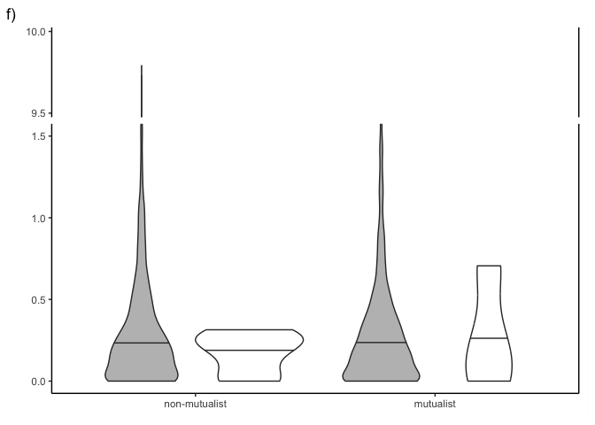<!-- -->

``` r
test<-ggarrange(print(va), print(vb),print(vc),print(vd),print(ve),print(vf),
          ncol=3, nrow=2)
test
```

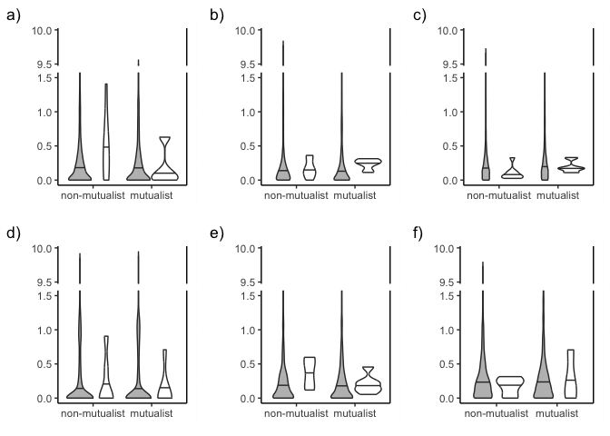<!-- -->

``` r
sppv<-plant_dnds_sym2 %>% 
  filter(Mutualist=="M") %>%
  ggplot(., aes(x=Species, y=dnds, fill=SymbioticGene)) +
  scale_y_continuous(
    limits = c(0, 10),  # Set the limits of the y-axis
    breaks = seq(0, 10, by=0.5)  # Specify breaks for y-axis
  ) +
  ggbreak::scale_y_break(c(1.5, 9.5), space = 0.1) +
  scale_fill_manual(labels=c("genome-wide", "symbiosis genes"), values=c("grey", "white"))+
  #scale_x_discrete(labels=c("F" = "non-mutualist", "M" = "mutualist")) +
  #geom_boxplot(outlier.shape=NA) + 
  geom_violin(draw_quantiles = c(0.5))+
  ylab("dN/dS ratio") +
  xlab("") +
  #ylim(0, 1) +
  theme_classic() + 
  theme(legend.title=element_blank(),
        legend.position="bottom",
        axis.ticks.y.right = element_blank(),
        axis.title.x = element_blank(),
        axis.text.y.right = element_blank(),
        axis.text.x = element_text(angle = 90, vjust = 0.5, hjust=1))

sppv
```

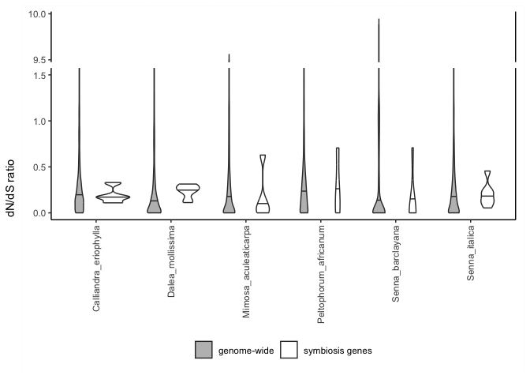<!-- -->

get the labels

``` r
vf<-plant_dnds_sym2 %>% 
  filter(Pair=="f") %>%
  ggplot(., aes(x=Species, y=dnds, fill=SymbioticGene)) +
  scale_y_continuous(
    limits = c(0, 10),  # Set the limits of the y-axis
    breaks = seq(0, 10, by=0.5)  # Specify breaks for y-axis
  ) +
  ggbreak::scale_y_break(c(1.5, 9.5), space = 0.1) +
  #facet_wrap(~Pair,  scales = "fixed",
  #           labeller=labeller(Pair=pairlabs), 
  #           strip.position = "top") +
  scale_fill_manual(labels=c("genome-wide", "symbiosis genes"), values=c("grey", "white"))+
  #scale_x_discrete(labels=c("F" = "non-mutualist", "M" = "mutualist")) +
  #geom_boxplot(outlier.shape=NA) + 
  geom_violin(draw_quantiles = c(0.5))+
  ylab("dN/dS ratio") +
  xlab("Genes") +
  #ylim(0, 1) +
  labs(tag="f)") +
  theme_classic() + 
  labs("f")+
  theme(legend.title=element_blank(),
        legend.position="none",
        axis.title.x = element_blank(),
        axis.title.y = element_blank(),
        axis.ticks.y.right = element_blank(),
        axis.text.y.right = element_blank())
vf
```

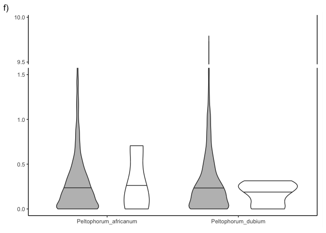<!-- -->

## Do the unpaired wilcoxon tests

``` r
plant_dnds_sym2 %>% 
  filter(Species=="Dalea_mollis") %>%
  wilcox.test(dnds~SymbioticGene, data=.)
```

    ## 
    ##  Wilcoxon rank sum test with continuity correction
    ## 
    ## data:  dnds by SymbioticGene
    ## W = 4188.5, p-value = 0.837
    ## alternative hypothesis: true location shift is not equal to 0

``` r
plant_dnds_sym2 %>% 
  filter(Species=="Dalea_mollissima") %>%
  wilcox.test(dnds~SymbioticGene, data=.)
```

    ## 
    ##  Wilcoxon rank sum test with continuity correction
    ## 
    ## data:  dnds by SymbioticGene
    ## W = 2825, p-value = 0.05491
    ## alternative hypothesis: true location shift is not equal to 0

``` r
plant_dnds_sym2 %>% 
  filter(Species=="Calliandra_eriophylla") %>%
  wilcox.test(dnds~SymbioticGene, data=.)
```

    ## 
    ##  Wilcoxon rank sum test with continuity correction
    ## 
    ## data:  dnds by SymbioticGene
    ## W = 7183, p-value = 0.9997
    ## alternative hypothesis: true location shift is not equal to 0

``` r
plant_dnds_sym2 %>% 
  filter(Species=="Calliandra_humilis") %>%
  wilcox.test(dnds~SymbioticGene, data=.)
```

    ## 
    ##  Wilcoxon rank sum test with continuity correction
    ## 
    ## data:  dnds by SymbioticGene
    ## W = 8795, p-value = 0.08326
    ## alternative hypothesis: true location shift is not equal to 0

``` r
plant_dnds_sym2 %>% 
  filter(Species=="Mimosa_aculeaticarpa") %>%
  wilcox.test(dnds~SymbioticGene, data=.)
```

    ## 
    ##  Wilcoxon rank sum test with continuity correction
    ## 
    ## data:  dnds by SymbioticGene
    ## W = 8263, p-value = 0.6599
    ## alternative hypothesis: true location shift is not equal to 0

``` r
plant_dnds_sym2 %>% 
  filter(Species=="Mimosa_grahamii") %>%
  wilcox.test(dnds~SymbioticGene, data=.)
```

    ## 
    ##  Wilcoxon rank sum test with continuity correction
    ## 
    ## data:  dnds by SymbioticGene
    ## W = 5499.5, p-value = 0.2157
    ## alternative hypothesis: true location shift is not equal to 0

``` r
plant_dnds_sym2 %>% 
  filter(Species=="Peltophorum_africanum") %>%
  wilcox.test(dnds~SymbioticGene, data=.)
```

    ## 
    ##  Wilcoxon rank sum test with continuity correction
    ## 
    ## data:  dnds by SymbioticGene
    ## W = 5467, p-value = 0.8021
    ## alternative hypothesis: true location shift is not equal to 0

``` r
plant_dnds_sym2 %>% 
  filter(Species=="Peltophorum_dubium") %>%
  wilcox.test(dnds~SymbioticGene, data=.)
```

    ## 
    ##  Wilcoxon rank sum test with continuity correction
    ## 
    ## data:  dnds by SymbioticGene
    ## W = 6147, p-value = 0.4653
    ## alternative hypothesis: true location shift is not equal to 0

``` r
plant_dnds_sym2 %>% 
  filter(Species=="Senna_barclayana") %>%
  wilcox.test(dnds~SymbioticGene, data=.)
```

    ## 
    ##  Wilcoxon rank sum test with continuity correction
    ## 
    ## data:  dnds by SymbioticGene
    ## W = 6755.5, p-value = 0.2129
    ## alternative hypothesis: true location shift is not equal to 0

``` r
plant_dnds_sym2 %>% 
  filter(Species=="Senna_italica") %>%
  wilcox.test(dnds~SymbioticGene, data=.)
```

    ## 
    ##  Wilcoxon rank sum test with continuity correction
    ## 
    ## data:  dnds by SymbioticGene
    ## W = 4112, p-value = 0.5527
    ## alternative hypothesis: true location shift is not equal to 0

``` r
plant_dnds_sym2 %>% 
  filter(Species=="Senna_occidentalis") %>%
  wilcox.test(dnds~SymbioticGene, data=.)
```

    ## 
    ##  Wilcoxon rank sum test with continuity correction
    ## 
    ## data:  dnds by SymbioticGene
    ## W = 5886, p-value = 0.6139
    ## alternative hypothesis: true location shift is not equal to 0

``` r
plant_dnds_sym2 %>% 
  filter(Species=="Senna_didymobotrya") %>%
  wilcox.test(dnds~SymbioticGene, data=.)
```

    ## 
    ##  Wilcoxon rank sum test with continuity correction
    ## 
    ## data:  dnds by SymbioticGene
    ## W = 2629, p-value = 0.1001
    ## alternative hypothesis: true location shift is not equal to 0

## Symbiosis genes comparing the numbers

Count how many genes are shared in different numbers of species Does the
number of species sharing the gene impact the dn/ds ratio? How to plot
this?

``` r
# Get the symbiotic genes 
symgenes3<-plant_dnds2 %>% 
  filter(Gene %in% sym_genes$Gene) 
  #filter(Code %in% roy_genes2)
# This is taking anything that matches the gene code 
  
plant_dnds_sym2 %>%
  group_by(Mutualist, Species)%>%
  summarize()
```

    ## `summarise()` has grouped output by 'Mutualist'. You can override using the
    ## `.groups` argument.

    ## # A tibble: 12 × 2
    ## # Groups:   Mutualist [2]
    ##    Mutualist Species              
    ##    <chr>     <chr>                
    ##  1 F         Calliandra_humilis   
    ##  2 F         Dalea_mollis         
    ##  3 F         Mimosa_grahamii      
    ##  4 F         Peltophorum_dubium   
    ##  5 F         Senna_didymobotrya   
    ##  6 F         Senna_occidentalis   
    ##  7 M         Calliandra_eriophylla
    ##  8 M         Dalea_mollissima     
    ##  9 M         Mimosa_aculeaticarpa 
    ## 10 M         Peltophorum_africanum
    ## 11 M         Senna_barclayana     
    ## 12 M         Senna_italica

``` r
symgenes3 %>%
  group_by(Mutualist, Species)%>%
  summarize()
```

    ## `summarise()` has grouped output by 'Mutualist'. You can override using the
    ## `.groups` argument.

    ## # A tibble: 12 × 2
    ## # Groups:   Mutualist [2]
    ##    Mutualist Species              
    ##    <chr>     <chr>                
    ##  1 F         Calliandra_humilis   
    ##  2 F         Dalea_mollis         
    ##  3 F         Mimosa_grahamii      
    ##  4 F         Peltophorum_dubium   
    ##  5 F         Senna_didymobotrya   
    ##  6 F         Senna_occidentalis   
    ##  7 M         Calliandra_eriophylla
    ##  8 M         Dalea_mollissima     
    ##  9 M         Mimosa_aculeaticarpa 
    ## 10 M         Peltophorum_africanum
    ## 11 M         Senna_barclayana     
    ## 12 M         Senna_italica

``` r
# This has the whole legume dataset now 

# Count how many species each gene is in (shared by)
symcount<-plant_dnds_sym2 %>%
  count(Gene)
symcount
```

    ## # A tibble: 3,521 × 2
    ##    Gene          n
    ##    <chr>     <int>
    ##  1 OG0017031    11
    ##  2 OG0017034    12
    ##  3 OG0017084    11
    ##  4 OG0017089    12
    ##  5 OG0017091    12
    ##  6 OG0017095    12
    ##  7 OG0017099    11
    ##  8 OG0017100    12
    ##  9 OG0017101    12
    ## 10 OG0017112    12
    ## # ℹ 3,511 more rows

``` r
symmeanM<-plant_dnds_sym2 %>%
  group_by(Gene) %>%
  filter(Mutualist=="M") %>%
  summarize(mean(dnds)) 
colnames(symmeanM)[2]="Mmean"

symmeanF<-plant_dnds_sym2 %>%
  group_by(Gene) %>%
  filter(Mutualist=="F") %>%
  summarize(mean(dnds))
colnames(symmeanF)[2]="Fmean"


# Clean up the dataset 
symdata1 <- symmeanM %>%
  full_join(symmeanF)
```

    ## Joining with `by = join_by(Gene)`

``` r
symdata3 <- symdata1 %>%
  full_join(symcount) %>%
  pivot_longer(cols=-c(Gene, n), names_to="Mean", values_to="dnds") %>%
  mutate(n=as.factor(n)) 
```

    ## Joining with `by = join_by(Gene)`

``` r
# Try a plot 
ggplot(symdata3, aes(x=n, y=dnds, fill=Mean)) +
  geom_bar(stat="identity", position="dodge") + 
  scale_fill_manual(labels=c("non-mutualists", "mutualists"), values=c("black", "grey"))+
  #scale_x_discrete(labels=c("Fmean" = "non-mutualists", "S" = "symbiosis")) +
  xlab("Number of species that share the gene") +
  ylab("dN/dS ratio") + 
  theme_classic() + 
  theme(legend.title=element_blank())
```

    ## Warning: Removed 299 rows containing missing values or values outside the scale range
    ## (`geom_bar()`).

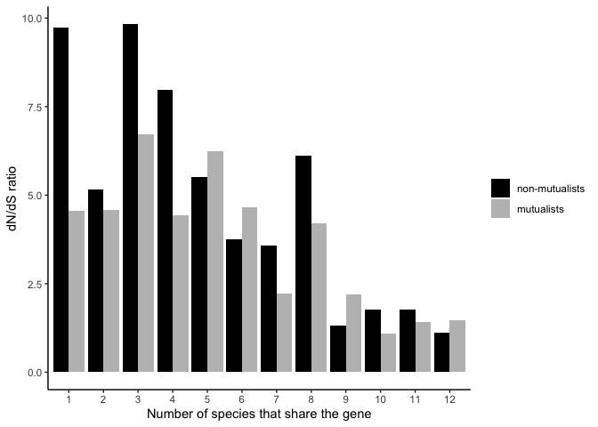<!-- -->

``` r
ggplot(symdata3, aes(x=n, y=dnds, color=Mean)) +
  geom_boxplot(outlier.shape = NA)+ 
  #geom_bar(stat="identity", position="dodge") + 
  #scale_fill_manual(labels=c("non-mutualists", "mutualists"), values=c("grey", "white"))+
  scale_color_manual(labels=c("non-mutualist", "mutualist"), values=c(non_col[2], mut_col[4]))+
  #scale_x_discrete(labels=c("Fmean" = "non-mutualists", "S" = "symbiosis")) +
  xlab("Number of species that share the gene") +
  ylab("dN/dS ratio") + 
  #ylim(c(0,0.45)) +
  theme_classic() + 
  theme(legend.title=element_blank())
```

    ## Warning: Removed 299 rows containing non-finite outside the scale range
    ## (`stat_boxplot()`).

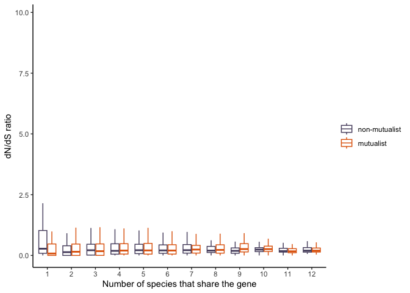<!-- -->

``` r
ggplot(symdata3, aes(x=n, y=dnds, color=Mean)) +
  geom_boxplot(outlier.shape = NA)+ 
  #geom_bar(stat="identity", position="dodge") + 
  #scale_fill_manual(labels=c("non-mutualists", "mutualists"), values=c("grey", "white"))+
  scale_color_manual(labels=c("non-mutualist", "mutualist"), values=c(non_col[2], mut_col[4]))+
  #scale_x_discrete(labels=c("Fmean" = "non-mutualists", "S" = "symbiosis")) +
  xlab("Number of species that share the gene") +
  ylab("dN/dS ratio") + 
  #ylim(c(0,0.45)) +
  theme_classic() + 
  theme(legend.title=element_blank())
```

    ## Warning: Removed 299 rows containing non-finite outside the scale range
    ## (`stat_boxplot()`).

<!-- -->

``` r
testbinaryplant<-symdata3 %>%
  mutate(Binary = ifelse(n == 12, "conserved", "unique"))

  ggplot(testbinaryplant, aes(x=Binary, y=dnds, fill=Mean)) + 
  geom_boxplot(outlier.shape = NA) + 
  scale_fill_manual(labels=c("non-mutualist", "mutualist"), values=c(non_col[2], mut_col[4]))+
  scale_x_discrete(labels=c("conserved symbiosis genes", "other symbiosis genes")) +
  xlab("") +
  ylab("dN/dS ratio") + 
  ylim(c(0,1.2))+
  theme_classic() + 
  theme(legend.title=element_blank())
```

    ## Warning: Removed 669 rows containing non-finite outside the scale range
    ## (`stat_boxplot()`).

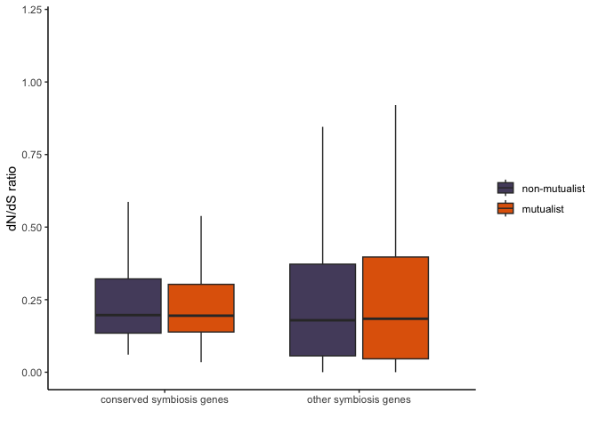<!-- -->

``` r
# test the model with anova 
modelplant<-lm(dnds~Binary*Mean, data=testbinaryplant)
plot(modelplant)
```

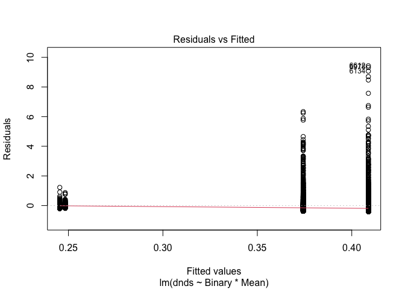<!-- -->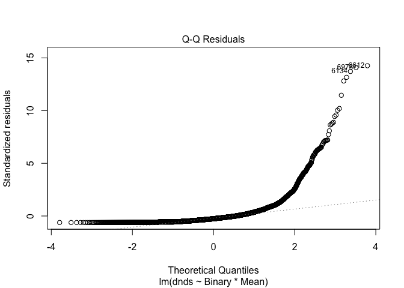<!-- -->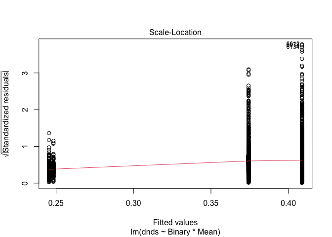<!-- -->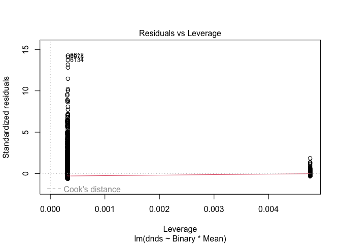<!-- -->

``` r
summary(modelplant)
```

    ## 
    ## Call:
    ## lm(formula = dnds ~ Binary * Mean, data = testbinaryplant)
    ## 
    ## Residuals:
    ##     Min      1Q  Median      3Q     Max 
    ## -0.4087 -0.3221 -0.1711  0.0597  9.4267 
    ## 
    ## Coefficients:
    ##                         Estimate Std. Error t value Pr(>|t|)    
    ## (Intercept)             0.248274   0.045619   5.442 5.45e-08 ***
    ## Binaryunique            0.160503   0.047136   3.405 0.000665 ***
    ## MeanMmean              -0.002859   0.064516  -0.044 0.964657    
    ## Binaryunique:MeanMmean -0.031633   0.066625  -0.475 0.634946    
    ## ---
    ## Signif. codes:  0 '***' 0.001 '**' 0.01 '*' 0.05 '.' 0.1 ' ' 1
    ## 
    ## Residual standard error: 0.6611 on 6739 degrees of freedom
    ##   (299 observations deleted due to missingness)
    ## Multiple R-squared:  0.003415,   Adjusted R-squared:  0.002971 
    ## F-statistic: 7.697 on 3 and 6739 DF,  p-value: 3.939e-05

``` r
Anova(modelplant, type=3) # significant but the data is not normal 
```

    ## Anova Table (Type III tests)
    ## 
    ## Response: dnds
    ##              Sum Sq   Df F value    Pr(>F)    
    ## (Intercept)   12.94    1 29.6186 5.445e-08 ***
    ## Binary         5.07    1 11.5946 0.0006653 ***
    ## Mean           0.00    1  0.0020 0.9646566    
    ## Binary:Mean    0.10    1  0.2254 0.6349464    
    ## Residuals   2945.20 6739                      
    ## ---
    ## Signif. codes:  0 '***' 0.001 '**' 0.01 '*' 0.05 '.' 0.1 ' ' 1

``` r
wilcox.test(dnds ~ Binary, data = testbinaryplant, exact = FALSE) # not significant 
```

    ## 
    ##  Wilcoxon rank sum test with continuity correction
    ## 
    ## data:  dnds by Binary
    ## W = 1375435, p-value = 0.2173
    ## alternative hypothesis: true location shift is not equal to 0

## Symbiotitic analysis

``` r
# Filter data for sym genes 
plant_sym <- plant_dnds2 %>%
  filter(Gene %in% sym_genes$Gene)
plant_sym # 137 rows 
```

    ## # A tibble: 135 × 7
    ##    Code                            dnds Gene  Species Mutualist Pair  Transition
    ##    <chr>                          <dbl> <chr> <chr>   <chr>     <chr> <chr>     
    ##  1 Calliandra_eriophylla_NODE_1… 0.109  OG00… Callia… M         c     loss      
    ##  2 Calliandra_eriophylla_NODE_1… 0.280  OG00… Callia… M         c     loss      
    ##  3 Calliandra_eriophylla_NODE_2… 0.169  OG00… Callia… M         c     loss      
    ##  4 Calliandra_eriophylla_NODE_6… 0.0838 OG00… Callia… M         c     loss      
    ##  5 Calliandra_eriophylla_NODE_7… 0.144  OG00… Callia… M         c     loss      
    ##  6 Calliandra_humilis_NODE_1443… 0.0852 OG00… Callia… F         c     loss      
    ##  7 Calliandra_humilis_NODE_1965… 0.121  OG00… Callia… F         c     loss      
    ##  8 Calliandra_humilis_NODE_2525… 0.0445 OG00… Callia… F         c     loss      
    ##  9 Calliandra_humilis_NODE_5234… 0.0592 OG00… Callia… F         c     loss      
    ## 10 Calliandra_humilis_NODE_6872… 0.327  OG00… Callia… F         c     loss      
    ## # ℹ 125 more rows

``` r
# Use this as input into the functions 
sym_function<- function(pair){
  
  # Subset each pair 
plantb<- plant_sym%>%
  filter(Pair==pair)
  
  # Make list of genes without missing data 
genesb<-plantb%>%
  filter(!is.na(dnds))%>%
  group_by(Gene)%>%
  tally() %>%
  filter(n==2)
  
genesb_list<-data.frame(Gene=genesb$Gene)

  # Keep only new genes 
plantb_new<- plantb%>%
  semi_join(genesb_list, by="Gene")

# Make into the right data format
plantb_new2<-plantb_new %>%
  select(Gene, Mutualist, dnds) %>%
  pivot_wider(names_from = Mutualist, values_from = dnds) 

# Run the paired test 
# In this example, the differences is calculated F-M
# And this is a mutualism gain so the direction is correct 
pairb_test<-wilcox.test(plantb_new2$F, plantb_new2$M, paired=TRUE)
return(pairb_test)

} 

sym_count<- function(pair){
    # Subset each pair 
plantb<- plant_sym%>%
  filter(Pair==pair)
  
  # Make list of genes without missing data 
genesb<-plantb%>%
  filter(!is.na(dnds))%>%
  group_by(Gene)%>%
  tally() %>%
  filter(n==2)
return(genesb)
}

# Test each pair 
# Def count how many genes are in each analysis 
# Might be better to just show reaction norms for teh genes we have if small 

sym_function("a") # not sig
```

    ## Warning in wilcox.test.default(plantb_new2$F, plantb_new2$M, paired = TRUE):
    ## cannot compute exact p-value with ties

    ## Warning in wilcox.test.default(plantb_new2$F, plantb_new2$M, paired = TRUE):
    ## cannot compute exact p-value with zeroes

    ## 
    ##  Wilcoxon signed rank test with continuity correction
    ## 
    ## data:  plantb_new2$F and plantb_new2$M
    ## V = 38, p-value = 0.3077
    ## alternative hypothesis: true location shift is not equal to 0

``` r
sym_count("a") # 11 genes 
```

    ## # A tibble: 11 × 2
    ##    Gene          n
    ##    <chr>     <int>
    ##  1 OG0017112     2
    ##  2 OG0017264     2
    ##  3 OG0019914     2
    ##  4 OG0019964     2
    ##  5 OG0020167     2
    ##  6 OG0020600     2
    ##  7 OG0020658     2
    ##  8 OG0022268     2
    ##  9 OG0026688     2
    ## 10 OG0031042     2
    ## 11 OG0035204     2

``` r
sym_function("b")
```

    ## 
    ##  Wilcoxon signed rank exact test
    ## 
    ## data:  plantb_new2$F and plantb_new2$M
    ## V = 12, p-value = 0.25
    ## alternative hypothesis: true location shift is not equal to 0

``` r
sym_count("b") # 9 genes 
```

    ## # A tibble: 9 × 2
    ##   Gene          n
    ##   <chr>     <int>
    ## 1 OG0017112     2
    ## 2 OG0017264     2
    ## 3 OG0019914     2
    ## 4 OG0019964     2
    ## 5 OG0020167     2
    ## 6 OG0020600     2
    ## 7 OG0022268     2
    ## 8 OG0026688     2
    ## 9 OG0028014     2

``` r
sym_function("c")
```

    ## 
    ##  Wilcoxon signed rank exact test
    ## 
    ## data:  plantb_new2$F and plantb_new2$M
    ## V = 26, p-value = 0.3394
    ## alternative hypothesis: true location shift is not equal to 0

``` r
sym_count("c") # 10 
```

    ## # A tibble: 12 × 2
    ##    Gene          n
    ##    <chr>     <int>
    ##  1 OG0017112     2
    ##  2 OG0017264     2
    ##  3 OG0019914     2
    ##  4 OG0019964     2
    ##  5 OG0020167     2
    ##  6 OG0020600     2
    ##  7 OG0020658     2
    ##  8 OG0021088     2
    ##  9 OG0022268     2
    ## 10 OG0026688     2
    ## 11 OG0031042     2
    ## 12 OG0035204     2

``` r
sym_function("d")
```

    ## Warning in wilcox.test.default(plantb_new2$F, plantb_new2$M, paired = TRUE):
    ## cannot compute exact p-value with zeroes

    ## 
    ##  Wilcoxon signed rank test with continuity correction
    ## 
    ## data:  plantb_new2$F and plantb_new2$M
    ## V = 4, p-value = 0.7893
    ## alternative hypothesis: true location shift is not equal to 0

``` r
sym_count("d") # 10 
```

    ## # A tibble: 10 × 2
    ##    Gene          n
    ##    <chr>     <int>
    ##  1 OG0017112     2
    ##  2 OG0017264     2
    ##  3 OG0019914     2
    ##  4 OG0019964     2
    ##  5 OG0020167     2
    ##  6 OG0020600     2
    ##  7 OG0020658     2
    ##  8 OG0021088     2
    ##  9 OG0029160     2
    ## 10 OG0035706     2

``` r
sym_function("e")
```

    ## 
    ##  Wilcoxon signed rank exact test
    ## 
    ## data:  plantb_new2$F and plantb_new2$M
    ## V = 25, p-value = 0.3828
    ## alternative hypothesis: true location shift is not equal to 0

``` r
sym_count("e") # 8
```

    ## # A tibble: 8 × 2
    ##   Gene          n
    ##   <chr>     <int>
    ## 1 OG0017112     2
    ## 2 OG0017264     2
    ## 3 OG0019914     2
    ## 4 OG0019964     2
    ## 5 OG0020167     2
    ## 6 OG0020600     2
    ## 7 OG0021088     2
    ## 8 OG0029160     2

``` r
sym_function("f")
```

    ## Warning in wilcox.test.default(plantb_new2$F, plantb_new2$M, paired = TRUE):
    ## cannot compute exact p-value with zeroes

    ## 
    ##  Wilcoxon signed rank test with continuity correction
    ## 
    ## data:  plantb_new2$F and plantb_new2$M
    ## V = 21, p-value = 0.5408
    ## alternative hypothesis: true location shift is not equal to 0

``` r
sym_count("f") # 11 
```

    ## # A tibble: 11 × 2
    ##    Gene          n
    ##    <chr>     <int>
    ##  1 OG0017112     2
    ##  2 OG0017264     2
    ##  3 OG0019914     2
    ##  4 OG0019964     2
    ##  5 OG0020167     2
    ##  6 OG0020600     2
    ##  7 OG0021088     2
    ##  8 OG0022268     2
    ##  9 OG0029160     2
    ## 10 OG0032198     2
    ## 11 OG0037224     2

``` r
# Try a total across all species comparison here 
plant_sym2<-plant_sym %>%
  mutate(MutualistLabel=case_when(Mutualist=="M" ~ "mutualist",
                                  Mutualist=="F" ~ "non-symbiotic")) %>%
  mutate(PairLabel=case_when(Pair=="c" ~ "Calliandra",
                             Pair=="b" ~ "Dalea",
                             Pair=="a" ~ "Mimosa",
                             Pair=="f" ~ "Peltophorum",
                             Pair=="d" ~ "Senna1",
                             Pair=="e" ~ "Senna2")) %>%
  mutate_at("Transition", str_replace, "gain", "mutualism gain") %>%
  mutate_at("Transition", str_replace, "loss", "mutualism loss")

# Check which genes have a match 
plant_sym%>%
  filter(Pair=="f") %>%
  group_by(Gene) %>%
  tally()
```

    ## # A tibble: 13 × 2
    ##    Gene          n
    ##    <chr>     <int>
    ##  1 OG0017112     2
    ##  2 OG0017264     2
    ##  3 OG0019914     2
    ##  4 OG0019964     2
    ##  5 OG0020167     2
    ##  6 OG0020600     2
    ##  7 OG0020658     1
    ##  8 OG0021088     2
    ##  9 OG0022268     2
    ## 10 OG0029160     2
    ## 11 OG0032198     2
    ## 12 OG0035706     1
    ## 13 OG0037224     2

``` r
# Remove the genes with no match 
plant_sym3<-plant_sym2 %>%
  subset(!(Pair=="a" & Gene=="OG0021088")) %>%
  subset(!(Pair=="b" & Gene=="OG0020658")) %>%
  subset(!(Pair=="b" & Gene=="OG0031042")) %>%
  subset(!(Pair=="b" & Gene=="OG0032198")) %>%
  subset(!(Pair=="b" & Gene=="OG0037224")) %>%
  subset(!(Pair=="c" & Gene=="OG0035706")) %>%
  subset(!(Pair=="d" & Gene=="OG0032198")) %>%
  subset(!(Pair=="d" & Gene=="OG0037224")) %>%
  subset(!(Pair=="e" & Gene=="OG0020658")) %>%
  subset(!(Pair=="e" & Gene=="OG0028014")) %>%
  subset(!(Pair=="e" & Gene=="OG0032198")) %>%
  subset(!(Pair=="f" & Gene=="OG0020658")) %>%
  subset(!(Pair=="f" & Gene=="OG0035706"))
plant_sym3
```

    ## # A tibble: 122 × 9
    ##    Code             dnds Gene  Species Mutualist Pair  Transition MutualistLabel
    ##    <chr>           <dbl> <chr> <chr>   <chr>     <chr> <chr>      <chr>         
    ##  1 Calliandra_er… 0.109  OG00… Callia… M         c     mutualism… mutualist     
    ##  2 Calliandra_er… 0.280  OG00… Callia… M         c     mutualism… mutualist     
    ##  3 Calliandra_er… 0.169  OG00… Callia… M         c     mutualism… mutualist     
    ##  4 Calliandra_er… 0.0838 OG00… Callia… M         c     mutualism… mutualist     
    ##  5 Calliandra_er… 0.144  OG00… Callia… M         c     mutualism… mutualist     
    ##  6 Calliandra_hu… 0.0852 OG00… Callia… F         c     mutualism… non-symbiotic 
    ##  7 Calliandra_hu… 0.121  OG00… Callia… F         c     mutualism… non-symbiotic 
    ##  8 Calliandra_hu… 0.0445 OG00… Callia… F         c     mutualism… non-symbiotic 
    ##  9 Calliandra_hu… 0.0592 OG00… Callia… F         c     mutualism… non-symbiotic 
    ## 10 Calliandra_hu… 0.327  OG00… Callia… F         c     mutualism… non-symbiotic 
    ## # ℹ 112 more rows
    ## # ℹ 1 more variable: PairLabel <chr>

``` r
# Try the lollipop plot 
# Prep the dataset 
plant_sym4 <- plant_sym3 %>%
  group_by(Pair) %>%
  dplyr::select(Mutualist, Transition, Gene, dnds) %>%
  pivot_wider(names_from=Mutualist, values_from=dnds) %>%
  filter(!is.na(M) & !is.na(F))
```

    ## Adding missing grouping variables: `Pair`

``` r
sym_plot_pl <- plant_sym4 %>%
  mutate(minus=M-F) %>%
  mutate(Diff=abs(minus)) %>% 
  filter(Diff!=0) %>%
  arrange(Diff) 

sym_plot_pl2 <- sym_plot_pl %>%
  mutate(Pair2=case_when(Pair=="a" ~ "Mimosa", 
                            Pair=="b" ~ "Dalea", 
                            Pair=="c" ~ "Calliandra",
                            Pair=="d" ~ "Senna1",
                            Pair=="e" ~ "Senna2",
                            Pair=="f" ~ "Peltophorum"))


# Plot the lollipop plot 
popplot_pl<- ggplot(sym_plot_pl2) + 
  geom_segment(aes(x=fct_reorder(Gene, minus), y=M, xend=Gene, yend=F), color="grey") + 
  geom_point(aes(x=Gene, y=M, color="M"), size=3.2) + 
  geom_point(aes(x=Gene, y=F, color="F"), size=3.2) + 
  scale_color_manual(labels=c("non-mutualist", "mutualist"), values=c(non_col[2], mut_col[4]))+
  coord_flip() + 
  facet_grid(rows = vars(Pair2), space="free", scales="free") +
  (xlab("Symbiotic genes"))+
  (ylab("dN/dS ratio"))+
  theme_light() + 
  theme(axis.title = element_text(size=12), 
        axis.text.y= element_text(size=9), 
        axis.text.x= element_text(size=11),
        legend.title = element_blank(),
        legend.position = "top",
        legend.text=element_text(size=9),
        #panel.grid = element_blank(),
        panel.border = element_blank()
  )
popplot_pl
```

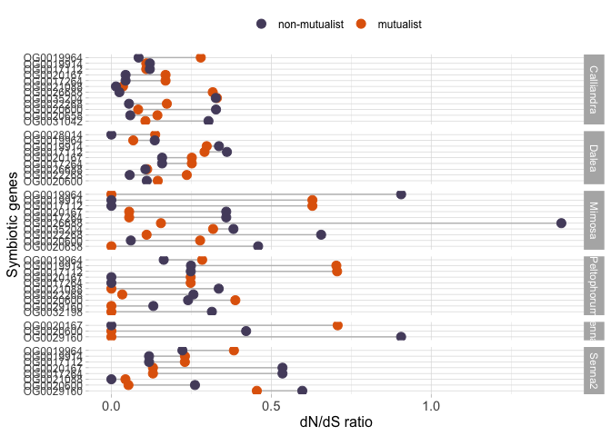<!-- -->

``` r
sym_plot_pl2
```

    ## # A tibble: 52 × 8
    ## # Groups:   Pair [6]
    ##    Pair  Transition     Gene           M      F    minus    Diff Pair2     
    ##    <chr> <chr>          <chr>      <dbl>  <dbl>    <dbl>   <dbl> <chr>     
    ##  1 c     mutualism loss OG0035204 0.330  0.327   0.00353 0.00353 Calliandra
    ##  2 b     mutualism loss OG0026688 0.112  0.106   0.00565 0.00565 Dalea     
    ##  3 c     mutualism loss OG0017112 0.109  0.120  -0.0113  0.0113  Calliandra
    ##  4 c     mutualism loss OG0019914 0.109  0.121  -0.0113  0.0113  Calliandra
    ##  5 c     mutualism loss OG0021088 0.0365 0.0144  0.0220  0.0220  Calliandra
    ##  6 b     mutualism loss OG0020600 0.145  0.111   0.0344  0.0344  Dalea     
    ##  7 b     mutualism loss OG0019914 0.298  0.336  -0.0382  0.0382  Dalea     
    ##  8 e     mutualism gain OG0021088 0.0441 0.0001  0.0440  0.0440  Senna2    
    ##  9 a     mutualism loss OG0035204 0.318  0.382  -0.0637  0.0637  Mimosa    
    ## 10 b     mutualism loss OG0019964 0.0685 0.136  -0.0672  0.0672  Dalea     
    ## # ℹ 42 more rows

``` r
popplot_power<- sym_plot_pl2 %>%
  filter(Pair2=="Calliandra") %>%
  ggplot() + 
  geom_segment(aes(x=fct_reorder(Gene, minus), y=M, xend=Gene, yend=F), color="grey") + 
  geom_point(aes(x=Gene, y=M, color="M"), size=7) + 
  geom_point(aes(x=Gene, y=F, color="F"), size=7) + 
  scale_color_manual(labels=c("non-mutualist", "mutualist"), values=c(non_col[2], mut_col[4]))+
  coord_flip() + 
  facet_grid(rows = vars(Pair2)) +
  (xlab("Symbiotic genes"))+
  (ylab("dN/dS ratio"))+
  theme_light() + 
  theme(axis.title = element_text(size=23), 
        axis.text.y= element_text(size=20), 
        axis.text.x= element_text(size=20),
        legend.title = element_blank(),
        panel.background = element_rect(fill='transparent'),
        legend.position = "top",
        plot.background = element_rect(fill='transparent', color=NA),
        legend.text=element_text(size=20),
        #panel.grid = element_blank(),
        panel.border = element_blank(), 
        aspect.ratio=1.2
  )
popplot_power
```

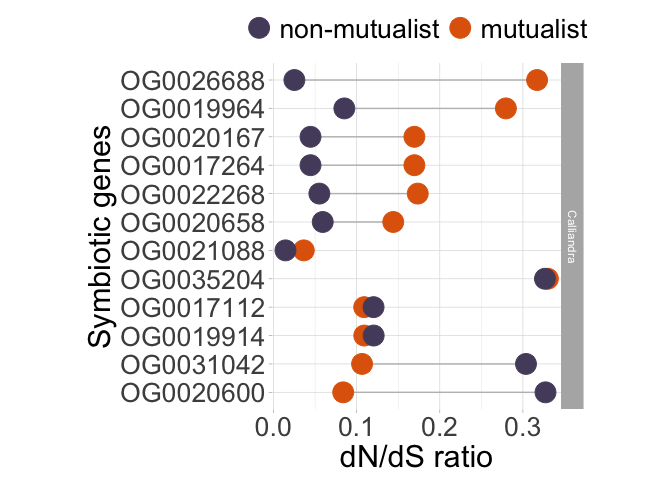<!-- -->

## Two ratio model analysis in subset of pairs

Instead of a free-ratio model, here we are analyzing mutualists and
non-mutualists as two categories. These analyses are only performed on
the species pairs that represent a loss of mutualism. These species also
share other similar life history traits.

``` r
# These include both losses and gains 
# Only going to include the loss species because they have lots of similarities in other life history traits 
plant_2ratio<-read_csv("TwoRateCombo_clean.csv") # dataset 
```

    ## Rows: 3462 Columns: 8
    ## ── Column specification ────────────────────────────────────────────────────────
    ## Delimiter: ","
    ## chr (7): Code, Gene, Estimate, Species, Mutualist, Pair, Transition
    ## dbl (1): dnds
    ## 
    ## ℹ Use `spec()` to retrieve the full column specification for this data.
    ## ℹ Specify the column types or set `show_col_types = FALSE` to quiet this message.

``` r
# Change the dnds ratio to a numeric value 
plant_2ratio <- plant_2ratio %>%
  mutate(dnds=as.numeric(dnds))

plant_2ratio %>%
  group_by(Gene) %>%
  tally()
```

    ## # A tibble: 300 × 2
    ##    Gene          n
    ##    <chr>     <int>
    ##  1 OG0019756    12
    ##  2 OG0019764    12
    ##  3 OG0019780     6
    ##  4 OG0019782    12
    ##  5 OG0019804    12
    ##  6 OG0019805    12
    ##  7 OG0019810    12
    ##  8 OG0019818    12
    ##  9 OG0019826     6
    ## 10 OG0019849    12
    ## # ℹ 290 more rows

``` r
# 300 genes total 

# Remove abnormally high dnds values 
high_gene<-plant_2ratio %>%
  filter(dnds>=10) %>%
  dplyr::select(Gene) %>%
  distinct(Gene)
# high_gene # 15 genes that are too high

plant_2ratio2<-plant_2ratio %>%
  filter(!Gene %in% high_gene$Gene)
plant_2ratio2 %>%
  filter(dnds>=10) # double check 
```

    ## # A tibble: 0 × 8
    ## # ℹ 8 variables: Code <chr>, dnds <dbl>, Gene <chr>, Estimate <chr>,
    ## #   Species <chr>, Mutualist <chr>, Pair <chr>, Transition <chr>

``` r
# Check the number of genes 
plant_2ratio2 %>%
  group_by(Gene) %>%
  tally() # 277 genes 
```

    ## # A tibble: 285 × 2
    ##    Gene          n
    ##    <chr>     <int>
    ##  1 OG0019756    12
    ##  2 OG0019764    12
    ##  3 OG0019780     6
    ##  4 OG0019782    12
    ##  5 OG0019804    12
    ##  6 OG0019805    12
    ##  7 OG0019810    12
    ##  8 OG0019818    12
    ##  9 OG0019826     6
    ## 10 OG0019849    12
    ## # ℹ 275 more rows

``` r
# Run the wilcoxon tests 
will_function2<- function(pair){
  
  # Subset each pair 
plantb<- plant_2ratio2 %>%
  filter(Pair==pair)
  
  # Make list of genes without missing data 
genesb<-plantb %>%
  filter(!is.na(dnds)) %>%
  group_by(Gene) %>%
  tally() %>%
  filter(n==2)
  
genesb_list<-data.frame(Gene=genesb$Gene)

  # Keep only new genes 
plantb_new<- plantb %>%
  semi_join(genesb_list, by="Gene")

# Make into the right data format
plantb_new2<-plantb_new %>%
  select(Gene, Mutualist, dnds) %>%
  pivot_wider(names_from = Mutualist, values_from = dnds) 

# Run the paired test 
# In this example, the differences is calculated F-M
# And this is a mutualism gain so the direction is correct 
pairb_test<-wilcox.test(plantb_new2$F, plantb_new2$M, paired=TRUE)
return(pairb_test)

} 

gene_count2<- function(pair){
    # Subset each pair 
plantb<- plant_2ratio2 %>%
  filter(Pair==pair)
  
  # Make list of genes without missing data 
genesb<-plantb %>%
  filter(!is.na(dnds)) %>%
  group_by(Gene) %>%
  tally() %>%
  filter(n==2)
return(genesb)
}

will_function_dir<- function(pair){
  
  # Subset each pair 
plantb<- plant_2ratio2 %>%
  filter(Pair==pair)
  
  # Make list of genes without missing data 
genesb<-plantb %>%
  filter(!is.na(dnds)) %>%
  group_by(Gene) %>%
  tally() %>%
  filter(n==2)
  
genesb_list<-data.frame(Gene=genesb$Gene)

  # Keep only new genes 
plantb_new<- plantb %>%
  semi_join(genesb_list, by="Gene")

# Make into the right data format
plantb_new2<-plantb_new %>%
  select(Gene, Mutualist, dnds) %>%
  pivot_wider(names_from = Mutualist, values_from = dnds) 

# Run the paired test 
# In this example, the differences is calculated F-M
# And this is a mutualism gain so the direction is correct 
# Greater and sig means free is greater than M 
pairb_test<-wilcox.test(plantb_new2$M, plantb_new2$F, paired=TRUE, alternative="less")
return(pairb_test)

}

# All pairs will be the same so can just run one 
will_function2("a") # sig! loss
```

    ## 
    ##  Wilcoxon signed rank test with continuity correction
    ## 
    ## data:  plantb_new2$F and plantb_new2$M
    ## V = 16102, p-value = 0.04662
    ## alternative hypothesis: true location shift is not equal to 0

``` r
will_function_dir("a") # For free greater not sig, and for free less than mut sig! 
```

    ## 
    ##  Wilcoxon signed rank test with continuity correction
    ## 
    ## data:  plantb_new2$M and plantb_new2$F
    ## V = 21299, p-value = 0.9767
    ## alternative hypothesis: true location shift is less than 0

``` r
gene_count2("a") # 273 genes 
```

    ## # A tibble: 273 × 2
    ##    Gene          n
    ##    <chr>     <int>
    ##  1 OG0019756     2
    ##  2 OG0019764     2
    ##  3 OG0019782     2
    ##  4 OG0019804     2
    ##  5 OG0019805     2
    ##  6 OG0019810     2
    ##  7 OG0019818     2
    ##  8 OG0019849     2
    ##  9 OG0019850     2
    ## 10 OG0019851     2
    ## # ℹ 263 more rows

## Plot the two-ratio values

``` r
# Change labels 
plant_2ratio2<-plant_2ratio2 %>%
  mutate_if(is.character, 
                str_replace_all, pattern = "_", replacement = " ")

# Boxplot plot  
plant_2ratio2_simple <- plant_2ratio2%>%
  filter(Pair=="f" | Pair=="a") %>%
  mutate_at("Transition", str_replace, "gain", "mutualism gain") %>%
  mutate_at("Transition", str_replace, "loss", "mutualism loss")
plant_2ratio2_simple
```

    ## # A tibble: 1,096 × 8
    ##    Code                   dnds Gene  Estimate Species Mutualist Pair  Transition
    ##    <chr>                 <dbl> <chr> <chr>    <chr>   <chr>     <chr> <chr>     
    ##  1 Mimosa grahamii      0.302  OG00… loss     Mimosa… F         a     mutualism…
    ##  2 Mimosa aculeaticarpa 0.181  OG00… loss     Mimosa… M         a     mutualism…
    ##  3 Mimosa grahamii      0.157  OG00… loss     Mimosa… F         a     mutualism…
    ##  4 Mimosa aculeaticarpa 0.144  OG00… loss     Mimosa… M         a     mutualism…
    ##  5 Mimosa grahamii      0.184  OG00… loss     Mimosa… F         a     mutualism…
    ##  6 Mimosa aculeaticarpa 0.168  OG00… loss     Mimosa… M         a     mutualism…
    ##  7 Mimosa grahamii      0.0605 OG00… loss     Mimosa… F         a     mutualism…
    ##  8 Mimosa aculeaticarpa 0.127  OG00… loss     Mimosa… M         a     mutualism…
    ##  9 Mimosa aculeaticarpa 0.195  OG00… loss     Mimosa… M         a     mutualism…
    ## 10 Mimosa grahamii      0.391  OG00… loss     Mimosa… F         a     mutualism…
    ## # ℹ 1,086 more rows

``` r
# Plot just the loss category with similar habitats 
two_box<-plant_2ratio2_simple %>%
  filter(Estimate=="loss") %>%
  ggplot(aes(x=Mutualist, y=dnds, fill=Mutualist))+ 
  geom_boxplot(outlier.shape=NA) + # To remove the outliers
  scale_y_continuous(limits = c(0, 0.57)) +
  ggsignif::geom_signif(annotations ="*", y_position = c(0.5), xmin = c(1), xmax =c(2), tip_length = 0) +
  (ylab("dN/dS ratio"))+
  (xlab(""))+
  scale_fill_manual(labels=c("non-symbiotic", "mutualist"), values=c(non_col[2],mut_col[4]))+
  scale_x_discrete(labels=c("F" = "non-symbiotic", "M" = "mutualist"))+
  theme_light() + 
  theme(axis.title = element_text(size=10), 
        axis.text.y= element_text(size=10), 
        axis.text.x= element_text(size=10), 
        legend.title = element_blank(), 
        legend.position= "none",
        panel.grid = element_blank(),
        panel.border = element_blank(),
        legend.text=element_text(size=10),
        axis.line.x = element_line(color="grey", size = 0.5),
        axis.line.y = element_line(color="grey", size = 0.5),
        aspect.ratio = 1.3
        )
two_box
```

    ## Warning: Removed 15 rows containing non-finite outside the scale range
    ## (`stat_boxplot()`).

    ## Warning: Removed 15 rows containing non-finite outside the scale range
    ## (`stat_signif()`).

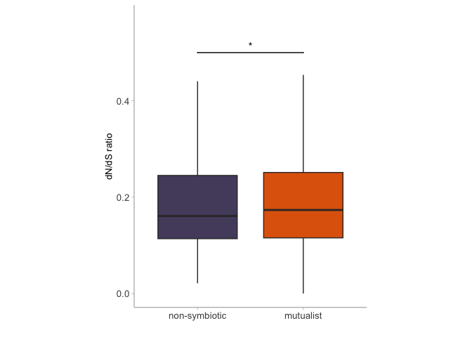<!-- -->

## Genes under positive selection in two-rate models

``` r
pos_genes<-plant_2ratio2_simple %>%
  dplyr::select(Mutualist, Transition, Gene, dnds) %>%
  pivot_wider(names_from=Mutualist, values_from=dnds) %>%
  filter(M > 1 | F >1 ) %>%
  filter(M<10 & F<10) %>%
  mutate(minus=M-F) %>%
  mutate(Diff=abs(minus)) %>% 
  arrange(Diff) 

pos_genes1<- pos_genes%>%
  filter(Transition=="mutualism loss")

# Plot the lollipop plot 
pos2plot<- ggplot(pos_genes1) + 
  geom_segment(aes(x=fct_reorder(Gene, M), y=M, xend=Gene, yend=F), color="grey") + 
  geom_point(aes(x=Gene, y=M, color="M"), size=3.2) + 
  geom_point(aes(x=Gene, y=F, color="F"), size=3.2) + 
  geom_hline(yintercept=1, linetype="dashed") + 
  scale_color_manual(labels=c("non-mutualist", "mutualist"), values=c(non_col[2], mut_col[4]))+
  coord_flip() + 
  (xlab("Significant genes"))+
  (ylab("dN/dS ratio"))+
  labs(tag = "(b)") +
  theme_light() + 
  theme(axis.title = element_text(size=10), 
        axis.text.y= element_text(size=10), 
        axis.text.x= element_text(size=10),
        legend.title = element_blank(),
        legend.position = "top",
        legend.text=element_text(size=9),
        panel.border = element_blank()
  )
pos2plot
```

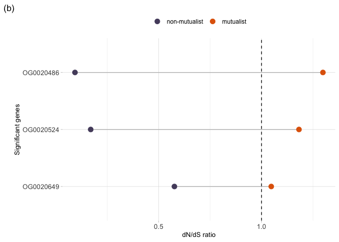<!-- -->

## Symbiotic genes in two rate models

Take the two rate model and get the sym genes

``` r
# Filter data for sym genes 
sym2w <- plant_2ratio2_simple %>%
  filter(Gene %in% sym_genes$Gene)
# sym2w # 18 rows 

sym2w_pop <- sym2w %>%
  dplyr::select(Mutualist, Transition, Gene, dnds) %>%
  pivot_wider(names_from=Mutualist, values_from=dnds) 

# Prep the dataset 
sym_plot <- sym2w_pop %>%
  mutate(minus=M-F) %>%
  mutate(Diff=abs(minus)) %>% 
  arrange(Diff) 

# Labels 
names2<- c(
  "gain" = "mutualism gain",
  "loss" = "mutualism loss"
)

# Plot the lollipop plot 
symloss<- sym_plot %>% 
  filter(Transition=="mutualism loss")

symloss_plot<-  ggplot(symloss) + 
  geom_segment(aes(x=fct_reorder(Gene, minus), y=M, xend=Gene, yend=F), color="grey") + 
  geom_point(aes(x=Gene, y=M, color="M"), size=3.2) + 
  geom_point(aes(x=Gene, y=F, color="F"), size=3.2) + 
  scale_color_manual(labels=c("non-mutualist", "mutualist"), values=c(non_col[2],mut_col[4]))+
  coord_flip() + 
  (xlab("Symbiotic genes"))+
  labs(tag = "(c)") +
  (ylab("dN/dS ratio"))+
  theme_light() + 
  theme(axis.title = element_text(size=10), 
        axis.text.y= element_text(size=10), 
        axis.text.x= element_text(size=10),
        legend.title = element_blank(),
        legend.position = "none",
        legend.text=element_text(size=9),
        #panel.grid = element_blank(),
        panel.border = element_blank()
  )

# Merge with the other two rate result 
two_box<-plant_2ratio2_simple %>%
  filter(Estimate=="loss") %>%
  ggplot(aes(x=Mutualist, y=dnds, fill=Mutualist))+ 
  geom_boxplot(outlier.shape=NA) + # To remove the outliers
  scale_y_continuous(limits = c(0, 0.57)) +
  ggsignif::geom_signif(annotations ="*", y_position = c(0.5), xmin = c(1), xmax =c(2), tip_length = 0) +
  (ylab("dN/dS ratio"))+
  (xlab(""))+
  scale_fill_manual(labels=c("non-mutualist", "mutualist"), values=c(non_col[2],mut_col[4]))+
  scale_x_discrete(labels=c("F" = "non-mutualist", "M" = "mutualist"))+
  theme_light() + 
  labs(tag = "(a)") +
  theme(axis.title = element_text(size=10), 
        axis.text.y= element_text(size=10), 
        axis.text.x= element_text(size=8.7), 
        legend.title = element_blank(), 
        legend.position= "none",
        panel.grid = element_blank(),
        panel.border = element_blank(),
        legend.text=element_text(size=10),
        axis.line.x = element_line(color="grey", size = 0.5),
        axis.line.y = element_line(color="grey", size = 0.5)
        )

# Merge the plots 
tworate_plot<- ggarrange(two_box, symloss_plot,
                    labels=c("(a)", "(b)"), 
                    ncol = 2, nrow=1,
                    hjust=0.1,
                    common.legend=FALSE 
                    )
```

    ## Warning: Removed 15 rows containing non-finite outside the scale range
    ## (`stat_boxplot()`).

    ## Warning: Removed 15 rows containing non-finite outside the scale range
    ## (`stat_signif()`).

``` r
library(gridExtra)
```

    ## 
    ## Attaching package: 'gridExtra'

    ## The following object is masked from 'package:dplyr':
    ## 
    ##     combine

``` r
grid.arrange(two_box, pos2plot, symloss_plot,
             ncol=3, nrow=2, 
             layout_matrix=rbind(c(1,2,2),
                                 c(1,3,3)))
```

    ## Warning: Removed 15 rows containing non-finite outside the scale range
    ## (`stat_boxplot()`).
    ## Removed 15 rows containing non-finite outside the scale range
    ## (`stat_signif()`).

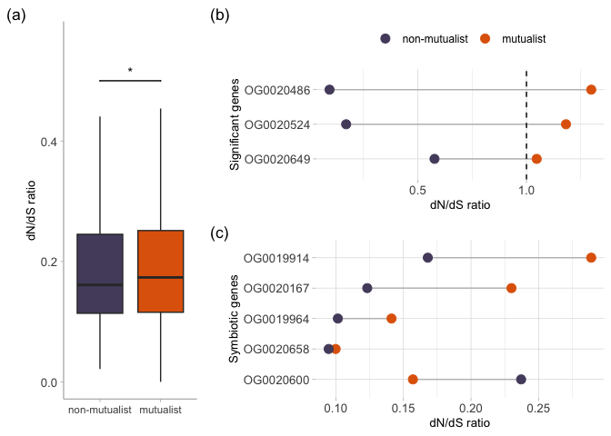<!-- -->

## Plot the tree with the traits for visualization

Here plot the main Zanne tree with the traits on it Only label the
species in our dataset Two species won’t have their pair because it was
from a different phylogeny that was on a smaller but more detailed tree

``` r
# Load the tree 
lpwg_tree<-read.newick("LPWG_2018_newick_spp.txt")
# 3842 tips 

# Load the data 
lpwg_data<-read_csv("LPWG_2018_data.csv")
```

    ## New names:
    ## Rows: 3842 Columns: 14
    ## ── Column specification
    ## ──────────────────────────────────────────────────────── Delimiter: "," chr
    ## (6): Species, Order, Family, Fixer, invasive, mutualist dbl (8): ...1,
    ## num_introduced, total_area_introduced, total_area_native, lat...
    ## ℹ Use `spec()` to retrieve the full column specification for this data. ℹ
    ## Specify the column types or set `show_col_types = FALSE` to quiet this message.
    ## • `` -> `...1`

``` r
# lpwg_data #3842 data rows 
lpwg_data2<- lpwg_data %>%
  mutate(Fixer=as.factor(Fixer)) %>%
  filter(!is.na(Fixer)) %>%
  filter(!is.na(lat_native))

# Prune tree for tips with data 
spp_prune<-lpwg_data2$Species
pruned_tree<-drop.tip(lpwg_tree,lpwg_tree$tip.label[-match(spp_prune, lpwg_tree$tip.label)])
# pruned_tree # 1104 tips 

# Save the tree 
plant_tree<- ggtree(pruned_tree, layout="fan", open.angle=10)
```

    ## Scale for y is already present.
    ## Adding another scale for y, which will replace the existing scale.

### Customize the plot of the tree

Add the

``` r
# Prep the data 
lpwg_data3<-lpwg_data2 %>%
  mutate(mutualist=case_when(Fixer=="Yes" ~ "mutualist",
                             Fixer=="No" ~ "non-mutualist")) %>% 
  dplyr::select(Species, mutualist)

lpwg_data2 %>% # 1154 total 
  filter(Fixer=="Yes") #987 
```

    ## # A tibble: 987 × 14
    ##     ...1 Species         Order Family Fixer num_introduced total_area_introduced
    ##    <dbl> <chr>           <chr> <chr>  <fct>          <dbl>                 <dbl>
    ##  1     4 Abarema_brachy… Faba… Fabac… Yes                0                     0
    ##  2     6 Abarema_cochle… Faba… Fabac… Yes                0                     0
    ##  3     9 Abarema_florib… Faba… Fabac… Yes                0                     0
    ##  4    11 Abarema_jupunba Faba… Fabac… Yes                0                     0
    ##  5    16 Abarema_macrad… Faba… Fabac… Yes                0                     0
    ##  6    19 Abarema_piresii Faba… Fabac… Yes                0                     0
    ##  7    20 Abarema_turbin… Faba… Fabac… Yes                0                     0
    ##  8    24 Abrus_precator… Faba… Fabac… Yes                4          148000000000
    ##  9    27 Acacia_alata    Faba… Fabac… Yes                0                     0
    ## 10    28 Acacia_amplice… Faba… Fabac… Yes                0                     0
    ## # ℹ 977 more rows
    ## # ℹ 7 more variables: total_area_native <dbl>, lat_native <dbl>,
    ## #   abs_lat_native <dbl>, annual <dbl>, uses_num_uses <dbl>, invasive <chr>,
    ## #   mutualist <chr>

``` r
lpwg_data2 %>% # 1154 total 
  filter(Fixer=="No") #167 
```

    ## # A tibble: 167 × 14
    ##     ...1 Species         Order Family Fixer num_introduced total_area_introduced
    ##    <dbl> <chr>           <chr> <chr>  <fct>          <dbl>                 <dbl>
    ##  1    96 Acrocarpus_fra… Faba… Fabac… No                 5         6430000000000
    ##  2   212 Aldina_heterop… Faba… Fabac… No                 0                     0
    ##  3   219 Alexa_grandifl… Faba… Fabac… No                 0                     0
    ##  4   228 Amblygonocarpu… Faba… Fabac… No                 0                     0
    ##  5   305 Apuleia_leioca… Faba… Fabac… No                 0                     0
    ##  6   453 Baikiaea_insig… Faba… Fabac… No                 2          256000000000
    ##  7   457 Balsamocarpon_… Faba… Fabac… No                 0                     0
    ##  8   467 Baphiopsis_par… Faba… Fabac… No                 0                     0
    ##  9   472 Batesia_florib… Faba… Fabac… No                 0                     0
    ## 10   475 Bauhinia_acrea… Faba… Fabac… No                 0                     0
    ## # ℹ 157 more rows
    ## # ℹ 7 more variables: total_area_native <dbl>, lat_native <dbl>,
    ## #   abs_lat_native <dbl>, annual <dbl>, uses_num_uses <dbl>, invasive <chr>,
    ## #   mutualist <chr>

``` r
# Tree and collapse 
p <- ggtree(pruned_tree, layout="circular", branch.length = "none", open.angle=10, size=0.1) %<+% lpwg_data3
p3<- scaleClade(p, 1459, 0.02) %>% collapse(1459, 'min', fill=mut_col[4]) 

# Prep data 
data1<-plant_dnds %>%
  dplyr::select(Species, Mutualist) %>%
  distinct()

lpwg_data4<-lpwg_data3 %>%
  mutate(Size=ifelse(Species %in% data1$Species, 0.8, 0.1)) %>%
  mutate(Mutualist=ifelse(mutualist=="mutualist", "M", "F")) %>%
  filter(!is.na(Mutualist)) %>%
  dplyr::select(Species, Mutualist, Size) %>%
  mutate(Shape=ifelse(Species %in% data1$Species, "Y", "N"))

lpwg_data5<-lpwg_data3 %>%
  mutate(Size=ifelse(Species %in% data1$Species, 3, 0.1)) %>%
  mutate(Mutualist=ifelse(mutualist=="mutualist", "M", "F")) %>%
  filter(!is.na(Mutualist)) %>%
  dplyr::select(Species, Mutualist, Size) %>%
  mutate(Shape=ifelse(Species %in% data1$Species, "Y", "N"))

# Prep the data 
p4 <- ggtree(pruned_tree, aes(color=mutualist, size=2), layout="circular", branch.length = "none", open.angle=10, size=0.1) %<+% lpwg_data3 
p4
```

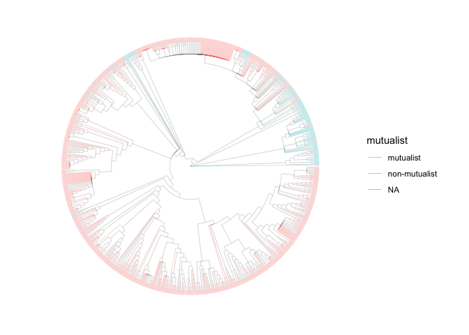<!-- -->

``` r
p5 <- scaleClade(p4, 1459, 0.02) %>% collapse(1459, 'min', fill=mut_col[4]) 

# Plot the tree 
plant_tree <- p5 %<+% lpwg_data5 + 
  geom_tree(size=0.8) + # Change thickness of the lines 
  geom_tiplab(aes(color=mutualist, align=TRUE,geom = "text", subset=c(label %in% c('Dalea_mollis', 'Dalea_mollissima', 'Senna_didymobotrya', 'Senna_italica', 'Peltophorum_africanum', 'Peltophorum_dubium', 'Senna_occidentalis', 'Senna_barclayana', 'Mimosa_aculeaticarpa', 'Calliandra_eriophylla'))), size=2, offset=1.3) + # Change labels and size, alignment 
  scale_color_manual(values=c(mut_col[4], non_col[2]), na.value="lightgrey", breaks = c("mutualist", "non-mutualist"))+
  #scale_color_manual(values=c(mut_col[4], non_col[2]))+
  geom_star(mapping=aes(fill=Mutualist, size=Size, starshape=Shape), position="identity",starstroke=0.3) + # For the species in the dataset 
  scale_fill_manual(values=c(non_col[2], mut_col[4])) + # Colour for mutualist and non-mutualists
  scale_starshape_manual(values=c(15, 1)) + 
  scale_size_continuous(range = c(0, 3.2)) +
  guides(size = FALSE, fill= FALSE, starshape=FALSE) +
  guides(color = guide_legend(override.aes = list(size=4))) + 
  theme(legend.title = element_blank(), 
        legend.text=element_text(size=12),
        legend.position="top"
        )
```

    ## Warning: The `<scale>` argument of `guides()` cannot be `FALSE`. Use "none" instead as
    ## of ggplot2 3.3.4.
    ## This warning is displayed once every 8 hours.
    ## Call `lifecycle::last_lifecycle_warnings()` to see where this warning was
    ## generated.

``` r
plant_tree
```

    ## Warning: Removed 1211 rows containing missing values or values outside the scale range
    ## (`geom_star()`).

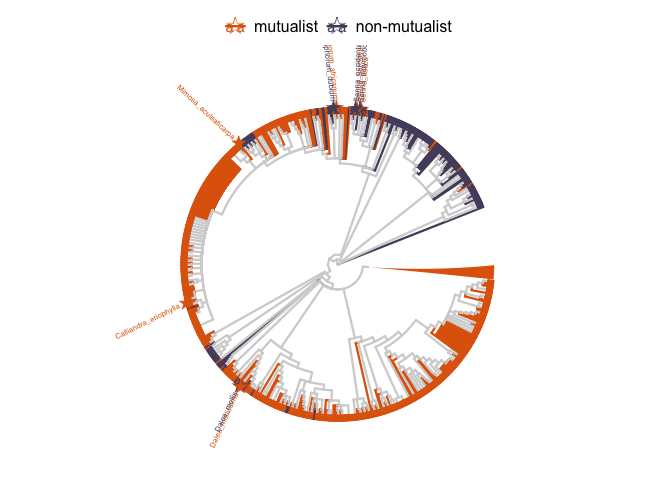<!-- -->

## Invasion tests

Test the impact of invasion status on rates of molecular evolution.

``` r
# Colour scheme 
inv_col<-park_palette("Yosemite")
inv_col2<-park_palette("Yellowstone")

# Put in the invasion data from PAML two rate model 
invasion_data<-read_csv("invasionrates_new.csv")
```

    ## Rows: 3324 Columns: 7
    ## ── Column specification ────────────────────────────────────────────────────────
    ## Delimiter: ","
    ## chr (6): Code, Gene, Species, Mutualist, Pair, Transition
    ## dbl (1): dnds
    ## 
    ## ℹ Use `spec()` to retrieve the full column specification for this data.
    ## ℹ Specify the column types or set `show_col_types = FALSE` to quiet this message.

``` r
invasion_data2<- invasion_data %>%
  filter(dnds<10) %>%
  filter(Species=="Dalea_mollis" | Species=="Senna_occidentalis") %>%
  mutate(Invasive=case_when(Species=="Dalea_mollis" ~ "N", 
                            Species=="Senna_occidentalis" ~ "Y")) %>%
  mutate(new_pair=case_when(Species=="Dalea_mollis" ~ "test", 
                            Species=="Senna_occidentalis" ~ "test"))

invasion_data2 %>% 
  group_by(Gene) %>%
  tally() %>%
  filter(n==2)
```

    ## # A tibble: 277 × 2
    ##    Gene          n
    ##    <chr>     <int>
    ##  1 OG0019756     2
    ##  2 OG0019764     2
    ##  3 OG0019782     2
    ##  4 OG0019804     2
    ##  5 OG0019805     2
    ##  6 OG0019810     2
    ##  7 OG0019818     2
    ##  8 OG0019849     2
    ##  9 OG0019850     2
    ## 10 OG0019851     2
    ## # ℹ 267 more rows

``` r
# Plot the new ratios 
  ggplot(invasion_data2, aes(x=Invasive, y=dnds, fill=Invasive)) + 
  geom_boxplot(outlier.shape = NA) +
  scale_fill_manual(values=c(inv_col2[2], inv_col[2])) +
  scale_y_continuous(limits = c(0, 1)) +
  ylab("dN/dS ratio") + 
  ggsignif::geom_signif(annotations ="*", y_position = c(0.65), xmin = c(1), xmax =c(2), tip_length = 0) +
  scale_x_discrete(labels=c("Y" = "invasive", "N" = "non-invasive"))+
  xlab("") +
  theme_light() + 
  theme(axis.title = element_text(size=10), 
        axis.text.y= element_text(size=10), 
        axis.text.x= element_text(size=10), 
        legend.title = element_blank(), 
        legend.text=element_text(size=9),
        panel.border = element_blank(),
        panel.grid = element_blank(),
        legend.position="none",
        #strip.text.x = element_blank(),
        strip.text.y = element_text(size = 23),
        axis.line.x = element_line(color="grey", size = 0.5),
        axis.line.y = element_line(color="grey", size = 0.5),
        strip.background = element_blank(), 
        aspect.ratio=1.2
        )
```

    ## Warning: Removed 4 rows containing non-finite outside the scale range
    ## (`stat_boxplot()`).

    ## Warning: Removed 4 rows containing non-finite outside the scale range
    ## (`stat_signif()`).

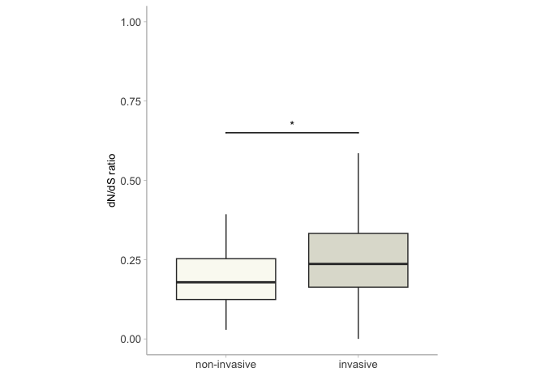<!-- -->

``` r
# Run a linear model to test for differences
# May have to limit dnds ratios to under 2 in order to fit model assumptions 
plant_dnds2_meta_lim<-plant_dnds2_meta %>%
  filter(dnds<2) %>%
  mutate(Species==as.factor(Species))

# Run the model 
mod_invasion=lmer((dnds)~Invasive+Mutualist+Human+Ploidy+(1|Pair/Species), data=plant_dnds2_meta_lim)
```

    ## boundary (singular) fit: see help('isSingular')

``` r
plot(mod_invasion) # not a great fit but better than transformed 
```

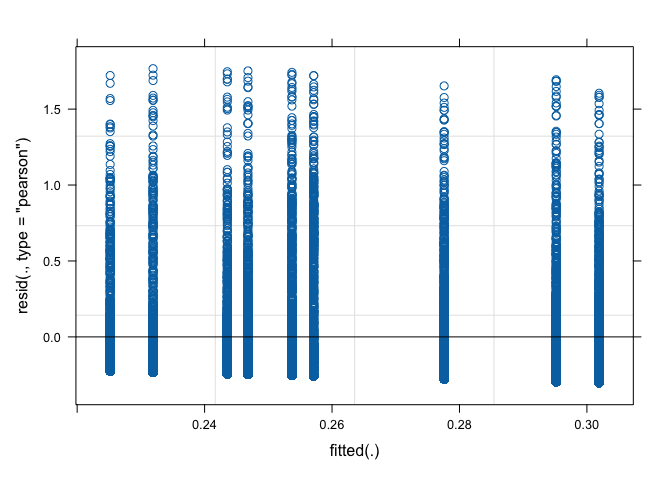<!-- -->

``` r
summary(mod_invasion)
```

    ## Linear mixed model fit by REML ['lmerMod']
    ## Formula: (dnds) ~ Invasive + Mutualist + Human + Ploidy + (1 | Pair/Species)
    ##    Data: plant_dnds2_meta_lim
    ## 
    ## REML criterion at convergence: 9948.1
    ## 
    ## Scaled residuals: 
    ##     Min      1Q  Median      3Q     Max 
    ## -0.8580 -0.6922 -0.3604  0.2304  5.0216 
    ## 
    ## Random effects:
    ##  Groups       Name        Variance  Std.Dev.
    ##  Species:Pair (Intercept) 0.0000000 0.00000 
    ##  Pair         (Intercept) 0.0009898 0.03146 
    ##  Residual                 0.1237275 0.35175 
    ## Number of obs: 13234, groups:  Species:Pair, 9; Pair, 6
    ## 
    ## Fixed effects:
    ##              Estimate Std. Error t value
    ## (Intercept)  0.259363   0.024477  10.596
    ## InvasiveY    0.018733   0.039651   0.472
    ## MutualistM  -0.006731   0.009627  -0.699
    ## Human       -0.002493   0.003920  -0.636
    ## PloidyP      0.001072   0.039956   0.027
    ## 
    ## Correlation of Fixed Effects:
    ##            (Intr) InvsvY MtlstM Human 
    ## InvasiveY   0.046                     
    ## MutualistM -0.339 -0.077              
    ## Human      -0.257 -0.293  0.605       
    ## PloidyP    -0.531 -0.682 -0.033  0.011
    ## optimizer (nloptwrap) convergence code: 0 (OK)
    ## boundary (singular) fit: see help('isSingular')

``` r
Anova(mod_invasion, type=3, singular.ok = T)
```

    ## Analysis of Deviance Table (Type III Wald chisquare tests)
    ## 
    ## Response: (dnds)
    ##                Chisq Df Pr(>Chisq)    
    ## (Intercept) 112.2829  1     <2e-16 ***
    ## Invasive      0.2232  1     0.6366    
    ## Mutualist     0.4889  1     0.4844    
    ## Human         0.4046  1     0.5247    
    ## Ploidy        0.0007  1     0.9786    
    ## ---
    ## Signif. codes:  0 '***' 0.001 '**' 0.01 '*' 0.05 '.' 0.1 ' ' 1

``` r
# What to do about Species? For PGLS will have to calculate an average but that method will lose some detail  

# Paired Wilcoxon test function 
inv_function<- function(pair){
  
  # Subset each pair 
plantb<- invasion_data2%>%
  filter(new_pair==pair)
  
  # Make list of genes without missing data 
genesb<-plantb%>%
  filter(!is.na(dnds))%>%
  group_by(Gene)%>%
  tally() %>%
  filter(n==2)
  
genesb_list<-data.frame(Gene=genesb$Gene)

  # Keep only new genes 
plantb_new<- plantb%>%
  semi_join(genesb_list, by="Gene")

# Make into the right data format
plantb_new2<-plantb_new %>%
  select(Gene, Invasive, dnds) %>%
  pivot_wider(names_from = Invasive, values_from = dnds) 

# Run the paired test 
# In this example, the differences is calculated F-M
# And this is a mutualism gain so the direction is correct 
pairb_test<-wilcox.test(plantb_new2$N, plantb_new2$Y, paired=TRUE)
return(pairb_test)

} 

# Function for counting genes in the analysis 
inv_gene_count<- function(pair){
    # Subset each pair 
plantb<- invasion_data2%>%
  filter(new_pair==pair)
  
  # Make list of genes without missing data 
genesb<-plantb%>%
  filter(!is.na(dnds))%>%
  group_by(Gene)%>%
  tally() %>%
  filter(n==2)
return(genesb)
}

# Run the analysis on the data 
inv_function(pair="test")
```

    ## 
    ##  Wilcoxon signed rank test with continuity correction
    ## 
    ## data:  plantb_new2$N and plantb_new2$Y
    ## V = 7742, p-value < 2.2e-16
    ## alternative hypothesis: true location shift is not equal to 0

``` r
# sig V=30761 p <0.0001 inv-non
# V=7742 non greater than inv 
inv_gene_count(pair="test") # 277 genes 
```

    ## # A tibble: 277 × 2
    ##    Gene          n
    ##    <chr>     <int>
    ##  1 OG0019756     2
    ##  2 OG0019764     2
    ##  3 OG0019782     2
    ##  4 OG0019804     2
    ##  5 OG0019805     2
    ##  6 OG0019810     2
    ##  7 OG0019818     2
    ##  8 OG0019849     2
    ##  9 OG0019850     2
    ## 10 OG0019851     2
    ## # ℹ 267 more rows

## Linear models

Here are the linear mixed models performed on all the genes across all
species at Matt Pennell’s request. This test will have sooooooo much
POWER!

The raw data does not fit the models well. Unclear if we should
transform the dnds values. Other problems are that the model outputs
results that are different than our wilcoxon tests.

``` r
# Prep the dataset 
mixeddata<-plant_dnds2_meta %>%
  mutate(Mutualist=as.factor(Mutualist)) %>%
  mutate(Pair=as.factor(Pair)) %>%
  mutate(Gene=as.factor(Gene)) %>%
  mutate(Transition=as.factor(Transition)) %>%
  mutate(Invasive=as.factor(Invasive)) %>%
  mutate(Ploidy=as.factor(Ploidy))

# Build the model 
# Need random terms to account for the paired design and go gene by gene 
# Mutualist is fixed effect and species pair and the gene are random effects 
model1<-lmer(dnds ~ Mutualist + Ploidy + (1|Pair) + (1|Gene), data=mixeddata)

# Check the model 
plot(model1)
```

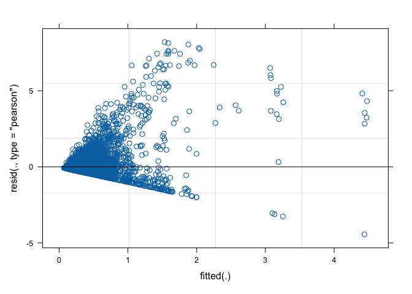<!-- -->

``` r
qqnorm(resid(model1))
qqline(resid(model1))
```

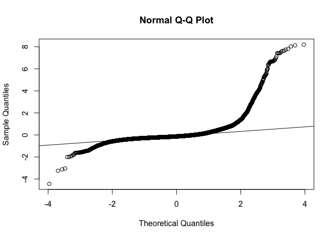<!-- -->

``` r
plot(fitted(model1), sqrt(abs(resid(model1))), main="Scale-location")
```

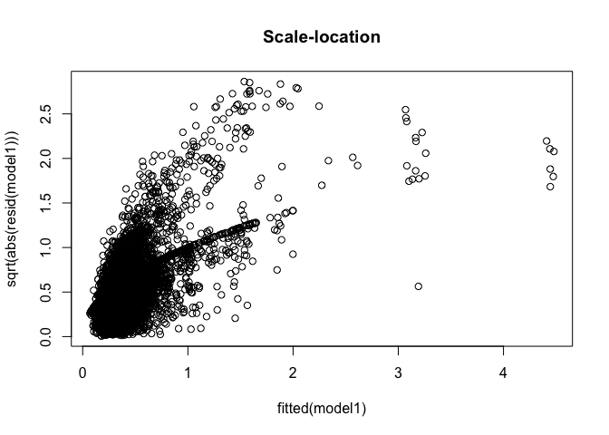<!-- -->

``` r
# Quite messy, not sure whether transforming dnds ratios seem like the right thing to do 

# Check significance 
summary(model1)
```

    ## Linear mixed model fit by REML ['lmerMod']
    ## Formula: dnds ~ Mutualist + Ploidy + (1 | Pair) + (1 | Gene)
    ##    Data: mixeddata
    ## 
    ## REML criterion at convergence: 30452.9
    ## 
    ## Scaled residuals: 
    ##     Min      1Q  Median      3Q     Max 
    ## -6.5361 -0.3453 -0.1992  0.0664 12.0668 
    ## 
    ## Random effects:
    ##  Groups   Name        Variance  Std.Dev.
    ##  Gene     (Intercept) 0.1313292 0.36239 
    ##  Pair     (Intercept) 0.0009084 0.03014 
    ##  Residual             0.4616089 0.67942 
    ## Number of obs: 13544, groups:  Gene, 3489; Pair, 6
    ## 
    ## Fixed effects:
    ##              Estimate Std. Error t value
    ## (Intercept)  0.388363   0.027035  14.365
    ## MutualistM  -0.034133   0.014354  -2.378
    ## PloidyP      0.005436   0.029615   0.184
    ## 
    ## Correlation of Fixed Effects:
    ##            (Intr) MtlstM
    ## MutualistM -0.387       
    ## PloidyP    -0.769  0.107

``` r
Anova(model1, type=3)
```

    ## Analysis of Deviance Table (Type III Wald chisquare tests)
    ## 
    ## Response: dnds
    ##                Chisq Df Pr(>Chisq)    
    ## (Intercept) 206.3540  1    < 2e-16 ***
    ## Mutualist     5.6548  1    0.01741 *  
    ## Ploidy        0.0337  1    0.85436    
    ## ---
    ## Signif. codes:  0 '***' 0.001 '**' 0.01 '*' 0.05 '.' 0.1 ' ' 1

``` r
# When we include ploidy then we see the significant result with mutualists 
# When we include transition the result is the same with the sig result with mutualists and no interaction with transition and mutualists 

# Grab means from the model 
model1_results<-data.frame(summary(emmeans(model1, ~Mutualist))) # Save the means from a linear model for plotting, gives the mean and se
```

    ## Note: D.f. calculations have been disabled because the number of observations exceeds 3000.
    ## To enable adjustments, add the argument 'pbkrtest.limit = 13544' (or larger)
    ## [or, globally, 'set emm_options(pbkrtest.limit = 13544)' or larger];
    ## but be warned that this may result in large computation time and memory use.

    ## Note: D.f. calculations have been disabled because the number of observations exceeds 3000.
    ## To enable adjustments, add the argument 'lmerTest.limit = 13544' (or larger)
    ## [or, globally, 'set emm_options(lmerTest.limit = 13544)' or larger];
    ## but be warned that this may result in large computation time and memory use.

``` r
model1_results # CRY!!!! This is the opposite pattern to our other analyses!!!! 
```

    ##   Mutualist    emmean         SE  df asymp.LCL asymp.UCL
    ## 1         F 0.3910808 0.01828993 Inf 0.3552332 0.4269284
    ## 2         M 0.3569478 0.01690222 Inf 0.3238201 0.3900755

``` r
# But the model is not a good fit for the data 
# Log transformed data does not really work well 
```
