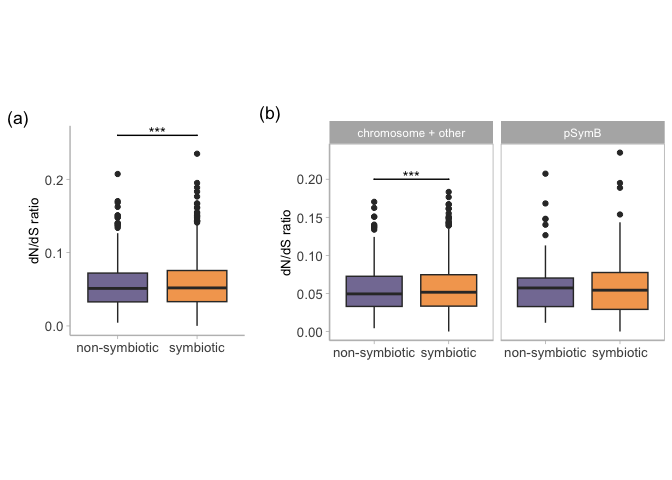
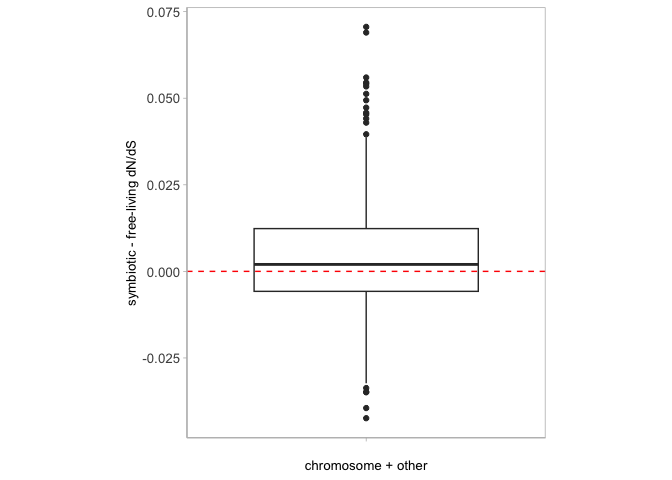

Rhizobia dnds
================
Tia Harrison
16/06/2022

## Load the packages

``` r
library(tidyverse)
```

    ## ── Attaching core tidyverse packages ──────────────────────── tidyverse 2.0.0 ──
    ## ✔ dplyr     1.1.4     ✔ readr     2.1.5
    ## ✔ forcats   1.0.0     ✔ stringr   1.5.1
    ## ✔ ggplot2   3.5.0     ✔ tibble    3.2.1
    ## ✔ lubridate 1.9.3     ✔ tidyr     1.3.1
    ## ✔ purrr     1.0.2     
    ## ── Conflicts ────────────────────────────────────────── tidyverse_conflicts() ──
    ## ✖ dplyr::filter() masks stats::filter()
    ## ✖ dplyr::lag()    masks stats::lag()
    ## ℹ Use the conflicted package (<http://conflicted.r-lib.org/>) to force all conflicts to become errors

``` r
library(multcomp)
```

    ## Loading required package: mvtnorm
    ## Loading required package: survival
    ## Loading required package: TH.data
    ## Loading required package: MASS
    ## 
    ## Attaching package: 'MASS'
    ## 
    ## The following object is masked from 'package:dplyr':
    ## 
    ##     select
    ## 
    ## 
    ## Attaching package: 'TH.data'
    ## 
    ## The following object is masked from 'package:MASS':
    ## 
    ##     geyser

``` r
library(tidyverse)
library(nationalparkcolors)
library(coin)
library(ggpubr)
library(rstatix)
```

    ## 
    ## Attaching package: 'rstatix'
    ## 
    ## The following objects are masked from 'package:coin':
    ## 
    ##     chisq_test, friedman_test, kruskal_test, sign_test, wilcox_test
    ## 
    ## The following object is masked from 'package:MASS':
    ## 
    ##     select
    ## 
    ## The following object is masked from 'package:stats':
    ## 
    ##     filter

``` r
library(phytools)
```

    ## Loading required package: ape
    ## 
    ## Attaching package: 'ape'
    ## 
    ## The following object is masked from 'package:ggpubr':
    ## 
    ##     rotate
    ## 
    ## The following object is masked from 'package:dplyr':
    ## 
    ##     where
    ## 
    ## Loading required package: maps
    ## 
    ## Attaching package: 'maps'
    ## 
    ## The following object is masked from 'package:purrr':
    ## 
    ##     map

``` r
library(geiger)
library(ape)
library(forcats)
library(ggh4x)
```

    ## 
    ## Attaching package: 'ggh4x'
    ## 
    ## The following object is masked from 'package:ggplot2':
    ## 
    ##     guide_axis_logticks

``` r
library(plotrix)
```

    ## 
    ## Attaching package: 'plotrix'
    ## 
    ## The following object is masked from 'package:phytools':
    ## 
    ##     rescale

``` r
library(qqman)
```

    ## 
    ## For example usage please run: vignette('qqman')
    ## 
    ## Citation appreciated but not required:
    ## Turner, (2018). qqman: an R package for visualizing GWAS results using Q-Q and manhattan plots. Journal of Open Source Software, 3(25), 731, https://doi.org/10.21105/joss.00731.

``` r
library(lsmeans)
```

    ## Loading required package: emmeans
    ## The 'lsmeans' package is now basically a front end for 'emmeans'.
    ## Users are encouraged to switch the rest of the way.
    ## See help('transition') for more information, including how to
    ## convert old 'lsmeans' objects and scripts to work with 'emmeans'.

## Load the new dataset and explore

Data set has been cleaned up in the previous script. If dnds value is
higher than 10 remove that gene because probably an error in assembly or
annotation.

This data is based on single copy orthologs in the genomes. This would
be more conservative that taking in paralogs into the data. Harder to
figure out what to do with the paralogs anyways. Especially if you want
to get a genome wide average dnds rate.

``` r
# Load the data 
rhizobia_dnds0<-read_csv("Rhizobia_pair2NEW_results.csv")
```

    ## Rows: 22659 Columns: 6
    ## ── Column specification ────────────────────────────────────────────────────────
    ## Delimiter: ","
    ## chr (5): Species, Gene, Mutualist, Pair, Transition
    ## dbl (1): dnds
    ## 
    ## ℹ Use `spec()` to retrieve the full column specification for this data.
    ## ℹ Specify the column types or set `show_col_types = FALSE` to quiet this message.

``` r
# 22 659 rows

# Remove the Sinorhizobium pair - only used in the tree to get better dnds ratios 
rhizobia_dnds<-rhizobia_dnds0 %>% 
  filter(Species!="Sinorhizobium_M4_45") %>%
  filter(Species!="Sinorhizobium_meliloti")

rhizobia_dnds %>%
  group_by(Gene) %>%
  tally() # 2812 genes 
```

    ## # A tibble: 2,812 × 2
    ##    Gene          n
    ##    <chr>     <int>
    ##  1 OG0001153    14
    ##  2 OG0001154    14
    ##  3 OG0001155    14
    ##  4 OG0001156    14
    ##  5 OG0001157    14
    ##  6 OG0001158    14
    ##  7 OG0001159    14
    ##  8 OG0001160    14
    ##  9 OG0001161    14
    ## 10 OG0001162    14
    ## # ℹ 2,802 more rows

``` r
rhizobia_dnds %>%
  group_by(Gene) %>%
  tally() %>%
  filter(n==14) # 438 genes shared before 
```

    ## # A tibble: 438 × 2
    ##    Gene          n
    ##    <chr>     <int>
    ##  1 OG0001153    14
    ##  2 OG0001154    14
    ##  3 OG0001155    14
    ##  4 OG0001156    14
    ##  5 OG0001157    14
    ##  6 OG0001158    14
    ##  7 OG0001159    14
    ##  8 OG0001160    14
    ##  9 OG0001161    14
    ## 10 OG0001162    14
    ## # ℹ 428 more rows

``` r
# Remove abnormally high dnds values 
rhizobia_dnds2<-rhizobia_dnds%>%
  filter(dnds<10)

# are there high dnds ratios? 
rhizobia_dnds%>%
  filter(dnds>10) # Yes indeed 
```

    ## # A tibble: 972 × 6
    ##    Species                      dnds Gene      Mutualist Pair  Transition
    ##    <chr>                       <dbl> <chr>     <chr>     <chr> <chr>     
    ##  1 Cupriavidus_taiwanensis     999   OG0001709 M         g     gain      
    ##  2 Bradyrhizobium_icense       650.  OG0001724 M         b     loss      
    ##  3 Bradyrhizobium_icense       999   OG0001725 M         b     loss      
    ##  4 Cupriavidus_alkaliphilus    999   OG0001743 F         g     gain      
    ##  5 Cupriavidus_taiwanensis     320.  OG0001749 M         g     gain      
    ##  6 Cupriavidus_alkaliphilus    999   OG0001751 F         g     gain      
    ##  7 Cupriavidus_taiwanensis     999   OG0001761 M         g     gain      
    ##  8 Cupriavidus_taiwanensis     249.  OG0001766 M         g     gain      
    ##  9 Paraburkholderia_caribensis  26.8 OG0001766 F         h     gain      
    ## 10 Microvirga_vignae           999   OG0001772 M         d     gain      
    ## # ℹ 962 more rows

``` r
# See how many data points are in each pair
# This combines both species in the pair so it will be roughly double the number of genes 
rhizobia_dnds2%>% 
  group_by(Pair)%>%
  tally()
```

    ## # A tibble: 7 × 2
    ##   Pair      n
    ##   <chr> <int>
    ## 1 b      2771
    ## 2 c      2355
    ## 3 d      2464
    ## 4 e      2810
    ## 5 f      3077
    ## 6 g      2253
    ## 7 h      2646

``` r
# How many genes per species 
rhizobia_dnds2%>% 
  group_by(Species)%>%
  tally()
```

    ## # A tibble: 14 × 2
    ##    Species                            n
    ##    <chr>                          <int>
    ##  1 Azorhizobium_caulinodans        1190
    ##  2 Bradyrhizobium_icense           1390
    ##  3 Bradyrhizobium_oligotrophicum   1381
    ##  4 Cupriavidus_alkaliphilus        1120
    ##  5 Cupriavidus_taiwanensis         1133
    ##  6 Mesorhizobium_oceanicum         1281
    ##  7 Mesorhizobium_temperatum        1529
    ##  8 Microvirga_subterranea          1206
    ##  9 Microvirga_vignae               1258
    ## 10 Paraburkholderia_caribensis     1310
    ## 11 Paraburkholderia_diazotrophica  1336
    ## 12 Rhizobium_gallicum              1609
    ## 13 Rhizobium_tubonense             1468
    ## 14 Xanthobacter_autotrophicus      1165

``` r
# How many orthologs 
rhizobia_dnds2 %>%
  group_by(Gene) %>%
  tally() %>%
  filter(n==14)
```

    ## # A tibble: 277 × 2
    ##    Gene          n
    ##    <chr>     <int>
    ##  1 OG0001154    14
    ##  2 OG0001155    14
    ##  3 OG0001156    14
    ##  4 OG0001161    14
    ##  5 OG0001166    14
    ##  6 OG0001168    14
    ##  7 OG0001169    14
    ##  8 OG0001172    14
    ##  9 OG0001176    14
    ## 10 OG0001177    14
    ## # ℹ 267 more rows

``` r
# 277 genes found in all 14 genomes 

# How many orthologs overall 
rhizobia_dnds2 %>%
  group_by(Gene) %>%
  tally() #2812 
```

    ## # A tibble: 2,812 × 2
    ##    Gene          n
    ##    <chr>     <int>
    ##  1 OG0001153    12
    ##  2 OG0001154    14
    ##  3 OG0001155    14
    ##  4 OG0001156    14
    ##  5 OG0001157    12
    ##  6 OG0001158    12
    ##  7 OG0001159    13
    ##  8 OG0001160    13
    ##  9 OG0001161    14
    ## 10 OG0001162    13
    ## # ℹ 2,802 more rows

## Paired Wilcoxon tests

Test for genome wide differences in rates of molecular evolution

``` r
# Run the wilcoxon tests 
will_function2<- function(pair){
  
  # Subset each pair 
rhizb<- rhizobia_dnds2%>%
  filter(Pair==pair)
  
  # Make list of genes without missing data 
genesb<-rhizb%>%
  filter(!is.na(dnds))%>%
  group_by(Gene)%>%
  tally() %>%
  filter(n==2)
  
genesb_list<-data.frame(Gene=genesb$Gene)

  # Keep only new genes 
rhizb_new<- rhizb%>%
  semi_join(genesb_list, by="Gene")

# Make into the right data format
rhizb_new2<-rhizb_new %>%
  select(Gene, Mutualist, dnds) %>%
  pivot_wider(names_from = Mutualist, values_from = dnds) 

# Run the paired test 
# In this example, the differences is calculated F-M
# And this is a mutualism gain so the direction is correct 
pairb_test<-wilcox.test(rhizb_new2$F, rhizb_new2$M, paired=TRUE)
return(pairb_test)

} 

gene_count2<- function(pair){
    # Subset each pair 
rhizb<- rhizobia_dnds2%>%
  filter(Pair==pair)
  
  # Make list of genes without missing data 
genesb<-rhizb%>%
  filter(!is.na(dnds))%>%
  group_by(Gene)%>%
  tally() %>%
  filter(n==2)
return(genesb)
}

will_function_dir<- function(pair){
  
  # Subset each pair 
rhizb<- rhizobia_dnds2%>%
  filter(Pair==pair)
  
  # Make list of genes without missing data 
genesb<-rhizb%>%
  filter(!is.na(dnds))%>%
  group_by(Gene)%>%
  tally() %>%
  filter(n==2)
  
genesb_list<-data.frame(Gene=genesb$Gene)

  # Keep only new genes 
rhizb_new<- rhizb%>%
  semi_join(genesb_list, by="Gene")

# Make into the right data format
rhizb_new2<-rhizb_new %>%
  select(Gene, Mutualist, dnds) %>%
  pivot_wider(names_from = Mutualist, values_from = dnds) 

# Run the paired test 
# In this example, the differences is calculated F-M
# And this is a mutualism gain so the direction is correct 
# Less and sig means mutualist is greater than free
pairb_test<-wilcox.test(rhizb_new2$F, rhizb_new2$M, paired=TRUE, alternative="less")
return(pairb_test)

}

#will_function2("a") # not sig, loss Sinorhizo
#gene_count2("a") # 965 genes 

will_function2("b") # not sig, loss Brady 
```

    ## 
    ##  Wilcoxon signed rank test with continuity correction
    ## 
    ## data:  rhizb_new2$F and rhizb_new2$M
    ## V = 335686, p-value = 0.6718
    ## alternative hypothesis: true location shift is not equal to 0

``` r
gene_count2("b") # 1154 genes 
```

    ## # A tibble: 1,154 × 2
    ##    Gene          n
    ##    <chr>     <int>
    ##  1 OG0001153     2
    ##  2 OG0001154     2
    ##  3 OG0001155     2
    ##  4 OG0001156     2
    ##  5 OG0001157     2
    ##  6 OG0001158     2
    ##  7 OG0001159     2
    ##  8 OG0001160     2
    ##  9 OG0001161     2
    ## 10 OG0001162     2
    ## # ℹ 1,144 more rows

``` r
will_function2("c") # sig! Xanther gain 
```

    ## 
    ##  Wilcoxon signed rank test with continuity correction
    ## 
    ## data:  rhizb_new2$F and rhizb_new2$M
    ## V = 200434, p-value = 2.095e-06
    ## alternative hypothesis: true location shift is not equal to 0

``` r
will_function_dir("c") # M is greater than F 
```

    ## 
    ##  Wilcoxon signed rank test with continuity correction
    ## 
    ## data:  rhizb_new2$F and rhizb_new2$M
    ## V = 200434, p-value = 1.048e-06
    ## alternative hypothesis: true location shift is less than 0

``` r
gene_count2("c") # 988 genes 
```

    ## # A tibble: 988 × 2
    ##    Gene          n
    ##    <chr>     <int>
    ##  1 OG0001153     2
    ##  2 OG0001154     2
    ##  3 OG0001155     2
    ##  4 OG0001156     2
    ##  5 OG0001157     2
    ##  6 OG0001158     2
    ##  7 OG0001159     2
    ##  8 OG0001160     2
    ##  9 OG0001161     2
    ## 10 OG0001162     2
    ## # ℹ 978 more rows

``` r
will_function2("d") # sig! Microvigra gain 
```

    ## 
    ##  Wilcoxon signed rank test with continuity correction
    ## 
    ## data:  rhizb_new2$F and rhizb_new2$M
    ## V = 216521, p-value = 4.627e-09
    ## alternative hypothesis: true location shift is not equal to 0

``` r
will_function_dir("d") # M greater
```

    ## 
    ##  Wilcoxon signed rank test with continuity correction
    ## 
    ## data:  rhizb_new2$F and rhizb_new2$M
    ## V = 216521, p-value = 2.314e-09
    ## alternative hypothesis: true location shift is less than 0

``` r
gene_count2("d") # 1052 genes 
```

    ## # A tibble: 1,052 × 2
    ##    Gene          n
    ##    <chr>     <int>
    ##  1 OG0001153     2
    ##  2 OG0001154     2
    ##  3 OG0001155     2
    ##  4 OG0001156     2
    ##  5 OG0001157     2
    ##  6 OG0001158     2
    ##  7 OG0001159     2
    ##  8 OG0001160     2
    ##  9 OG0001161     2
    ## 10 OG0001162     2
    ## # ℹ 1,042 more rows

``` r
will_function2("e") # sig! Mesorhizobium loss 
```

    ## 
    ##  Wilcoxon signed rank test with continuity correction
    ## 
    ## data:  rhizb_new2$F and rhizb_new2$M
    ## V = 204387, p-value < 2.2e-16
    ## alternative hypothesis: true location shift is not equal to 0

``` r
will_function_dir("e") # M greater
```

    ## 
    ##  Wilcoxon signed rank test with continuity correction
    ## 
    ## data:  rhizb_new2$F and rhizb_new2$M
    ## V = 204387, p-value < 2.2e-16
    ## alternative hypothesis: true location shift is less than 0

``` r
gene_count2("e") #1090 genes 
```

    ## # A tibble: 1,090 × 2
    ##    Gene          n
    ##    <chr>     <int>
    ##  1 OG0001153     2
    ##  2 OG0001154     2
    ##  3 OG0001155     2
    ##  4 OG0001156     2
    ##  5 OG0001157     2
    ##  6 OG0001158     2
    ##  7 OG0001159     2
    ##  8 OG0001160     2
    ##  9 OG0001161     2
    ## 10 OG0001162     2
    ## # ℹ 1,080 more rows

``` r
will_function2("f") # sig 
```

    ## 
    ##  Wilcoxon signed rank test with continuity correction
    ## 
    ## data:  rhizb_new2$F and rhizb_new2$M
    ## V = 373359, p-value = 0.003239
    ## alternative hypothesis: true location shift is not equal to 0

``` r
will_function_dir("f") # M greater
```

    ## 
    ##  Wilcoxon signed rank test with continuity correction
    ## 
    ## data:  rhizb_new2$F and rhizb_new2$M
    ## V = 373359, p-value = 0.00162
    ## alternative hypothesis: true location shift is less than 0

``` r
gene_count2("f") # 1288 genes 
```

    ## # A tibble: 1,288 × 2
    ##    Gene          n
    ##    <chr>     <int>
    ##  1 OG0001153     2
    ##  2 OG0001154     2
    ##  3 OG0001155     2
    ##  4 OG0001156     2
    ##  5 OG0001157     2
    ##  6 OG0001158     2
    ##  7 OG0001159     2
    ##  8 OG0001160     2
    ##  9 OG0001161     2
    ## 10 OG0001162     2
    ## # ℹ 1,278 more rows

``` r
will_function2("g") # Just on the line Cupriavidus gain 0.06
```

    ## 
    ##  Wilcoxon signed rank test with continuity correction
    ## 
    ## data:  rhizb_new2$F and rhizb_new2$M
    ## V = 116267, p-value = 0.06034
    ## alternative hypothesis: true location shift is not equal to 0

``` r
will_function_dir("g") # sig M is greater 
```

    ## 
    ##  Wilcoxon signed rank test with continuity correction
    ## 
    ## data:  rhizb_new2$F and rhizb_new2$M
    ## V = 116267, p-value = 0.03017
    ## alternative hypothesis: true location shift is less than 0

``` r
gene_count2("g") # 836 genes 
```

    ## # A tibble: 836 × 2
    ##    Gene          n
    ##    <chr>     <int>
    ##  1 OG0001154     2
    ##  2 OG0001155     2
    ##  3 OG0001156     2
    ##  4 OG0001160     2
    ##  5 OG0001161     2
    ##  6 OG0001162     2
    ##  7 OG0001165     2
    ##  8 OG0001166     2
    ##  9 OG0001167     2
    ## 10 OG0001168     2
    ## # ℹ 826 more rows

``` r
will_function2("h") # not sig Paraburkholderia gain 
```

    ## 
    ##  Wilcoxon signed rank test with continuity correction
    ## 
    ## data:  rhizb_new2$F and rhizb_new2$M
    ## V = 262824, p-value = 0.3341
    ## alternative hypothesis: true location shift is not equal to 0

``` r
gene_count2("h") # 1074
```

    ## # A tibble: 1,074 × 2
    ##    Gene          n
    ##    <chr>     <int>
    ##  1 OG0001154     2
    ##  2 OG0001155     2
    ##  3 OG0001156     2
    ##  4 OG0001159     2
    ##  5 OG0001161     2
    ##  6 OG0001165     2
    ##  7 OG0001166     2
    ##  8 OG0001167     2
    ##  9 OG0001168     2
    ## 10 OG0001169     2
    ## # ℹ 1,064 more rows

``` r
# Check the pairs 
rhizobia_dnds2%>%
  filter(Pair=="h")
```

    ## # A tibble: 2,646 × 6
    ##    Species                          dnds Gene      Mutualist Pair  Transition
    ##    <chr>                           <dbl> <chr>     <chr>     <chr> <chr>     
    ##  1 Paraburkholderia_diazotrophica 0.0411 OG0001707 M         h     gain      
    ##  2 Paraburkholderia_caribensis    0.0928 OG0001709 F         h     gain      
    ##  3 Paraburkholderia_diazotrophica 0.102  OG0001724 M         h     gain      
    ##  4 Paraburkholderia_caribensis    0.0132 OG0001724 F         h     gain      
    ##  5 Paraburkholderia_diazotrophica 0.0473 OG0001725 M         h     gain      
    ##  6 Paraburkholderia_diazotrophica 0.0422 OG0001727 M         h     gain      
    ##  7 Paraburkholderia_diazotrophica 0.0618 OG0001736 M         h     gain      
    ##  8 Paraburkholderia_diazotrophica 0.0475 OG0001738 M         h     gain      
    ##  9 Paraburkholderia_caribensis    0.0238 OG0001738 F         h     gain      
    ## 10 Paraburkholderia_diazotrophica 0.0937 OG0001742 M         h     gain      
    ## # ℹ 2,636 more rows

``` r
# Hmm it seems to be that mutualist is usually higher no matter whether it is a gain or loss 
# This is same as the plants! 
```

## Plot the ratios

Now plot the ratios based on the ratios

``` r
# Change labels 
rhizobia_dnds2_plot<-rhizobia_dnds2 %>%
  mutate_if(is.character, 
                str_replace_all, pattern = "_", replacement = " ")

# Make dummy variable for visualization 
# And clean up labels 
rhizobia_dnds2_plot2<- rhizobia_dnds2_plot %>%
   mutate(dummy="test") %>% 
   mutate_at("Transition", str_replace, "gain", "mutualism gain") %>%
   mutate_at("Transition", str_replace, "loss", "mutualism loss")


# Make labels for the plot 
# For number of pairs
facet_labeller_pair <- function(variable, value) {
  c(
    "",
    "*",
    "*",
    "*", 
    "*",
    "",
    ""
  )
}


facet_labbler_test <- function(variable, value) {
  c(
    ""
  )
}

# Make level order for species for plotting 
level_order<-c("Bradyrhizobium oligotrophicum", "Bradyrhizobium icense", "Mesorhizobium oceanicum","Mesorhizobium temperatum", "Rhizobium tubonense", "Rhizobium gallicum", "Xanthobacter autotrophicus", "Azorhizobium caulinodans", "Microvirga subterranea", "Microvirga vignae", "Cupriavidus alkaliphilus", "Cupriavidus taiwanensis", "Paraburkholderia caribensis",  "Paraburkholderia diazotrophica")

# Bar plot 
library(ggpubr)
library(ggsignif)

lifestyle<-park_palette("Saguaro")

# Careful bc ylim causes data to be removed 
# For a true zoom use coord_cartesian(ylim=c(0, 7)) but the coord_cartesian doesn't work with coord_flip so put the ylim in the coord_flip() argument 
bp_free_rhiz<-ggplot(rhizobia_dnds2_plot2, aes(x=factor(Species, level = level_order), y=dnds, fill=Mutualist))+ 
  #geom_boxplot(coef=0, outlier.shape=NA) + # To remove the outliers 
  geom_boxplot(outlier.shape=NA) + # To remove the outliers 
  # geom_boxplot() +
  #coord_cartesian(ylim(-0.2,0.3)) +
  (ylab("dN/dS ratio"))+
  (xlab(""))+
  scale_fill_manual(labels=c("non-symbiotic", "symbiotic"), values=lifestyle[c(1,3)])+
  #coord_flip(ylim=c(-0.1, 0.65)) +
  coord_flip(ylim=c(0, 0.18)) +
  #coord_flip() +
  #facet_nested(Transition + Pair ~ dummy, scales = "free_y", space = "free_y", switch = "y") +
  #facet_nested(Transition + Pair ~ dummy, scales = "free", space="free", labeller= labeller( Pair=as_labeller(facet_labeller_pair), dummy=as_labeller(facet_labbler_test)), nest_line = element_line(linetype = 1)) +
  #facet_nested(Transition + Pair ~ dummy, scales = "free", space="free", labeller= labeller( Pair=as_labeller(facet_labeller_pair), dummy=as_labeller(facet_labbler_test))) +
  #facet_nested(Pair ~ dummy, scales = "free", space="free", labeller= labeller( Pair=as_labeller(facet_labeller_pair), dummy=as_labeller(facet_labbler_test))) +
  facet_nested(Pair ~ dummy, scales = "free", space="free", labeller= labeller( Pair=as_labeller(facet_labeller_pair), dummy=as_labeller(facet_labbler_test))) +
  theme_light() + 
  #geom_text(data = ann_text,label = "*")+
  theme_classic() + 
  theme(axis.title = element_text(size=10), 
        axis.text.y= element_text(size=8, face="italic"), 
        axis.text.x= element_text(size=10), 
        legend.title = element_blank(), 
        legend.text=element_text(size=9),
        panel.border = element_blank(),
        panel.grid = element_blank(),
        legend.position="top",
        #strip.text.x = element_blank(),
        strip.text.y = element_text(size = 23),
        axis.line.x = element_line(color="grey", size = 0.5),
        axis.line.y = element_line(color="grey", size = 0.5),
        strip.background = element_blank()
        #ggh4x.facet.nestline = element_line(colour = "black")
        )
```

    ## Warning: The `size` argument of `element_line()` is deprecated as of ggplot2 3.4.0.
    ## ℹ Please use the `linewidth` argument instead.
    ## This warning is displayed once every 8 hours.
    ## Call `lifecycle::last_lifecycle_warnings()` to see where this warning was
    ## generated.

``` r
bp_free_rhiz
```

<!-- -->

``` r
# This looks like mutualists are higher? I need to go back and look at that Wilcoxon test results but if this is correct then that is helpful! Then it matches the plant! 

rhizobia_dnds2_plot2
```

    ## # A tibble: 18,376 × 7
    ##    Species                          dnds Gene   Mutualist Pair  Transition dummy
    ##    <chr>                           <dbl> <chr>  <chr>     <chr> <chr>      <chr>
    ##  1 Cupriavidus taiwanensis        0.0001 OG000… M         g     mutualism… test 
    ##  2 Paraburkholderia diazotrophica 0.0411 OG000… M         h     mutualism… test 
    ##  3 Mesorhizobium oceanicum        0.0229 OG000… F         e     mutualism… test 
    ##  4 Mesorhizobium temperatum       0.0334 OG000… M         e     mutualism… test 
    ##  5 Rhizobium tubonense            0.0387 OG000… F         f     mutualism… test 
    ##  6 Rhizobium gallicum             0.0163 OG000… M         f     mutualism… test 
    ##  7 Microvirga subterranea         0.0372 OG000… F         d     mutualism… test 
    ##  8 Microvirga vignae              0.0203 OG000… M         d     mutualism… test 
    ##  9 Bradyrhizobium icense          0.0209 OG000… M         b     mutualism… test 
    ## 10 Bradyrhizobium oligotrophicum  0.0224 OG000… F         b     mutualism… test 
    ## # ℹ 18,366 more rows

## Find symbiotic genes

Plasmid information wasn’t really there for most of the assemblies and
some of the species might not have a dedicated plasmid but instead have
just a symbiotic island.

So instead I’m going to search the annotated genes of the assemblies and
pull out the genes (and corresponding ortholog name) for anything that
matches nod, nif, noe, nol, nop, nfe, nodul, fix, fixation, nitrogenase

``` r
# Load the symbiotic codes 
symgenes<-read_csv("symbiotic_orthos.csv")
```

    ## Rows: 99 Columns: 2
    ## ── Column specification ────────────────────────────────────────────────────────
    ## Delimiter: ","
    ## chr (2): Gene, Genus
    ## 
    ## ℹ Use `spec()` to retrieve the full column specification for this data.
    ## ℹ Specify the column types or set `show_col_types = FALSE` to quiet this message.

``` r
symgenes # Now there is likely some overlap but the genes might be different in the different pairs so prob want to filter by pair! 
```

    ## # A tibble: 99 × 2
    ##    Gene      Genus        
    ##    <chr>     <chr>        
    ##  1 OG0002301 Azorrhizobium
    ##  2 OG0002527 Azorrhizobium
    ##  3 OG0002676 Azorrhizobium
    ##  4 OG0002850 Azorrhizobium
    ##  5 OG0002851 Azorrhizobium
    ##  6 OG0002852 Azorrhizobium
    ##  7 OG0002853 Azorrhizobium
    ##  8 OG0002897 Azorrhizobium
    ##  9 OG0002898 Azorrhizobium
    ## 10 OG0002899 Azorrhizobium
    ## # ℹ 89 more rows

``` r
symgenes2<-symgenes %>%
  distinct(Gene) # 33 genes total 
symgenes2
```

    ## # A tibble: 33 × 1
    ##    Gene     
    ##    <chr>    
    ##  1 OG0002301
    ##  2 OG0002527
    ##  3 OG0002676
    ##  4 OG0002850
    ##  5 OG0002851
    ##  6 OG0002852
    ##  7 OG0002853
    ##  8 OG0002897
    ##  9 OG0002898
    ## 10 OG0002899
    ## # ℹ 23 more rows

``` r
# Prep the data 
sym_rhiz <- rhizobia_dnds2 %>%
  filter(Gene %in% symgenes2$Gene)
sym_rhiz # 269 rows 
```

    ## # A tibble: 238 × 6
    ##    Species                         dnds Gene      Mutualist Pair  Transition
    ##    <chr>                          <dbl> <chr>     <chr>     <chr> <chr>     
    ##  1 Mesorhizobium_temperatum      0.0140 OG0002301 M         e     loss      
    ##  2 Azorhizobium_caulinodans      0.0391 OG0002301 M         c     gain      
    ##  3 Xanthobacter_autotrophicus    0.115  OG0002301 F         c     gain      
    ##  4 Microvirga_vignae             0.0700 OG0002301 M         d     gain      
    ##  5 Microvirga_subterranea        0.0302 OG0002301 F         d     gain      
    ##  6 Bradyrhizobium_icense         0.0149 OG0002301 M         b     loss      
    ##  7 Bradyrhizobium_oligotrophicum 0.0121 OG0002301 F         b     loss      
    ##  8 Mesorhizobium_oceanicum       0.0400 OG0002301 F         e     loss      
    ##  9 Rhizobium_tubonense           0.0303 OG0002301 F         f     loss      
    ## 10 Rhizobium_gallicum            0.0158 OG0002301 M         f     loss      
    ## # ℹ 228 more rows

``` r
# Test a pair 
sym_rhiz %>%
  filter(Pair=="h") %>%
  group_by(Pair) %>%
  dplyr::select(Mutualist, Gene, dnds) %>%
  pivot_wider(names_from=Mutualist, values_from=dnds) %>%
  filter(!is.na(M) & !is.na(F)) %>%
  mutate(diff=M-F) %>%
  filter(diff>0)
```

    ## Adding missing grouping variables: `Pair`

    ## # A tibble: 5 × 5
    ## # Groups:   Pair [1]
    ##   Pair  Gene           F      M   diff
    ##   <chr> <chr>      <dbl>  <dbl>  <dbl>
    ## 1 h     OG0002676 0.0197 0.0586 0.0389
    ## 2 h     OG0002800 0.0598 0.168  0.108 
    ## 3 h     OG0003430 0.0201 0.0856 0.0655
    ## 4 h     OG0001474 0.0001 0.0145 0.0144
    ## 5 h     OG0001495 0.0269 0.294  0.267

``` r
# Test one pair 
sym_rhiz2 <- sym_rhiz %>%
  #filter(Pair=="e") %>%
  group_by(Pair) %>%
  dplyr::select(Mutualist, Transition, Gene, dnds) %>%
  pivot_wider(names_from=Mutualist, values_from=dnds) %>%
  filter(!is.na(M) & !is.na(F))
```

    ## Adding missing grouping variables: `Pair`

``` r
sym_rhiz2 
```

    ## # A tibble: 81 × 5
    ## # Groups:   Pair [7]
    ##    Pair  Transition Gene            M       F
    ##    <chr> <chr>      <chr>       <dbl>   <dbl>
    ##  1 e     loss       OG0002301 0.0140  0.0400 
    ##  2 c     gain       OG0002301 0.0391  0.115  
    ##  3 d     gain       OG0002301 0.0700  0.0302 
    ##  4 b     loss       OG0002301 0.0149  0.0121 
    ##  5 f     loss       OG0002301 0.0158  0.0303 
    ##  6 f     loss       OG0002495 0.0432  0.0495 
    ##  7 c     gain       OG0002495 0.00201 0.0761 
    ##  8 d     gain       OG0002495 0.0349  0.335  
    ##  9 b     loss       OG0002495 0.0409  0.00115
    ## 10 e     loss       OG0002495 0.00136 0.00193
    ## # ℹ 71 more rows

``` r
# Prep the dataset 
sym_plot <- sym_rhiz2 %>%
  mutate(minus=M-F) %>%
  mutate(Diff=abs(minus)) %>% 
  filter(Diff!=0) %>%
  arrange(Diff) 
  #mutate(Diff2=Diff) %>%
  #mutate(Diff2=as.factor(Diff2)) %>%
  #mutate(Diff2=factor(Diff2, Diff2)) # reorder based on the difference between the two ratios 
sym_plot2 <- sym_plot %>%
  mutate(Pair2=case_when( Pair=="b" ~ "Bradyrhizobium", 
                            Pair=="c" ~ "Azorhizobium",
                            Pair=="d" ~ "Microvigra",
                            Pair=="e" ~ "Mesorhizobium",
                            Pair=="f" ~ "Rhizobium",
                            Pair=="g"~  "Cupriavidus",
                            Pair=="h" ~ "Paraburkholderia"))

# Plot the lollipop plot 
sym_pop_plot<- ggplot(sym_plot2) + 
  geom_segment(aes(x=fct_reorder(Gene, minus), y=M, xend=Gene, yend=F), color="grey") + 
  geom_point(aes(x=Gene, y=M, color="M"), size=3.2) + 
  geom_point(aes(x=Gene, y=F, color="F"), size=3.2) + 
  scale_color_manual(labels=c("non-symbiotic", "symbiotic"), values=lifestyle[c(1,3)])+
  coord_flip() + 
  facet_grid(rows = vars(Pair2), space="free", scales="free") +
  (xlab("Symbiotic genes"))+
  (ylab("dN/dS ratio"))+
  theme_light() + 
  theme(axis.title = element_text(size=12), 
        axis.text.y= element_text(size=9), 
        axis.text.x= element_text(size=11),
        legend.title = element_blank(),
        legend.position = "top",
        legend.text=element_text(size=9),
        #panel.grid = element_blank(),
        panel.border = element_blank()
  )
sym_pop_plot
```

<!-- -->

``` r
#sym_pop_power<- sym_plot2 %>%
#  filter(Pair2=="Brady.") %>%
#  ggplot() + 
#  geom_segment(aes(x=fct_reorder(Gene, minus), y=M, xend=Gene, yend=F), color="grey") + 
#  geom_point(aes(x=Gene, y=M, color="M"), size=5) + 
#  geom_point(aes(x=Gene, y=F, color="F"), size=5) + 
#  scale_color_manual(labels=c("non-symbiotic", "symbiotic"), values=lifestyle[c(1,3)])+
#  coord_flip() + 
#  facet_grid(rows = vars(Pair2), space="free", scales="free") +
#  (xlab("Symbiotic genes"))+
#  (ylab("dN/dS ratio"))+
#  theme_light() + 
#  theme(axis.title = element_text(size=18), 
#        axis.text.y= element_text(size=15), 
#        axis.text.x= element_text(size=15),
#        legend.title = element_blank(),
#        legend.position = "top",
#        legend.text=element_text(size=15),
#        #panel.grid = element_blank(),
#        panel.border = element_blank()
#  )
#sym_pop_power

#ggsave(plot=sym_pop_power, "Bradytest.pdf", width=10, height=6)

# What is the gene with the really high value? 
#sym_plot2 %>%
#  filter(Pair2=="Brady.")
# Look up the code in the original sequence files 
```

Found the ortholog codes for gene names. Now search the genome files on
the server for these gene functions/descriptions:

grep BAF89407.1 new_GCA_000010525.1.faa grep ABS65365.1
new_GCA_000017645.1.faa grep BAM88287.1 new_GCA_000344805.1.faa grep
ANW03186.1 new_GCA_001693385.1.faa \# Brady but its not really a
nitrogen function here - it is a hypothetical protein??? grep APO70279.1
new_GCA_001908615.1.faa \# Fe-S cofactor nitrogenase synthesis protein
on a rhizobium plasmid but not really in the bradyrhizobium genome as a
nitrogen related gene grep PAQ09936.1 new_GCA_002284575.1.faa grep
PJR10728.1 new_GCA_002807095.1.faa

A lot of iron-sulfur assembly proteins

Hmmmm, maybe I need to filter for genes that are just nod related in
their own genome instead of calling all of them nitrogen related. That
would reduce the number of genes but it might give a clearer pattern? It
could be worth looking at and I already have that information in the
gene file - no going back to the original genomes to get that
information.

# Genes under positive selection

``` r
rhizobia_dnds2 %>%
  filter(dnds>1) %>%
  distinct(Gene)
```

    ## # A tibble: 110 × 1
    ##    Gene     
    ##    <chr>    
    ##  1 OG0001760
    ##  2 OG0002037
    ##  3 OG0002096
    ##  4 OG0002239
    ##  5 OG0002460
    ##  6 OG0002504
    ##  7 OG0002519
    ##  8 OG0002618
    ##  9 OG0002676
    ## 10 OG0002731
    ## # ℹ 100 more rows

``` r
pos_genes_rhiz<-rhizobia_dnds2 %>%
  dplyr::select(Mutualist, Pair,Transition, Gene, dnds) %>%
  pivot_wider(names_from=Mutualist, values_from=dnds) %>%
  filter(M > 1 | F >1 ) %>%
  filter(M<7 & F<7) %>%
  mutate(minus=M-F) %>%
  mutate(Diff=abs(minus)) %>% 
  arrange(Diff)


pos_genes_rhiz %>%
  filter(Pair=="g") 
```

    ## # A tibble: 45 × 7
    ##    Pair  Transition Gene           M      F  minus  Diff
    ##    <chr> <chr>      <chr>      <dbl>  <dbl>  <dbl> <dbl>
    ##  1 g     gain       OG0001230 4.72   3.77    0.942 0.942
    ##  2 g     gain       OG0005779 0.0001 1.50   -1.50  1.50 
    ##  3 g     gain       OG0005450 1.61   0.0252  1.59  1.59 
    ##  4 g     gain       OG0003318 0.0001 1.62   -1.61  1.61 
    ##  5 g     gain       OG0005861 1.64   0.0145  1.62  1.62 
    ##  6 g     gain       OG0004922 1.76   0.0384  1.72  1.72 
    ##  7 g     gain       OG0005875 0.0289 1.77   -1.74  1.74 
    ##  8 g     gain       OG0001510 0.0001 1.77   -1.77  1.77 
    ##  9 g     gain       OG0001440 4.40   6.19   -1.80  1.80 
    ## 10 g     gain       OG0003529 1.83   0.0103  1.82  1.82 
    ## # ℹ 35 more rows

``` r
# really need the upset r plot for this to see if all species are sharing the same genes under positive selection 
rhizobia_dnds_pos <- rhizobia_dnds2 %>%
  mutate(Pos=ifelse(dnds>1, 1, 0)) %>%
  dplyr::select(Species, Gene, Pos) %>%
  pivot_wider(names_from=Species, values_from=Pos) 

rhizobia_dnds2 %>%
  mutate(Pos=ifelse(dnds>1, 1, 0)) %>%
  filter(Pos==1) %>%
  distinct()
```

    ## # A tibble: 120 × 7
    ##    Species                      dnds Gene      Mutualist Pair  Transition   Pos
    ##    <chr>                       <dbl> <chr>     <chr>     <chr> <chr>      <dbl>
    ##  1 Cupriavidus_alkaliphilus     2.42 OG0001760 F         g     gain           1
    ##  2 Paraburkholderia_caribensis  8.47 OG0001760 F         h     gain           1
    ##  3 Microvirga_vignae            8.13 OG0002037 M         d     gain           1
    ##  4 Xanthobacter_autotrophicus   1.10 OG0002037 F         c     gain           1
    ##  5 Cupriavidus_taiwanensis      2.86 OG0002096 M         g     gain           1
    ##  6 Microvirga_vignae            5.58 OG0002239 M         d     gain           1
    ##  7 Mesorhizobium_temperatum     7.80 OG0002460 M         e     loss           1
    ##  8 Bradyrhizobium_icense        2.27 OG0002504 M         b     loss           1
    ##  9 Microvirga_vignae            1.56 OG0002519 M         d     gain           1
    ## 10 Paraburkholderia_caribensis  1.95 OG0002618 F         h     gain           1
    ## # ℹ 110 more rows

``` r
rhizobia_dnds_pos2 <- rhizobia_dnds_pos[complete.cases(rhizobia_dnds_pos), ] # Remove NA
rhizobia_dnds_pos3 <-rhizobia_dnds_pos2[rowSums(rhizobia_dnds_pos2[-(1)]) !=0, ] # Remove 0s

rhizobia_dnds_pos3<-data.frame(rhizobia_dnds_pos3) # 18 genes under positive selection in at least one species 
rhizobia_dnds_pos3
```

    ##         Gene Cupriavidus_taiwanensis Paraburkholderia_diazotrophica
    ## 1  OG0001222                       1                              0
    ## 2  OG0001252                       0                              0
    ## 3  OG0001319                       1                              0
    ## 4  OG0001339                       0                              1
    ## 5  OG0001399                       0                              0
    ## 6  OG0001510                       0                              0
    ## 7  OG0001515                       0                              1
    ## 8  OG0001527                       0                              0
    ## 9  OG0001578                       1                              0
    ## 10 OG0001585                       0                              0
    ## 11 OG0001591                       1                              0
    ## 12 OG0001637                       1                              0
    ## 13 OG0001645                       1                              0
    ##    Mesorhizobium_oceanicum Mesorhizobium_temperatum Rhizobium_tubonense
    ## 1                        0                        0                   0
    ## 2                        0                        0                   0
    ## 3                        0                        0                   0
    ## 4                        0                        0                   0
    ## 5                        0                        1                   0
    ## 6                        0                        0                   0
    ## 7                        0                        0                   0
    ## 8                        0                        0                   0
    ## 9                        0                        0                   0
    ## 10                       0                        0                   0
    ## 11                       0                        0                   0
    ## 12                       0                        0                   0
    ## 13                       0                        0                   0
    ##    Rhizobium_gallicum Microvirga_subterranea Microvirga_vignae
    ## 1                   0                      0                 0
    ## 2                   0                      0                 0
    ## 3                   0                      0                 0
    ## 4                   0                      0                 0
    ## 5                   0                      0                 0
    ## 6                   0                      0                 0
    ## 7                   0                      0                 0
    ## 8                   0                      0                 0
    ## 9                   0                      0                 0
    ## 10                  0                      0                 0
    ## 11                  0                      0                 0
    ## 12                  0                      0                 0
    ## 13                  0                      0                 0
    ##    Bradyrhizobium_icense Bradyrhizobium_oligotrophicum Azorhizobium_caulinodans
    ## 1                      0                             0                        0
    ## 2                      0                             0                        0
    ## 3                      0                             0                        0
    ## 4                      0                             0                        0
    ## 5                      0                             0                        0
    ## 6                      0                             0                        0
    ## 7                      0                             0                        0
    ## 8                      0                             0                        0
    ## 9                      0                             0                        0
    ## 10                     0                             0                        0
    ## 11                     0                             0                        0
    ## 12                     0                             0                        0
    ## 13                     0                             0                        0
    ##    Xanthobacter_autotrophicus Cupriavidus_alkaliphilus
    ## 1                           0                        0
    ## 2                           0                        0
    ## 3                           0                        0
    ## 4                           0                        0
    ## 5                           0                        0
    ## 6                           0                        1
    ## 7                           0                        0
    ## 8                           0                        1
    ## 9                           0                        0
    ## 10                          0                        1
    ## 11                          0                        0
    ## 12                          0                        0
    ## 13                          0                        0
    ##    Paraburkholderia_caribensis
    ## 1                            0
    ## 2                            1
    ## 3                            0
    ## 4                            0
    ## 5                            0
    ## 6                            0
    ## 7                            0
    ## 8                            0
    ## 9                            0
    ## 10                           0
    ## 11                           0
    ## 12                           0
    ## 13                           0

``` r
# Plot the upset r plot 
# Try plotting an upsetr plot 
library(UpSetR)

# Test 
upset(rhizobia_dnds_pos3,
   # sets=c("Mesorhizobium_temperatum","Paraburkholderia_caribensis", "Paraburkholderia_diazotrophica", "Cupriavidus_taiwanensis","Cupriavidus_alkaliphilus"), keep.order=TRUE, 
    sets.x.label = "Genes per Species", 
    mainbar.y.label = "",
    sets.bar.color = c(lifestyle[3],lifestyle[1],lifestyle[3], lifestyle[1], lifestyle[3]), 
    main.bar.color= c(lifestyle[3],lifestyle[1],lifestyle[3], lifestyle[3], lifestyle[1])
    ) 
```

    ## `geom_line()`: Each group consists of only one observation.
    ## ℹ Do you need to adjust the group aesthetic?

<!-- -->

``` r
# This upsetR plot is on the full dataset - all asvs even though there is unequal sampling across the three regions 
```

## Plot the big proteobacteria tree

``` r
proteo_tree <- read.newick("Proteo_tree.txt")
```

    ## Warning in getEdgeLength(text, i): NAs introduced by coercion

    ## Warning in getEdgeLength(text, i): NAs introduced by coercion

    ## Warning in getEdgeLength(text, i): NAs introduced by coercion

    ## Warning in getEdgeLength(text, i): NAs introduced by coercion

    ## Warning in getEdgeLength(text, i): NAs introduced by coercion

    ## Warning in getEdgeLength(text, i): NAs introduced by coercion

    ## Warning in getEdgeLength(text, i): NAs introduced by coercion

    ## Warning in getEdgeLength(text, i): NAs introduced by coercion

    ## Warning in getEdgeLength(text, i): NAs introduced by coercion

    ## Warning in getEdgeLength(text, i): NAs introduced by coercion

    ## Warning in getEdgeLength(text, i): NAs introduced by coercion

    ## Warning in getEdgeLength(text, i): NAs introduced by coercion

    ## Warning in getEdgeLength(text, i): NAs introduced by coercion

    ## Warning in getEdgeLength(text, i): NAs introduced by coercion

    ## Warning in getEdgeLength(text, i): NAs introduced by coercion

    ## Warning in getEdgeLength(text, i): NAs introduced by coercion

    ## Warning in getEdgeLength(text, i): NAs introduced by coercion

    ## Warning in getEdgeLength(text, i): NAs introduced by coercion

    ## Warning in getEdgeLength(text, i): NAs introduced by coercion

    ## Warning in getEdgeLength(text, i): NAs introduced by coercion

    ## Warning in getEdgeLength(text, i): NAs introduced by coercion

    ## Warning in getEdgeLength(text, i): NAs introduced by coercion

    ## Warning in getEdgeLength(text, i): NAs introduced by coercion

    ## Warning in getEdgeLength(text, i): NAs introduced by coercion

    ## Warning in getEdgeLength(text, i): NAs introduced by coercion

    ## Warning in getEdgeLength(text, i): NAs introduced by coercion

    ## Warning in getEdgeLength(text, i): NAs introduced by coercion

    ## Warning in getEdgeLength(text, i): NAs introduced by coercion

    ## Warning in getEdgeLength(text, i): NAs introduced by coercion

    ## Warning in getEdgeLength(text, i): NAs introduced by coercion

    ## Warning in getEdgeLength(text, i): NAs introduced by coercion

    ## Warning in getEdgeLength(text, i): NAs introduced by coercion

    ## Warning in getEdgeLength(text, i): NAs introduced by coercion

    ## Warning in getEdgeLength(text, i): NAs introduced by coercion

    ## Warning in getEdgeLength(text, i): NAs introduced by coercion

    ## Warning in getEdgeLength(text, i): NAs introduced by coercion

    ## Warning in getEdgeLength(text, i): NAs introduced by coercion

    ## Warning in getEdgeLength(text, i): NAs introduced by coercion

    ## Warning in getEdgeLength(text, i): NAs introduced by coercion

    ## Warning in getEdgeLength(text, i): NAs introduced by coercion

    ## Warning in getEdgeLength(text, i): NAs introduced by coercion

    ## Warning in getEdgeLength(text, i): NAs introduced by coercion

    ## Warning in getEdgeLength(text, i): NAs introduced by coercion

    ## Warning in getEdgeLength(text, i): NAs introduced by coercion

    ## Warning in getEdgeLength(text, i): NAs introduced by coercion

    ## Warning in getEdgeLength(text, i): NAs introduced by coercion

    ## Warning in getEdgeLength(text, i): NAs introduced by coercion

    ## Warning in getEdgeLength(text, i): NAs introduced by coercion

    ## Warning in getEdgeLength(text, i): NAs introduced by coercion

    ## Warning in getEdgeLength(text, i): NAs introduced by coercion

    ## Warning in getEdgeLength(text, i): NAs introduced by coercion

    ## Warning in getEdgeLength(text, i): NAs introduced by coercion

    ## Warning in getEdgeLength(text, i): NAs introduced by coercion

    ## Warning in getEdgeLength(text, i): NAs introduced by coercion

    ## Warning in getEdgeLength(text, i): NAs introduced by coercion

    ## Warning in getEdgeLength(text, i): NAs introduced by coercion

    ## Warning in getEdgeLength(text, i): NAs introduced by coercion

    ## Warning in getEdgeLength(text, i): NAs introduced by coercion

    ## Warning in getEdgeLength(text, i): NAs introduced by coercion

    ## Warning in getEdgeLength(text, i): NAs introduced by coercion

    ## Warning in getEdgeLength(text, i): NAs introduced by coercion

    ## Warning in getEdgeLength(text, i): NAs introduced by coercion

    ## Warning in getEdgeLength(text, i): NAs introduced by coercion

    ## Warning in getEdgeLength(text, i): NAs introduced by coercion

    ## Warning in getEdgeLength(text, i): NAs introduced by coercion

    ## Warning in getEdgeLength(text, i): NAs introduced by coercion

    ## Warning in getEdgeLength(text, i): NAs introduced by coercion

    ## Warning in getEdgeLength(text, i): NAs introduced by coercion

    ## Warning in getEdgeLength(text, i): NAs introduced by coercion

    ## Warning in getEdgeLength(text, i): NAs introduced by coercion

    ## Warning in getEdgeLength(text, i): NAs introduced by coercion

    ## Warning in getEdgeLength(text, i): NAs introduced by coercion

    ## Warning in getEdgeLength(text, i): NAs introduced by coercion

    ## Warning in getEdgeLength(text, i): NAs introduced by coercion

    ## Warning in getEdgeLength(text, i): NAs introduced by coercion

    ## Warning in getEdgeLength(text, i): NAs introduced by coercion

    ## Warning in getEdgeLength(text, i): NAs introduced by coercion

    ## Warning in getEdgeLength(text, i): NAs introduced by coercion

    ## Warning in getEdgeLength(text, i): NAs introduced by coercion

    ## Warning in getEdgeLength(text, i): NAs introduced by coercion

    ## Warning in getEdgeLength(text, i): NAs introduced by coercion

    ## Warning in getEdgeLength(text, i): NAs introduced by coercion

    ## Warning in getEdgeLength(text, i): NAs introduced by coercion

    ## Warning in getEdgeLength(text, i): NAs introduced by coercion

    ## Warning in getEdgeLength(text, i): NAs introduced by coercion

    ## Warning in getEdgeLength(text, i): NAs introduced by coercion

    ## Warning in getEdgeLength(text, i): NAs introduced by coercion

    ## Warning in getEdgeLength(text, i): NAs introduced by coercion

    ## Warning in getEdgeLength(text, i): NAs introduced by coercion

    ## Warning in getEdgeLength(text, i): NAs introduced by coercion

    ## Warning in getEdgeLength(text, i): NAs introduced by coercion

    ## Warning in getEdgeLength(text, i): NAs introduced by coercion

    ## Warning in getEdgeLength(text, i): NAs introduced by coercion

    ## Warning in getEdgeLength(text, i): NAs introduced by coercion

    ## Warning in getEdgeLength(text, i): NAs introduced by coercion

    ## Warning in getEdgeLength(text, i): NAs introduced by coercion

    ## Warning in getEdgeLength(text, i): NAs introduced by coercion

    ## Warning in getEdgeLength(text, i): NAs introduced by coercion

    ## Warning in getEdgeLength(text, i): NAs introduced by coercion

    ## Warning in getEdgeLength(text, i): NAs introduced by coercion

    ## Warning in getEdgeLength(text, i): NAs introduced by coercion

    ## Warning in getEdgeLength(text, i): NAs introduced by coercion

    ## Warning in getEdgeLength(text, i): NAs introduced by coercion

    ## Warning in getEdgeLength(text, i): NAs introduced by coercion

    ## Warning in getEdgeLength(text, i): NAs introduced by coercion

    ## Warning in getEdgeLength(text, i): NAs introduced by coercion

    ## Warning in getEdgeLength(text, i): NAs introduced by coercion

    ## Warning in getEdgeLength(text, i): NAs introduced by coercion

    ## Warning in getEdgeLength(text, i): NAs introduced by coercion

    ## Warning in getEdgeLength(text, i): NAs introduced by coercion

    ## Warning in getEdgeLength(text, i): NAs introduced by coercion

    ## Warning in getEdgeLength(text, i): NAs introduced by coercion

    ## Warning in getEdgeLength(text, i): NAs introduced by coercion

    ## Warning in getEdgeLength(text, i): NAs introduced by coercion

    ## Warning in getEdgeLength(text, i): NAs introduced by coercion

    ## Warning in getEdgeLength(text, i): NAs introduced by coercion

    ## Warning in getEdgeLength(text, i): NAs introduced by coercion

    ## Warning in getEdgeLength(text, i): NAs introduced by coercion

    ## Warning in getEdgeLength(text, i): NAs introduced by coercion

    ## Warning in getEdgeLength(text, i): NAs introduced by coercion

    ## Warning in getEdgeLength(text, i): NAs introduced by coercion

    ## Warning in getEdgeLength(text, i): NAs introduced by coercion

    ## Warning in getEdgeLength(text, i): NAs introduced by coercion

    ## Warning in getEdgeLength(text, i): NAs introduced by coercion

    ## Warning in getEdgeLength(text, i): NAs introduced by coercion

    ## Warning in getEdgeLength(text, i): NAs introduced by coercion

    ## Warning in getEdgeLength(text, i): NAs introduced by coercion

    ## Warning in getEdgeLength(text, i): NAs introduced by coercion

    ## Warning in getEdgeLength(text, i): NAs introduced by coercion

    ## Warning in getEdgeLength(text, i): NAs introduced by coercion

    ## Warning in getEdgeLength(text, i): NAs introduced by coercion

    ## Warning in getEdgeLength(text, i): NAs introduced by coercion

    ## Warning in getEdgeLength(text, i): NAs introduced by coercion

    ## Warning in getEdgeLength(text, i): NAs introduced by coercion

    ## Warning in getEdgeLength(text, i): NAs introduced by coercion

    ## Warning in getEdgeLength(text, i): NAs introduced by coercion

    ## Warning in getEdgeLength(text, i): NAs introduced by coercion

    ## Warning in getEdgeLength(text, i): NAs introduced by coercion

    ## Warning in getEdgeLength(text, i): NAs introduced by coercion

    ## Warning in getEdgeLength(text, i): NAs introduced by coercion

    ## Warning in getEdgeLength(text, i): NAs introduced by coercion

    ## Warning in getEdgeLength(text, i): NAs introduced by coercion

    ## Warning in getEdgeLength(text, i): NAs introduced by coercion

    ## Warning in getEdgeLength(text, i): NAs introduced by coercion

    ## Warning in getEdgeLength(text, i): NAs introduced by coercion

    ## Warning in getEdgeLength(text, i): NAs introduced by coercion

    ## Warning in getEdgeLength(text, i): NAs introduced by coercion

    ## Warning in getEdgeLength(text, i): NAs introduced by coercion

    ## Warning in getEdgeLength(text, i): NAs introduced by coercion

    ## Warning in getEdgeLength(text, i): NAs introduced by coercion

    ## Warning in getEdgeLength(text, i): NAs introduced by coercion

    ## Warning in getEdgeLength(text, i): NAs introduced by coercion

    ## Warning in getEdgeLength(text, i): NAs introduced by coercion

    ## Warning in getEdgeLength(text, i): NAs introduced by coercion

    ## Warning in getEdgeLength(text, i): NAs introduced by coercion

    ## Warning in getEdgeLength(text, i): NAs introduced by coercion

    ## Warning in getEdgeLength(text, i): NAs introduced by coercion

    ## Warning in getEdgeLength(text, i): NAs introduced by coercion

    ## Warning in getEdgeLength(text, i): NAs introduced by coercion

    ## Warning in getEdgeLength(text, i): NAs introduced by coercion

    ## Warning in getEdgeLength(text, i): NAs introduced by coercion

    ## Warning in getEdgeLength(text, i): NAs introduced by coercion

    ## Warning in getEdgeLength(text, i): NAs introduced by coercion

    ## Warning in getEdgeLength(text, i): NAs introduced by coercion

    ## Warning in getEdgeLength(text, i): NAs introduced by coercion

    ## Warning in getEdgeLength(text, i): NAs introduced by coercion

    ## Warning in getEdgeLength(text, i): NAs introduced by coercion

    ## Warning in getEdgeLength(text, i): NAs introduced by coercion

    ## Warning in getEdgeLength(text, i): NAs introduced by coercion

    ## Warning in getEdgeLength(text, i): NAs introduced by coercion

    ## Warning in getEdgeLength(text, i): NAs introduced by coercion

    ## Warning in getEdgeLength(text, i): NAs introduced by coercion

    ## Warning in getEdgeLength(text, i): NAs introduced by coercion

    ## Warning in getEdgeLength(text, i): NAs introduced by coercion

    ## Warning in getEdgeLength(text, i): NAs introduced by coercion

    ## Warning in getEdgeLength(text, i): NAs introduced by coercion

    ## Warning in getEdgeLength(text, i): NAs introduced by coercion

    ## Warning in getEdgeLength(text, i): NAs introduced by coercion

    ## Warning in getEdgeLength(text, i): NAs introduced by coercion

    ## Warning in getEdgeLength(text, i): NAs introduced by coercion

    ## Warning in getEdgeLength(text, i): NAs introduced by coercion

    ## Warning in getEdgeLength(text, i): NAs introduced by coercion

    ## Warning in getEdgeLength(text, i): NAs introduced by coercion

    ## Warning in getEdgeLength(text, i): NAs introduced by coercion

    ## Warning in getEdgeLength(text, i): NAs introduced by coercion

    ## Warning in getEdgeLength(text, i): NAs introduced by coercion

    ## Warning in getEdgeLength(text, i): NAs introduced by coercion

    ## Warning in getEdgeLength(text, i): NAs introduced by coercion

    ## Warning in getEdgeLength(text, i): NAs introduced by coercion

    ## Warning in getEdgeLength(text, i): NAs introduced by coercion

    ## Warning in getEdgeLength(text, i): NAs introduced by coercion

    ## Warning in getEdgeLength(text, i): NAs introduced by coercion

    ## Warning in getEdgeLength(text, i): NAs introduced by coercion

    ## Warning in getEdgeLength(text, i): NAs introduced by coercion

    ## Warning in getEdgeLength(text, i): NAs introduced by coercion

    ## Warning in getEdgeLength(text, i): NAs introduced by coercion

    ## Warning in getEdgeLength(text, i): NAs introduced by coercion

    ## Warning in getEdgeLength(text, i): NAs introduced by coercion

    ## Warning in getEdgeLength(text, i): NAs introduced by coercion

    ## Warning in getEdgeLength(text, i): NAs introduced by coercion

    ## Warning in getEdgeLength(text, i): NAs introduced by coercion

    ## Warning in getEdgeLength(text, i): NAs introduced by coercion

    ## Warning in getEdgeLength(text, i): NAs introduced by coercion

    ## Warning in getEdgeLength(text, i): NAs introduced by coercion

    ## Warning in getEdgeLength(text, i): NAs introduced by coercion

    ## Warning in getEdgeLength(text, i): NAs introduced by coercion

    ## Warning in getEdgeLength(text, i): NAs introduced by coercion

    ## Warning in getEdgeLength(text, i): NAs introduced by coercion

    ## Warning in getEdgeLength(text, i): NAs introduced by coercion

    ## Warning in getEdgeLength(text, i): NAs introduced by coercion

    ## Warning in getEdgeLength(text, i): NAs introduced by coercion

    ## Warning in getEdgeLength(text, i): NAs introduced by coercion

    ## Warning in getEdgeLength(text, i): NAs introduced by coercion

    ## Warning in getEdgeLength(text, i): NAs introduced by coercion

    ## Warning in getEdgeLength(text, i): NAs introduced by coercion

    ## Warning in getEdgeLength(text, i): NAs introduced by coercion

    ## Warning in getEdgeLength(text, i): NAs introduced by coercion

    ## Warning in getEdgeLength(text, i): NAs introduced by coercion

    ## Warning in getEdgeLength(text, i): NAs introduced by coercion

    ## Warning in getEdgeLength(text, i): NAs introduced by coercion

    ## Warning in getEdgeLength(text, i): NAs introduced by coercion

    ## Warning in getEdgeLength(text, i): NAs introduced by coercion

    ## Warning in getEdgeLength(text, i): NAs introduced by coercion

    ## Warning in getEdgeLength(text, i): NAs introduced by coercion

    ## Warning in getEdgeLength(text, i): NAs introduced by coercion

    ## Warning in getEdgeLength(text, i): NAs introduced by coercion

    ## Warning in getEdgeLength(text, i): NAs introduced by coercion

    ## Warning in getEdgeLength(text, i): NAs introduced by coercion

    ## Warning in getEdgeLength(text, i): NAs introduced by coercion

    ## Warning in getEdgeLength(text, i): NAs introduced by coercion

    ## Warning in getEdgeLength(text, i): NAs introduced by coercion

    ## Warning in getEdgeLength(text, i): NAs introduced by coercion

    ## Warning in getEdgeLength(text, i): NAs introduced by coercion

    ## Warning in getEdgeLength(text, i): NAs introduced by coercion

    ## Warning in getEdgeLength(text, i): NAs introduced by coercion

    ## Warning in getEdgeLength(text, i): NAs introduced by coercion

    ## Warning in getEdgeLength(text, i): NAs introduced by coercion

    ## Warning in getEdgeLength(text, i): NAs introduced by coercion

    ## Warning in getEdgeLength(text, i): NAs introduced by coercion

    ## Warning in getEdgeLength(text, i): NAs introduced by coercion

    ## Warning in getEdgeLength(text, i): NAs introduced by coercion

    ## Warning in getEdgeLength(text, i): NAs introduced by coercion

    ## Warning in getEdgeLength(text, i): NAs introduced by coercion

    ## Warning in getEdgeLength(text, i): NAs introduced by coercion

    ## Warning in getEdgeLength(text, i): NAs introduced by coercion

    ## Warning in getEdgeLength(text, i): NAs introduced by coercion

    ## Warning in getEdgeLength(text, i): NAs introduced by coercion

    ## Warning in getEdgeLength(text, i): NAs introduced by coercion

    ## Warning in getEdgeLength(text, i): NAs introduced by coercion

    ## Warning in getEdgeLength(text, i): NAs introduced by coercion

    ## Warning in getEdgeLength(text, i): NAs introduced by coercion

    ## Warning in getEdgeLength(text, i): NAs introduced by coercion

    ## Warning in getEdgeLength(text, i): NAs introduced by coercion

    ## Warning in getEdgeLength(text, i): NAs introduced by coercion

    ## Warning in getEdgeLength(text, i): NAs introduced by coercion

    ## Warning in getEdgeLength(text, i): NAs introduced by coercion

    ## Warning in getEdgeLength(text, i): NAs introduced by coercion

    ## Warning in getEdgeLength(text, i): NAs introduced by coercion

    ## Warning in getEdgeLength(text, i): NAs introduced by coercion

    ## Warning in getEdgeLength(text, i): NAs introduced by coercion

    ## Warning in getEdgeLength(text, i): NAs introduced by coercion

    ## Warning in getEdgeLength(text, i): NAs introduced by coercion

    ## Warning in getEdgeLength(text, i): NAs introduced by coercion

    ## Warning in getEdgeLength(text, i): NAs introduced by coercion

    ## Warning in getEdgeLength(text, i): NAs introduced by coercion

    ## Warning in getEdgeLength(text, i): NAs introduced by coercion

    ## Warning in getEdgeLength(text, i): NAs introduced by coercion

    ## Warning in getEdgeLength(text, i): NAs introduced by coercion

    ## Warning in getEdgeLength(text, i): NAs introduced by coercion

    ## Warning in getEdgeLength(text, i): NAs introduced by coercion

    ## Warning in getEdgeLength(text, i): NAs introduced by coercion

    ## Warning in getEdgeLength(text, i): NAs introduced by coercion

    ## Warning in getEdgeLength(text, i): NAs introduced by coercion

    ## Warning in getEdgeLength(text, i): NAs introduced by coercion

    ## Warning in getEdgeLength(text, i): NAs introduced by coercion

    ## Warning in getEdgeLength(text, i): NAs introduced by coercion

    ## Warning in getEdgeLength(text, i): NAs introduced by coercion

    ## Warning in getEdgeLength(text, i): NAs introduced by coercion

    ## Warning in getEdgeLength(text, i): NAs introduced by coercion

    ## Warning in getEdgeLength(text, i): NAs introduced by coercion

    ## Warning in getEdgeLength(text, i): NAs introduced by coercion

    ## Warning in getEdgeLength(text, i): NAs introduced by coercion

    ## Warning in getEdgeLength(text, i): NAs introduced by coercion

    ## Warning in getEdgeLength(text, i): NAs introduced by coercion

    ## Warning in getEdgeLength(text, i): NAs introduced by coercion

    ## Warning in getEdgeLength(text, i): NAs introduced by coercion

    ## Warning in getEdgeLength(text, i): NAs introduced by coercion

    ## Warning in getEdgeLength(text, i): NAs introduced by coercion

    ## Warning in getEdgeLength(text, i): NAs introduced by coercion

    ## Warning in getEdgeLength(text, i): NAs introduced by coercion

    ## Warning in getEdgeLength(text, i): NAs introduced by coercion

    ## Warning in getEdgeLength(text, i): NAs introduced by coercion

    ## Warning in getEdgeLength(text, i): NAs introduced by coercion

    ## Warning in getEdgeLength(text, i): NAs introduced by coercion

    ## Warning in getEdgeLength(text, i): NAs introduced by coercion

    ## Warning in getEdgeLength(text, i): NAs introduced by coercion

    ## Warning in getEdgeLength(text, i): NAs introduced by coercion

    ## Warning in getEdgeLength(text, i): NAs introduced by coercion

    ## Warning in getEdgeLength(text, i): NAs introduced by coercion

    ## Warning in getEdgeLength(text, i): NAs introduced by coercion

    ## Warning in getEdgeLength(text, i): NAs introduced by coercion

    ## Warning in getEdgeLength(text, i): NAs introduced by coercion

    ## Warning in getEdgeLength(text, i): NAs introduced by coercion

    ## Warning in getEdgeLength(text, i): NAs introduced by coercion

    ## Warning in getEdgeLength(text, i): NAs introduced by coercion

    ## Warning in getEdgeLength(text, i): NAs introduced by coercion

    ## Warning in getEdgeLength(text, i): NAs introduced by coercion

    ## Warning in getEdgeLength(text, i): NAs introduced by coercion

    ## Warning in getEdgeLength(text, i): NAs introduced by coercion

    ## Warning in getEdgeLength(text, i): NAs introduced by coercion

    ## Warning in getEdgeLength(text, i): NAs introduced by coercion

    ## Warning in getEdgeLength(text, i): NAs introduced by coercion

    ## Warning in getEdgeLength(text, i): NAs introduced by coercion

    ## Warning in getEdgeLength(text, i): NAs introduced by coercion

    ## Warning in getEdgeLength(text, i): NAs introduced by coercion

    ## Warning in getEdgeLength(text, i): NAs introduced by coercion

    ## Warning in getEdgeLength(text, i): NAs introduced by coercion

    ## Warning in getEdgeLength(text, i): NAs introduced by coercion

    ## Warning in getEdgeLength(text, i): NAs introduced by coercion

    ## Warning in getEdgeLength(text, i): NAs introduced by coercion

    ## Warning in getEdgeLength(text, i): NAs introduced by coercion

    ## Warning in getEdgeLength(text, i): NAs introduced by coercion

    ## Warning in getEdgeLength(text, i): NAs introduced by coercion

    ## Warning in getEdgeLength(text, i): NAs introduced by coercion

    ## Warning in getEdgeLength(text, i): NAs introduced by coercion

    ## Warning in getEdgeLength(text, i): NAs introduced by coercion

    ## Warning in getEdgeLength(text, i): NAs introduced by coercion

    ## Warning in getEdgeLength(text, i): NAs introduced by coercion

    ## Warning in getEdgeLength(text, i): NAs introduced by coercion

    ## Warning in getEdgeLength(text, i): NAs introduced by coercion

    ## Warning in getEdgeLength(text, i): NAs introduced by coercion

    ## Warning in getEdgeLength(text, i): NAs introduced by coercion

    ## Warning in getEdgeLength(text, i): NAs introduced by coercion

    ## Warning in getEdgeLength(text, i): NAs introduced by coercion

    ## Warning in getEdgeLength(text, i): NAs introduced by coercion

    ## Warning in getEdgeLength(text, i): NAs introduced by coercion

    ## Warning in getEdgeLength(text, i): NAs introduced by coercion

    ## Warning in getEdgeLength(text, i): NAs introduced by coercion

    ## Warning in getEdgeLength(text, i): NAs introduced by coercion

    ## Warning in getEdgeLength(text, i): NAs introduced by coercion

    ## Warning in getEdgeLength(text, i): NAs introduced by coercion

    ## Warning in getEdgeLength(text, i): NAs introduced by coercion

    ## Warning in getEdgeLength(text, i): NAs introduced by coercion

    ## Warning in getEdgeLength(text, i): NAs introduced by coercion

    ## Warning in getEdgeLength(text, i): NAs introduced by coercion

    ## Warning in getEdgeLength(text, i): NAs introduced by coercion

    ## Warning in getEdgeLength(text, i): NAs introduced by coercion

    ## Warning in getEdgeLength(text, i): NAs introduced by coercion

    ## Warning in getEdgeLength(text, i): NAs introduced by coercion

    ## Warning in getEdgeLength(text, i): NAs introduced by coercion

    ## Warning in getEdgeLength(text, i): NAs introduced by coercion

    ## Warning in getEdgeLength(text, i): NAs introduced by coercion

    ## Warning in getEdgeLength(text, i): NAs introduced by coercion

    ## Warning in getEdgeLength(text, i): NAs introduced by coercion

    ## Warning in getEdgeLength(text, i): NAs introduced by coercion

    ## Warning in getEdgeLength(text, i): NAs introduced by coercion

    ## Warning in getEdgeLength(text, i): NAs introduced by coercion

    ## Warning in getEdgeLength(text, i): NAs introduced by coercion

    ## Warning in getEdgeLength(text, i): NAs introduced by coercion

    ## Warning in getEdgeLength(text, i): NAs introduced by coercion

    ## Warning in getEdgeLength(text, i): NAs introduced by coercion

    ## Warning in getEdgeLength(text, i): NAs introduced by coercion

    ## Warning in getEdgeLength(text, i): NAs introduced by coercion

    ## Warning in getEdgeLength(text, i): NAs introduced by coercion

    ## Warning in getEdgeLength(text, i): NAs introduced by coercion

    ## Warning in getEdgeLength(text, i): NAs introduced by coercion

    ## Warning in getEdgeLength(text, i): NAs introduced by coercion

    ## Warning in getEdgeLength(text, i): NAs introduced by coercion

    ## Warning in getEdgeLength(text, i): NAs introduced by coercion

    ## Warning in getEdgeLength(text, i): NAs introduced by coercion

    ## Warning in getEdgeLength(text, i): NAs introduced by coercion

    ## Warning in getEdgeLength(text, i): NAs introduced by coercion

    ## Warning in getEdgeLength(text, i): NAs introduced by coercion

    ## Warning in getEdgeLength(text, i): NAs introduced by coercion

    ## Warning in getEdgeLength(text, i): NAs introduced by coercion

    ## Warning in getEdgeLength(text, i): NAs introduced by coercion

    ## Warning in getEdgeLength(text, i): NAs introduced by coercion

    ## Warning in getEdgeLength(text, i): NAs introduced by coercion

    ## Warning in getEdgeLength(text, i): NAs introduced by coercion

    ## Warning in getEdgeLength(text, i): NAs introduced by coercion

    ## Warning in getEdgeLength(text, i): NAs introduced by coercion

    ## Warning in getEdgeLength(text, i): NAs introduced by coercion

    ## Warning in getEdgeLength(text, i): NAs introduced by coercion

    ## Warning in getEdgeLength(text, i): NAs introduced by coercion

    ## Warning in getEdgeLength(text, i): NAs introduced by coercion

    ## Warning in getEdgeLength(text, i): NAs introduced by coercion

    ## Warning in getEdgeLength(text, i): NAs introduced by coercion

    ## Warning in getEdgeLength(text, i): NAs introduced by coercion

    ## Warning in getEdgeLength(text, i): NAs introduced by coercion

    ## Warning in getEdgeLength(text, i): NAs introduced by coercion

    ## Warning in getEdgeLength(text, i): NAs introduced by coercion

    ## Warning in getEdgeLength(text, i): NAs introduced by coercion

    ## Warning in getEdgeLength(text, i): NAs introduced by coercion

    ## Warning in getEdgeLength(text, i): NAs introduced by coercion

    ## Warning in getEdgeLength(text, i): NAs introduced by coercion

    ## Warning in getEdgeLength(text, i): NAs introduced by coercion

    ## Warning in getEdgeLength(text, i): NAs introduced by coercion

    ## Warning in getEdgeLength(text, i): NAs introduced by coercion

    ## Warning in getEdgeLength(text, i): NAs introduced by coercion

    ## Warning in getEdgeLength(text, i): NAs introduced by coercion

    ## Warning in getEdgeLength(text, i): NAs introduced by coercion

    ## Warning in getEdgeLength(text, i): NAs introduced by coercion

    ## Warning in getEdgeLength(text, i): NAs introduced by coercion

    ## Warning in getEdgeLength(text, i): NAs introduced by coercion

    ## Warning in getEdgeLength(text, i): NAs introduced by coercion

    ## Warning in getEdgeLength(text, i): NAs introduced by coercion

    ## Warning in getEdgeLength(text, i): NAs introduced by coercion

    ## Warning in getEdgeLength(text, i): NAs introduced by coercion

    ## Warning in getEdgeLength(text, i): NAs introduced by coercion

    ## Warning in getEdgeLength(text, i): NAs introduced by coercion

    ## Warning in getEdgeLength(text, i): NAs introduced by coercion

    ## Warning in getEdgeLength(text, i): NAs introduced by coercion

    ## Warning in getEdgeLength(text, i): NAs introduced by coercion

    ## Warning in getEdgeLength(text, i): NAs introduced by coercion

    ## Warning in getEdgeLength(text, i): NAs introduced by coercion

    ## Warning in getEdgeLength(text, i): NAs introduced by coercion

    ## Warning in getEdgeLength(text, i): NAs introduced by coercion

    ## Warning in getEdgeLength(text, i): NAs introduced by coercion

    ## Warning in getEdgeLength(text, i): NAs introduced by coercion

    ## Warning in getEdgeLength(text, i): NAs introduced by coercion

    ## Warning in getEdgeLength(text, i): NAs introduced by coercion

    ## Warning in getEdgeLength(text, i): NAs introduced by coercion

    ## Warning in getEdgeLength(text, i): NAs introduced by coercion

    ## Warning in getEdgeLength(text, i): NAs introduced by coercion

    ## Warning in getEdgeLength(text, i): NAs introduced by coercion

    ## Warning in getEdgeLength(text, i): NAs introduced by coercion

    ## Warning in getEdgeLength(text, i): NAs introduced by coercion

    ## Warning in getEdgeLength(text, i): NAs introduced by coercion

    ## Warning in getEdgeLength(text, i): NAs introduced by coercion

    ## Warning in getEdgeLength(text, i): NAs introduced by coercion

    ## Warning in getEdgeLength(text, i): NAs introduced by coercion

    ## Warning in getEdgeLength(text, i): NAs introduced by coercion

    ## Warning in getEdgeLength(text, i): NAs introduced by coercion

    ## Warning in getEdgeLength(text, i): NAs introduced by coercion

    ## Warning in getEdgeLength(text, i): NAs introduced by coercion

    ## Warning in getEdgeLength(text, i): NAs introduced by coercion

    ## Warning in getEdgeLength(text, i): NAs introduced by coercion

    ## Warning in getEdgeLength(text, i): NAs introduced by coercion

    ## Warning in getEdgeLength(text, i): NAs introduced by coercion

    ## Warning in getEdgeLength(text, i): NAs introduced by coercion

    ## Warning in getEdgeLength(text, i): NAs introduced by coercion

    ## Warning in getEdgeLength(text, i): NAs introduced by coercion

    ## Warning in getEdgeLength(text, i): NAs introduced by coercion

    ## Warning in getEdgeLength(text, i): NAs introduced by coercion

    ## Warning in getEdgeLength(text, i): NAs introduced by coercion

    ## Warning in getEdgeLength(text, i): NAs introduced by coercion

    ## Warning in getEdgeLength(text, i): NAs introduced by coercion

    ## Warning in getEdgeLength(text, i): NAs introduced by coercion

    ## Warning in getEdgeLength(text, i): NAs introduced by coercion

    ## Warning in getEdgeLength(text, i): NAs introduced by coercion

    ## Warning in getEdgeLength(text, i): NAs introduced by coercion

    ## Warning in getEdgeLength(text, i): NAs introduced by coercion

    ## Warning in getEdgeLength(text, i): NAs introduced by coercion

    ## Warning in getEdgeLength(text, i): NAs introduced by coercion

    ## Warning in getEdgeLength(text, i): NAs introduced by coercion

    ## Warning in getEdgeLength(text, i): NAs introduced by coercion

    ## Warning in getEdgeLength(text, i): NAs introduced by coercion

    ## Warning in getEdgeLength(text, i): NAs introduced by coercion

    ## Warning in getEdgeLength(text, i): NAs introduced by coercion

    ## Warning in getEdgeLength(text, i): NAs introduced by coercion

    ## Warning in getEdgeLength(text, i): NAs introduced by coercion

    ## Warning in getEdgeLength(text, i): NAs introduced by coercion

    ## Warning in getEdgeLength(text, i): NAs introduced by coercion

    ## Warning in getEdgeLength(text, i): NAs introduced by coercion

    ## Warning in getEdgeLength(text, i): NAs introduced by coercion

    ## Warning in getEdgeLength(text, i): NAs introduced by coercion

    ## Warning in getEdgeLength(text, i): NAs introduced by coercion

    ## Warning in getEdgeLength(text, i): NAs introduced by coercion

    ## Warning in getEdgeLength(text, i): NAs introduced by coercion

    ## Warning in getEdgeLength(text, i): NAs introduced by coercion

    ## Warning in getEdgeLength(text, i): NAs introduced by coercion

    ## Warning in getEdgeLength(text, i): NAs introduced by coercion

    ## Warning in getEdgeLength(text, i): NAs introduced by coercion

    ## Warning in getEdgeLength(text, i): NAs introduced by coercion

    ## Warning in getEdgeLength(text, i): NAs introduced by coercion

    ## Warning in getEdgeLength(text, i): NAs introduced by coercion

    ## Warning in getEdgeLength(text, i): NAs introduced by coercion

    ## Warning in getEdgeLength(text, i): NAs introduced by coercion

    ## Warning in getEdgeLength(text, i): NAs introduced by coercion

    ## Warning in getEdgeLength(text, i): NAs introduced by coercion

    ## Warning in getEdgeLength(text, i): NAs introduced by coercion

    ## Warning in getEdgeLength(text, i): NAs introduced by coercion

    ## Warning in getEdgeLength(text, i): NAs introduced by coercion

    ## Warning in getEdgeLength(text, i): NAs introduced by coercion

    ## Warning in getEdgeLength(text, i): NAs introduced by coercion

    ## Warning in getEdgeLength(text, i): NAs introduced by coercion

    ## Warning in getEdgeLength(text, i): NAs introduced by coercion

    ## Warning in getEdgeLength(text, i): NAs introduced by coercion

    ## Warning in getEdgeLength(text, i): NAs introduced by coercion

    ## Warning in getEdgeLength(text, i): NAs introduced by coercion

    ## Warning in getEdgeLength(text, i): NAs introduced by coercion

    ## Warning in getEdgeLength(text, i): NAs introduced by coercion

    ## Warning in getEdgeLength(text, i): NAs introduced by coercion

    ## Warning in getEdgeLength(text, i): NAs introduced by coercion

    ## Warning in getEdgeLength(text, i): NAs introduced by coercion

    ## Warning in getEdgeLength(text, i): NAs introduced by coercion

    ## Warning in getEdgeLength(text, i): NAs introduced by coercion

    ## Warning in getEdgeLength(text, i): NAs introduced by coercion

    ## Warning in getEdgeLength(text, i): NAs introduced by coercion

    ## Warning in getEdgeLength(text, i): NAs introduced by coercion

    ## Warning in getEdgeLength(text, i): NAs introduced by coercion

    ## Warning in getEdgeLength(text, i): NAs introduced by coercion

    ## Warning in getEdgeLength(text, i): NAs introduced by coercion

    ## Warning in getEdgeLength(text, i): NAs introduced by coercion

    ## Warning in getEdgeLength(text, i): NAs introduced by coercion

    ## Warning in getEdgeLength(text, i): NAs introduced by coercion

    ## Warning in getEdgeLength(text, i): NAs introduced by coercion

    ## Warning in getEdgeLength(text, i): NAs introduced by coercion

    ## Warning in getEdgeLength(text, i): NAs introduced by coercion

    ## Warning in getEdgeLength(text, i): NAs introduced by coercion

    ## Warning in getEdgeLength(text, i): NAs introduced by coercion

    ## Warning in getEdgeLength(text, i): NAs introduced by coercion

    ## Warning in getEdgeLength(text, i): NAs introduced by coercion

    ## Warning in getEdgeLength(text, i): NAs introduced by coercion

    ## Warning in getEdgeLength(text, i): NAs introduced by coercion

    ## Warning in getEdgeLength(text, i): NAs introduced by coercion

    ## Warning in getEdgeLength(text, i): NAs introduced by coercion

    ## Warning in getEdgeLength(text, i): NAs introduced by coercion

    ## Warning in getEdgeLength(text, i): NAs introduced by coercion

    ## Warning in getEdgeLength(text, i): NAs introduced by coercion

    ## Warning in getEdgeLength(text, i): NAs introduced by coercion

    ## Warning in getEdgeLength(text, i): NAs introduced by coercion

    ## Warning in getEdgeLength(text, i): NAs introduced by coercion

    ## Warning in getEdgeLength(text, i): NAs introduced by coercion

    ## Warning in getEdgeLength(text, i): NAs introduced by coercion

    ## Warning in getEdgeLength(text, i): NAs introduced by coercion

    ## Warning in getEdgeLength(text, i): NAs introduced by coercion

    ## Warning in getEdgeLength(text, i): NAs introduced by coercion

    ## Warning in getEdgeLength(text, i): NAs introduced by coercion

    ## Warning in getEdgeLength(text, i): NAs introduced by coercion

    ## Warning in getEdgeLength(text, i): NAs introduced by coercion

    ## Warning in getEdgeLength(text, i): NAs introduced by coercion

    ## Warning in getEdgeLength(text, i): NAs introduced by coercion

    ## Warning in getEdgeLength(text, i): NAs introduced by coercion

    ## Warning in getEdgeLength(text, i): NAs introduced by coercion

    ## Warning in getEdgeLength(text, i): NAs introduced by coercion

    ## Warning in getEdgeLength(text, i): NAs introduced by coercion

    ## Warning in getEdgeLength(text, i): NAs introduced by coercion

    ## Warning in getEdgeLength(text, i): NAs introduced by coercion

    ## Warning in getEdgeLength(text, i): NAs introduced by coercion

    ## Warning in getEdgeLength(text, i): NAs introduced by coercion

    ## Warning in getEdgeLength(text, i): NAs introduced by coercion

    ## Warning in getEdgeLength(text, i): NAs introduced by coercion

    ## Warning in getEdgeLength(text, i): NAs introduced by coercion

    ## Warning in getEdgeLength(text, i): NAs introduced by coercion

    ## Warning in getEdgeLength(text, i): NAs introduced by coercion

    ## Warning in getEdgeLength(text, i): NAs introduced by coercion

    ## Warning in getEdgeLength(text, i): NAs introduced by coercion

    ## Warning in getEdgeLength(text, i): NAs introduced by coercion

    ## Warning in getEdgeLength(text, i): NAs introduced by coercion

    ## Warning in getEdgeLength(text, i): NAs introduced by coercion

    ## Warning in getEdgeLength(text, i): NAs introduced by coercion

    ## Warning in getEdgeLength(text, i): NAs introduced by coercion

    ## Warning in getEdgeLength(text, i): NAs introduced by coercion

    ## Warning in getEdgeLength(text, i): NAs introduced by coercion

    ## Warning in getEdgeLength(text, i): NAs introduced by coercion

    ## Warning in getEdgeLength(text, i): NAs introduced by coercion

    ## Warning in getEdgeLength(text, i): NAs introduced by coercion

    ## Warning in getEdgeLength(text, i): NAs introduced by coercion

    ## Warning in getEdgeLength(text, i): NAs introduced by coercion

    ## Warning in getEdgeLength(text, i): NAs introduced by coercion

    ## Warning in getEdgeLength(text, i): NAs introduced by coercion

    ## Warning in getEdgeLength(text, i): NAs introduced by coercion

    ## Warning in getEdgeLength(text, i): NAs introduced by coercion

    ## Warning in getEdgeLength(text, i): NAs introduced by coercion

    ## Warning in getEdgeLength(text, i): NAs introduced by coercion

    ## Warning in getEdgeLength(text, i): NAs introduced by coercion

    ## Warning in getEdgeLength(text, i): NAs introduced by coercion

    ## Warning in getEdgeLength(text, i): NAs introduced by coercion

    ## Warning in getEdgeLength(text, i): NAs introduced by coercion

    ## Warning in getEdgeLength(text, i): NAs introduced by coercion

    ## Warning in getEdgeLength(text, i): NAs introduced by coercion

    ## Warning in getEdgeLength(text, i): NAs introduced by coercion

    ## Warning in getEdgeLength(text, i): NAs introduced by coercion

    ## Warning in getEdgeLength(text, i): NAs introduced by coercion

    ## Warning in getEdgeLength(text, i): NAs introduced by coercion

    ## Warning in getEdgeLength(text, i): NAs introduced by coercion

    ## Warning in getEdgeLength(text, i): NAs introduced by coercion

    ## Warning in getEdgeLength(text, i): NAs introduced by coercion

    ## Warning in getEdgeLength(text, i): NAs introduced by coercion

    ## Warning in getEdgeLength(text, i): NAs introduced by coercion

    ## Warning in getEdgeLength(text, i): NAs introduced by coercion

    ## Warning in getEdgeLength(text, i): NAs introduced by coercion

    ## Warning in getEdgeLength(text, i): NAs introduced by coercion

    ## Warning in getEdgeLength(text, i): NAs introduced by coercion

    ## Warning in getEdgeLength(text, i): NAs introduced by coercion

    ## Warning in getEdgeLength(text, i): NAs introduced by coercion

    ## Warning in getEdgeLength(text, i): NAs introduced by coercion

    ## Warning in getEdgeLength(text, i): NAs introduced by coercion

    ## Warning in getEdgeLength(text, i): NAs introduced by coercion

    ## Warning in getEdgeLength(text, i): NAs introduced by coercion

    ## Warning in getEdgeLength(text, i): NAs introduced by coercion

    ## Warning in getEdgeLength(text, i): NAs introduced by coercion

    ## Warning in getEdgeLength(text, i): NAs introduced by coercion

    ## Warning in getEdgeLength(text, i): NAs introduced by coercion

    ## Warning in getEdgeLength(text, i): NAs introduced by coercion

    ## Warning in getEdgeLength(text, i): NAs introduced by coercion

    ## Warning in getEdgeLength(text, i): NAs introduced by coercion

    ## Warning in getEdgeLength(text, i): NAs introduced by coercion

    ## Warning in getEdgeLength(text, i): NAs introduced by coercion

    ## Warning in getEdgeLength(text, i): NAs introduced by coercion

    ## Warning in getEdgeLength(text, i): NAs introduced by coercion

    ## Warning in getEdgeLength(text, i): NAs introduced by coercion

    ## Warning in getEdgeLength(text, i): NAs introduced by coercion

    ## Warning in getEdgeLength(text, i): NAs introduced by coercion

    ## Warning in getEdgeLength(text, i): NAs introduced by coercion

    ## Warning in getEdgeLength(text, i): NAs introduced by coercion

    ## Warning in getEdgeLength(text, i): NAs introduced by coercion

    ## Warning in getEdgeLength(text, i): NAs introduced by coercion

    ## Warning in getEdgeLength(text, i): NAs introduced by coercion

    ## Warning in getEdgeLength(text, i): NAs introduced by coercion

    ## Warning in getEdgeLength(text, i): NAs introduced by coercion

    ## Warning in getEdgeLength(text, i): NAs introduced by coercion

    ## Warning in getEdgeLength(text, i): NAs introduced by coercion

    ## Warning in getEdgeLength(text, i): NAs introduced by coercion

    ## Warning in getEdgeLength(text, i): NAs introduced by coercion

    ## Warning in getEdgeLength(text, i): NAs introduced by coercion

    ## Warning in getEdgeLength(text, i): NAs introduced by coercion

    ## Warning in getEdgeLength(text, i): NAs introduced by coercion

    ## Warning in getEdgeLength(text, i): NAs introduced by coercion

    ## Warning in getEdgeLength(text, i): NAs introduced by coercion

    ## Warning in getEdgeLength(text, i): NAs introduced by coercion

    ## Warning in getEdgeLength(text, i): NAs introduced by coercion

    ## Warning in getEdgeLength(text, i): NAs introduced by coercion

    ## Warning in getEdgeLength(text, i): NAs introduced by coercion

    ## Warning in getEdgeLength(text, i): NAs introduced by coercion

    ## Warning in getEdgeLength(text, i): NAs introduced by coercion

    ## Warning in getEdgeLength(text, i): NAs introduced by coercion

    ## Warning in getEdgeLength(text, i): NAs introduced by coercion

    ## Warning in getEdgeLength(text, i): NAs introduced by coercion

    ## Warning in getEdgeLength(text, i): NAs introduced by coercion

    ## Warning in getEdgeLength(text, i): NAs introduced by coercion

    ## Warning in getEdgeLength(text, i): NAs introduced by coercion

    ## Warning in getEdgeLength(text, i): NAs introduced by coercion

    ## Warning in getEdgeLength(text, i): NAs introduced by coercion

    ## Warning in getEdgeLength(text, i): NAs introduced by coercion

    ## Warning in getEdgeLength(text, i): NAs introduced by coercion

    ## Warning in getEdgeLength(text, i): NAs introduced by coercion

    ## Warning in getEdgeLength(text, i): NAs introduced by coercion

    ## Warning in getEdgeLength(text, i): NAs introduced by coercion

    ## Warning in getEdgeLength(text, i): NAs introduced by coercion

    ## Warning in getEdgeLength(text, i): NAs introduced by coercion

    ## Warning in getEdgeLength(text, i): NAs introduced by coercion

    ## Warning in getEdgeLength(text, i): NAs introduced by coercion

    ## Warning in getEdgeLength(text, i): NAs introduced by coercion

    ## Warning in getEdgeLength(text, i): NAs introduced by coercion

    ## Warning in getEdgeLength(text, i): NAs introduced by coercion

    ## Warning in getEdgeLength(text, i): NAs introduced by coercion

    ## Warning in getEdgeLength(text, i): NAs introduced by coercion

    ## Warning in getEdgeLength(text, i): NAs introduced by coercion

    ## Warning in getEdgeLength(text, i): NAs introduced by coercion

    ## Warning in getEdgeLength(text, i): NAs introduced by coercion

    ## Warning in getEdgeLength(text, i): NAs introduced by coercion

    ## Warning in getEdgeLength(text, i): NAs introduced by coercion

    ## Warning in getEdgeLength(text, i): NAs introduced by coercion

    ## Warning in getEdgeLength(text, i): NAs introduced by coercion

    ## Warning in getEdgeLength(text, i): NAs introduced by coercion

    ## Warning in getEdgeLength(text, i): NAs introduced by coercion

    ## Warning in getEdgeLength(text, i): NAs introduced by coercion

    ## Warning in getEdgeLength(text, i): NAs introduced by coercion

    ## Warning in getEdgeLength(text, i): NAs introduced by coercion

    ## Warning in getEdgeLength(text, i): NAs introduced by coercion

    ## Warning in getEdgeLength(text, i): NAs introduced by coercion

    ## Warning in getEdgeLength(text, i): NAs introduced by coercion

    ## Warning in getEdgeLength(text, i): NAs introduced by coercion

    ## Warning in getEdgeLength(text, i): NAs introduced by coercion

    ## Warning in getEdgeLength(text, i): NAs introduced by coercion

    ## Warning in getEdgeLength(text, i): NAs introduced by coercion

    ## Warning in getEdgeLength(text, i): NAs introduced by coercion

    ## Warning in getEdgeLength(text, i): NAs introduced by coercion

    ## Warning in getEdgeLength(text, i): NAs introduced by coercion

    ## Warning in getEdgeLength(text, i): NAs introduced by coercion

    ## Warning in getEdgeLength(text, i): NAs introduced by coercion

    ## Warning in getEdgeLength(text, i): NAs introduced by coercion

    ## Warning in getEdgeLength(text, i): NAs introduced by coercion

    ## Warning in getEdgeLength(text, i): NAs introduced by coercion

    ## Warning in getEdgeLength(text, i): NAs introduced by coercion

    ## Warning in getEdgeLength(text, i): NAs introduced by coercion

    ## Warning in getEdgeLength(text, i): NAs introduced by coercion

    ## Warning in getEdgeLength(text, i): NAs introduced by coercion

    ## Warning in getEdgeLength(text, i): NAs introduced by coercion

``` r
proteo_data<- read_csv("Proteo_nodule.csv")
```

    ## Rows: 99 Columns: 2
    ## ── Column specification ────────────────────────────────────────────────────────
    ## Delimiter: ","
    ## chr (2): Species, Nodulating
    ## 
    ## ℹ Use `spec()` to retrieve the full column specification for this data.
    ## ℹ Specify the column types or set `show_col_types = FALSE` to quiet this message.

``` r
library(ggstar)
library(ggtree)
```

    ## ggtree v3.10.1 For help: https://yulab-smu.top/treedata-book/
    ## 
    ## If you use the ggtree package suite in published research, please cite
    ## the appropriate paper(s):
    ## 
    ## Guangchuang Yu, David Smith, Huachen Zhu, Yi Guan, Tommy Tsan-Yuk Lam.
    ## ggtree: an R package for visualization and annotation of phylogenetic
    ## trees with their covariates and other associated data. Methods in
    ## Ecology and Evolution. 2017, 8(1):28-36. doi:10.1111/2041-210X.12628
    ## 
    ## Guangchuang Yu, Tommy Tsan-Yuk Lam, Huachen Zhu, Yi Guan. Two methods
    ## for mapping and visualizing associated data on phylogeny using ggtree.
    ## Molecular Biology and Evolution. 2018, 35(12):3041-3043.
    ## doi:10.1093/molbev/msy194
    ## 
    ## Guangchuang Yu. Using ggtree to visualize data on tree-like structures.
    ## Current Protocols in Bioinformatics. 2020, 69:e96. doi:10.1002/cpbi.96
    ## 
    ## Attaching package: 'ggtree'
    ## 
    ## The following object is masked from 'package:ape':
    ## 
    ##     rotate
    ## 
    ## The following object is masked from 'package:ggpubr':
    ## 
    ##     rotate
    ## 
    ## The following object is masked from 'package:tidyr':
    ## 
    ##     expand

``` r
library(treeio)
```

    ## treeio v1.26.0 For help: https://yulab-smu.top/treedata-book/
    ## 
    ## If you use the ggtree package suite in published research, please cite
    ## the appropriate paper(s):
    ## 
    ## LG Wang, TTY Lam, S Xu, Z Dai, L Zhou, T Feng, P Guo, CW Dunn, BR
    ## Jones, T Bradley, H Zhu, Y Guan, Y Jiang, G Yu. treeio: an R package
    ## for phylogenetic tree input and output with richly annotated and
    ## associated data. Molecular Biology and Evolution. 2020, 37(2):599-603.
    ## doi: 10.1093/molbev/msz240
    ## 
    ## Guangchuang Yu. Using ggtree to visualize data on tree-like structures.
    ## Current Protocols in Bioinformatics. 2020, 69:e96. doi:10.1002/cpbi.96
    ## 
    ## Guangchuang Yu.  Data Integration, Manipulation and Visualization of
    ## Phylogenetic Trees (1st edition). Chapman and Hall/CRC. 2022,
    ## doi:10.1201/9781003279242
    ## 
    ## Attaching package: 'treeio'
    ## 
    ## The following object is masked from 'package:geiger':
    ## 
    ##     treedata
    ## 
    ## The following object is masked from 'package:phytools':
    ## 
    ##     read.newick

``` r
library(TDbook)

# Check out the tree
bac_tree<- ggtree(proteo_tree, layout="fan", open.angle=10)
```

    ## Scale for y is already present.
    ## Adding another scale for y, which will replace the existing scale.

``` r
bac_tree
```

<!-- -->

``` r
# Prep the data 
# Get tips and label 
bac_tips<-proteo_tree$tip.label
bac_tips2<-data.frame(bac_tips)
bac_tips3<-bac_tips2 %>%
  mutate(Species=bac_tips) %>%
  mutate(Nod=ifelse(Species %in% proteo_data$Species, "symbiotic", "non-symbiotic")) %>%
  dplyr::select(Species, Nod)

# Tree  
prot <- ggtree(proteo_tree, layout="circular", branch.length = "none", open.angle=10, size=0.1) %<+% bac_tips3

# Prep data again 
pdata1<-rhizobia_dnds2 %>%
  dplyr::select(Species, Mutualist) %>%
  distinct()
pdata1
```

    ## # A tibble: 14 × 2
    ##    Species                        Mutualist
    ##    <chr>                          <chr>    
    ##  1 Cupriavidus_taiwanensis        M        
    ##  2 Paraburkholderia_diazotrophica M        
    ##  3 Mesorhizobium_oceanicum        F        
    ##  4 Mesorhizobium_temperatum       M        
    ##  5 Rhizobium_tubonense            F        
    ##  6 Rhizobium_gallicum             M        
    ##  7 Microvirga_subterranea         F        
    ##  8 Microvirga_vignae              M        
    ##  9 Bradyrhizobium_icense          M        
    ## 10 Bradyrhizobium_oligotrophicum  F        
    ## 11 Azorhizobium_caulinodans       M        
    ## 12 Xanthobacter_autotrophicus     F        
    ## 13 Cupriavidus_alkaliphilus       F        
    ## 14 Paraburkholderia_caribensis    F

``` r
bac_tips4<-bac_tips3 %>%
  mutate(Size=ifelse(Species %in% pdata1$Species, 0.8, 0.1)) %>%
  mutate(Mutualist=ifelse(Nod=="mutualist", "M", "F")) %>%
  filter(!is.na(Mutualist)) %>%
  dplyr::select(Species, Mutualist, Size) %>%
  mutate(Shape=ifelse(Species %in% pdata1$Species, "Y", "N"))

# Add the additional information 
prot_test <- prot %<+% bac_tips4  + 
  geom_tippoint(aes(color = Nod), size=0.1, shape=16) + 
    geom_tree(aes(color=Nod)) +
    geom_tiplab(aes(color=Nod, align=TRUE,geom = "text", subset=c(label %in% pdata1$Species)), size=1.7, offset=0.7) +
    scale_color_manual(values=lifestyle[c(3,1)], breaks = c("symbiotic", "non-symbiotic")) +
  geom_star(mapping=aes(fill=Nod, size=Size, starshape=Shape), position="identity",starstroke=0.1) + 
  scale_fill_manual(values=lifestyle[c(1,3)]) + 
  scale_starshape_manual(values=c(15, 1)) + 
  scale_size_continuous(range = c(1, 2.6)) + 
  guides(size = FALSE, fill=FALSE, starshape=FALSE) + 
  guides(color = guide_legend(override.aes = list(size=2))) + 
  theme(legend.title = element_blank(), 
        legend.text=element_text(size=12),
        legend.position="top"
        )
```

    ## Warning: The `<scale>` argument of `guides()` cannot be `FALSE`. Use "none" instead as
    ## of ggplot2 3.3.4.
    ## This warning is displayed once every 8 hours.
    ## Call `lifecycle::last_lifecycle_warnings()` to see where this warning was
    ## generated.

``` r
prot_test
```

    ## Warning: Removed 682 rows containing missing values or values outside the scale range
    ## (`geom_star()`).

<!-- -->

``` r
# Test figure for plotting 

prot1 <- ggtree(proteo_tree, aes(color=Nod, size=3), layout="circular", branch.length = "none", open.angle=10, size=0.1) %<+% bac_tips3

# Add the additional information 
prot_test2 <- prot1 %<+% bac_tips4  +
  geom_tree(size=0.8) +
  #geom_tippoint(aes(color = Nod), size=0.1, shape=16) + 
  #geom_tiplab(aes(color=Nod, align=TRUE,geom = "text", subset=c(label %in% pdata1$Species)), size=1.7, offset=0.7) +
  scale_color_manual(values=lifestyle[c(3,1)], breaks = c("symbiotic", "non-symbiotic")) +
  geom_star(mapping=aes(fill=Nod, size=Size, starshape=Shape), position="identity",starstroke=0.1) + 
  scale_fill_manual(values=c(lifestyle[1], lifestyle[3])) + 
  scale_starshape_manual(values=c(15, 1)) + 
  scale_size_continuous(range = c(0, 8)) + 
  guides(size = FALSE, fill=FALSE, starshape=FALSE) + 
  guides(color = guide_legend(override.aes = list(size=2))) + 
  theme(legend.title = element_blank(), 
        legend.text=element_text(size=12),
        legend.position="top"
        )
prot_test2
```

    ## Warning: Removed 682 rows containing missing values or values outside the scale range
    ## (`geom_star()`).

<!-- -->

``` r
# Add the additional information 
prot_test3 <- prot1 %<+% bac_tips4  +
  geom_tree(size=0.8) +
  #geom_tippoint(aes(color = Nod), size=0.1, shape=16) + 
  geom_tiplab(aes(color=Nod, align=TRUE, geom = "text", subset=c(label %in% pdata1$Species)), size=1.7, offset=0.7) +
  scale_color_manual(values=lifestyle[c(3,1)], na.value="lightgrey", breaks = c("symbiotic", "non-symbiotic")) +
  geom_star(mapping=aes(fill=Nod, size=Size, starshape=Shape), position="identity",starstroke=0.1) + 
  scale_fill_manual(values=c(lifestyle[1], lifestyle[3])) + 
  scale_starshape_manual(values=c(15, 1)) + 
  scale_size_continuous(range = c(0, 3)) + 
  guides(size = FALSE, fill=FALSE, starshape=FALSE) + 
  guides(color = guide_legend(override.aes = list(size=2))) + 
  theme(legend.title = element_blank(), 
        legend.text=element_text(size=12),
        legend.position="top"
        )
prot_test3
```

    ## Warning: Removed 682 rows containing missing values or values outside the scale range
    ## (`geom_star()`).

<!-- -->

# Sinorhizobium genomes

Here taking the genomes from the Fagorzi paper Only two genes that have
the nodulation key words were found and had dnds ratios calculated among
the two clades But we do have more plasmid genes (according to one
genome annotations)

``` r
# Get the info on all the samples 
sublist<-read_csv("EniSamples.csv")
```

    ## Rows: 104 Columns: 1
    ## ── Column specification ────────────────────────────────────────────────────────
    ## Delimiter: ","
    ## chr (1): Samples
    ## 
    ## ℹ Use `spec()` to retrieve the full column specification for this data.
    ## ℹ Specify the column types or set `show_col_types = FALSE` to quiet this message.

``` r
fulllist<-read_csv("EniSamplesFull.csv")
```

    ## Rows: 157 Columns: 4
    ## ── Column specification ────────────────────────────────────────────────────────
    ## Delimiter: ","
    ## chr (4): Organism, Assembly, Level, Symbiotic
    ## 
    ## ℹ Use `spec()` to retrieve the full column specification for this data.
    ## ℹ Specify the column types or set `show_col_types = FALSE` to quiet this message.

``` r
fulllist2<-fulllist %>%
  filter(Assembly %in% sublist$Samples)
write.csv(fulllist2, "EniSamplesClean.csv")

# Load the data 
sinotree1<-read_csv("sinotreefinal.csv")
```

    ## New names:
    ## Rows: 810 Columns: 6
    ## ── Column specification
    ## ──────────────────────────────────────────────────────── Delimiter: "," chr
    ## (4): mutualist, gene, plasmid, symgenes dbl (2): ...1, dnds
    ## ℹ Use `spec()` to retrieve the full column specification for this data. ℹ
    ## Specify the column types or set `show_col_types = FALSE` to quiet this message.
    ## • `` -> `...1`

``` r
sinotree1 # 810 observations so 405 genes total 
```

    ## # A tibble: 810 × 6
    ##     ...1 mutualist    dnds gene      plasmid symgenes
    ##    <dbl> <chr>       <dbl> <chr>     <chr>   <chr>   
    ##  1     1 symbiotic  0.0707 OG0001182 chr     N       
    ##  2     2 freeliving 0.0710 OG0001182 chr     N       
    ##  3     3 symbiotic  0.0312 OG0001184 chr     N       
    ##  4     4 freeliving 0.0268 OG0001184 chr     N       
    ##  5     5 freeliving 0.111  OG0001185 chr     N       
    ##  6     6 symbiotic  0.110  OG0001185 chr     N       
    ##  7     7 freeliving 0.107  OG0001186 chr     N       
    ##  8     8 symbiotic  0.0732 OG0001186 chr     N       
    ##  9     9 freeliving 0.0513 OG0001188 chr     N       
    ## 10    10 symbiotic  0.0465 OG0001188 chr     N       
    ## # ℹ 800 more rows

``` r
# Load list of pSymB genes 
psymB<-read_csv("psymBorthosMEL.csv")
```

    ## Rows: 130 Columns: 1
    ## ── Column specification ────────────────────────────────────────────────────────
    ## Delimiter: ","
    ## chr (1): psymB_codes
    ## 
    ## ℹ Use `spec()` to retrieve the full column specification for this data.
    ## ℹ Specify the column types or set `show_col_types = FALSE` to quiet this message.

``` r
psymB # 130 genes are in psymB 
```

    ## # A tibble: 130 × 1
    ##    psymB_codes
    ##    <chr>      
    ##  1 OG0001315  
    ##  2 OG0001316  
    ##  3 OG0001317  
    ##  4 OG0001318  
    ##  5 OG0001319  
    ##  6 OG0001320  
    ##  7 OG0001321  
    ##  8 OG0001322  
    ##  9 OG0001323  
    ## 10 OG0001324  
    ## # ℹ 120 more rows

``` r
# Make new column of data 
sinotree<-sinotree1%>%
  mutate(psymB=ifelse(gene %in% psymB$psymB_codes, "Y", "N"))
sinotree%>% 
  filter(psymB=="Y") # 140 rows 
```

    ## # A tibble: 140 × 7
    ##     ...1 mutualist    dnds gene      plasmid symgenes psymB
    ##    <dbl> <chr>       <dbl> <chr>     <chr>   <chr>    <chr>
    ##  1   193 freeliving 0.0164 OG0001315 pls     N        Y    
    ##  2   194 symbiotic  0.0207 OG0001315 pls     N        Y    
    ##  3   195 freeliving 0.0672 OG0001317 pls     N        Y    
    ##  4   196 symbiotic  0.0460 OG0001317 pls     N        Y    
    ##  5   197 freeliving 0.0247 OG0001318 pls     N        Y    
    ##  6   198 symbiotic  0.0001 OG0001318 pls     N        Y    
    ##  7   199 symbiotic  0.0248 OG0001319 pls     N        Y    
    ##  8   200 freeliving 0.0353 OG0001319 pls     N        Y    
    ##  9   201 freeliving 0.104  OG0001320 pls     N        Y    
    ## 10   202 symbiotic  0.0280 OG0001320 pls     N        Y    
    ## # ℹ 130 more rows

``` r
# How many genes? 
sinotree%>%
  filter(psymB=="Y") %>%
  group_by(gene) %>%
  tally() # 70 genes in psymB! 
```

    ## # A tibble: 70 × 2
    ##    gene          n
    ##    <chr>     <int>
    ##  1 OG0001315     2
    ##  2 OG0001317     2
    ##  3 OG0001318     2
    ##  4 OG0001319     2
    ##  5 OG0001320     2
    ##  6 OG0001321     2
    ##  7 OG0001322     2
    ##  8 OG0001323     2
    ##  9 OG0001324     2
    ## 10 OG0001325     2
    ## # ℹ 60 more rows

``` r
# Remove dnds values greater than 10 
sinotree2<-sinotree %>%
  filter(dnds<10)
sinotree2 # nothing removed! 
```

    ## # A tibble: 810 × 7
    ##     ...1 mutualist    dnds gene      plasmid symgenes psymB
    ##    <dbl> <chr>       <dbl> <chr>     <chr>   <chr>    <chr>
    ##  1     1 symbiotic  0.0707 OG0001182 chr     N        N    
    ##  2     2 freeliving 0.0710 OG0001182 chr     N        N    
    ##  3     3 symbiotic  0.0312 OG0001184 chr     N        N    
    ##  4     4 freeliving 0.0268 OG0001184 chr     N        N    
    ##  5     5 freeliving 0.111  OG0001185 chr     N        N    
    ##  6     6 symbiotic  0.110  OG0001185 chr     N        N    
    ##  7     7 freeliving 0.107  OG0001186 chr     N        N    
    ##  8     8 symbiotic  0.0732 OG0001186 chr     N        N    
    ##  9     9 freeliving 0.0513 OG0001188 chr     N        N    
    ## 10    10 symbiotic  0.0465 OG0001188 chr     N        N    
    ## # ℹ 800 more rows

``` r
sinotree2%>%
  group_by(gene) %>%
  tally()
```

    ## # A tibble: 405 × 2
    ##    gene          n
    ##    <chr>     <int>
    ##  1 OG0001182     2
    ##  2 OG0001184     2
    ##  3 OG0001185     2
    ##  4 OG0001186     2
    ##  5 OG0001188     2
    ##  6 OG0001189     2
    ##  7 OG0001190     2
    ##  8 OG0001192     2
    ##  9 OG0001193     2
    ## 10 OG0001194     2
    ## # ℹ 395 more rows

``` r
# Any under positive selection? 
sinotree %>%
  filter(dnds>1)
```

    ## # A tibble: 0 × 7
    ## # ℹ 7 variables: ...1 <dbl>, mutualist <chr>, dnds <dbl>, gene <chr>,
    ## #   plasmid <chr>, symgenes <chr>, psymB <chr>

``` r
# plot the result 
sino_plot <- ggplot(sinotree2, aes(x=mutualist, y=dnds, fill=mutualist)) + 
  #geom_boxplot(outlier.shape = NA) +
  geom_boxplot() +
  scale_fill_manual(values=c(lifestyle[1], lifestyle[3])) +
  #scale_y_continuous(limits = c(0, 1)) +
  ylab("dN/dS ratio") + 
  ggsignif::geom_signif(annotations ="***", y_position = c(0.26), xmin = c(1), xmax =c(2), vjust=0.4, tip_length = 0) +
  scale_x_discrete(labels=c("symbiotic" = "symbiotic", "freeliving" = "non-symbiotic"))+
  xlab("") +
  theme_light() + 
  labs(tag = "(a)") +
  theme(axis.title = element_text(size=10), 
        axis.text.y= element_text(size=10), 
        axis.text.x= element_text(size=10), 
        legend.title = element_blank(), 
        legend.text=element_text(size=9),
        panel.border = element_blank(),
        panel.grid = element_blank(),
        legend.position="none",
        #strip.text.x = element_blank(),
        strip.text.y = element_text(size = 23),
        axis.line.x = element_line(color="grey", size = 0.5),
        axis.line.y = element_line(color="grey", size = 0.5),
        strip.background = element_blank(), 
        aspect.ratio=1.2
        )
sino_plot
```

<!-- -->

``` r
# Trying out other plots 
paired_sino <- ggplot(sinotree2, aes(x=mutualist, y=dnds)) +
  #geom_boxplot(aes(fill=Species)) + 
  geom_line(aes(group=gene), alpha=0.6) + 
  geom_point(size=1.5, alpha=0.6) +
  #scale_fill_manual(labels=c("Free-living", "Mutualist"), values=lifestyle[c(1,3)])+
  theme_classic()
paired_sino # Hard to tell what's going on 
```

<!-- -->

``` r
# Calculate mean and se for the bar plot 
sino_means <- sinotree2 %>%
  dplyr::group_by(mutualist) %>%
  dplyr::summarise(mean_dnds=mean(dnds, na.rm = TRUE), se=std.error(dnds), mutualist=mutualist) %>%
  distinct()
```

    ## Warning: Returning more (or less) than 1 row per `summarise()` group was deprecated in
    ## dplyr 1.1.0.
    ## ℹ Please use `reframe()` instead.
    ## ℹ When switching from `summarise()` to `reframe()`, remember that `reframe()`
    ##   always returns an ungrouped data frame and adjust accordingly.
    ## Call `lifecycle::last_lifecycle_warnings()` to see where this warning was
    ## generated.

    ## `summarise()` has grouped output by 'mutualist'. You can override using the
    ## `.groups` argument.

``` r
# Plot the means and se 
sino_plot2 <- ggplot(sino_means, aes(x=mutualist, y=mean_dnds, fill=mutualist)) + 
  geom_bar(aes(factor(mutualist), mean_dnds, fill = mutualist, group=mutualist), color="black", position = position_dodge(), stat = "identity") +
  geom_errorbar(aes(ymin=mean_dnds-se, ymax=mean_dnds+se), width=.2, position=position_dodge(.9))+
  scale_fill_manual(values=c(lifestyle[1], lifestyle[3])) +
  ylab("dN/dS ratio") + 
  xlab("") +
  theme_light() + 
  theme(axis.title = element_text(size=10), 
        axis.text.y= element_text(size=10), 
        axis.text.x= element_text(size=10), 
        legend.title = element_blank(), 
        legend.text=element_text(size=9),
        panel.border = element_blank(),
        panel.grid = element_blank(),
        legend.position="none",
        #strip.text.x = element_blank(),
        strip.text.y = element_text(size = 23),
        axis.line.x = element_line(color="grey", size = 0.5),
        axis.line.y = element_line(color="grey", size = 0.5),
        strip.background = element_blank(), 
        aspect.ratio=1.2
        )
sino_plot2
```

<!-- -->

``` r
# Now do it for the plasmids and chromosomes separately! 
# Make the labels 
variable_names <- list(
  "N" = "chromosome + other" ,
  "Y" = "pSymB"
)

variable_labeller <- function(variable,value){
  return(variable_names[value])
}


ann.data.s<-data.frame(
  psymB="N",
  start="freeliving",
  end="symbiotic",
  y=0.2,
  label="***"
)


# Can we make one big facet plot of everything? Maybe just the split of chr and pls
sino_plot3 <- ggplot(sinotree2, aes(x=mutualist, y=dnds, fill=mutualist)) + 
  geom_boxplot() +
  scale_fill_manual(values=c(lifestyle[1], lifestyle[3])) +
  ylab("dN/dS ratio") + 
  xlab("") +
  scale_x_discrete(labels=c("symbiotic" = "symbiotic", "freeliving" = "non-symbiotic"))+
  facet_wrap(~psymB, labeller=variable_labeller) +
  geom_signif(data=ann.data.s, aes(xmin=start, xmax=end, annotations=label, y_position=y), manual=TRUE, inherit.aes = FALSE, vjust=0.4, tip_length=0) +
  theme_light() +
  labs(tag = "(b)") +
  theme(axis.title = element_text(size=10), 
        axis.text.y= element_text(size=10), 
        axis.text.x= element_text(size=10), 
        #panel.border = element_blank(),
        panel.grid = element_blank(),
        legend.position="none",
        strip.text.y = element_text(size = 23),
        axis.line.x = element_line(color="grey", size = 0.5),
        axis.line.y = element_line(color="grey", size = 0.5),
        #strip.background = element_blank(), 
        aspect.ratio=1.2
        )
```

    ## Warning: The `labeller` API has been updated. Labellers taking `variable` and `value`
    ## arguments are now deprecated.
    ## ℹ See labellers documentation.

    ## Warning in geom_signif(data = ann.data.s, aes(xmin = start, xmax = end, :
    ## Ignoring unknown aesthetics: xmin, xmax, annotations, and y_position

``` r
sino_plot3
```

<!-- -->

``` r
# Hmmm interesting! It looks like the plasmid genes have lower dnds values! This could mean that it is conserved and suggests its being swapped around and the chromosome is showing that when engaged in mutualism it impacts other parts of the genome (but not the symbiosis genes) which matches previous results :) 


ggarrange(sino_plot,sino_plot3,
             widths=c(1.2,2))
```

<!-- -->

## Paired wilcoxon tests for the Sinorhizobium

``` r
# Make list of genes without missing data 
genes_sino<-sinotree2%>%
  filter(!is.na(dnds))%>%
  group_by(gene)%>%
  tally() %>%
  filter(n==2)
genes_sino # 405 total genes - and they are all here 
```

    ## # A tibble: 405 × 2
    ##    gene          n
    ##    <chr>     <int>
    ##  1 OG0001182     2
    ##  2 OG0001184     2
    ##  3 OG0001185     2
    ##  4 OG0001186     2
    ##  5 OG0001188     2
    ##  6 OG0001189     2
    ##  7 OG0001190     2
    ##  8 OG0001192     2
    ##  9 OG0001193     2
    ## 10 OG0001194     2
    ## # ℹ 395 more rows

``` r
# Make into the right data format
sinotree3<-sinotree2 %>%
  select(gene, mutualist, dnds) %>%
  pivot_wider(names_from = mutualist, values_from = dnds)

# Run the paired test 
# In this example, the differences is calculated F-M
wilcox.test(sinotree3$symbiotic, sinotree3$freeliving, paired=TRUE)
```

    ## 
    ##  Wilcoxon signed rank test with continuity correction
    ## 
    ## data:  sinotree3$symbiotic and sinotree3$freeliving
    ## V = 49589, p-value = 0.0003208
    ## alternative hypothesis: true location shift is not equal to 0

``` r
# It is significant! What is the direction? 
# V = 49589

wilcox.test(sinotree3$freeliving, sinotree3$symbiotic, paired=TRUE)
```

    ## 
    ##  Wilcoxon signed rank test with continuity correction
    ## 
    ## data:  sinotree3$freeliving and sinotree3$symbiotic
    ## V = 32626, p-value = 0.0003208
    ## alternative hypothesis: true location shift is not equal to 0

``` r
# V = 32626

# Test for the direction 
# Greater and sig means free is greater than M 
wilcox.test(sinotree3$freeliving, sinotree3$symbiotic, paired=TRUE, alternative="greater") # Not sig! 
```

    ## 
    ##  Wilcoxon signed rank test with continuity correction
    ## 
    ## data:  sinotree3$freeliving and sinotree3$symbiotic
    ## V = 32626, p-value = 0.9998
    ## alternative hypothesis: true location shift is greater than 0

``` r
# Greater and sig means M is greater than F 
wilcox.test(sinotree3$symbiotic, sinotree3$freeliving, paired=TRUE, alternative="greater") # Sig! So symbiotics are higher than freeliving ones! 
```

    ## 
    ##  Wilcoxon signed rank test with continuity correction
    ## 
    ## data:  sinotree3$symbiotic and sinotree3$freeliving
    ## V = 49589, p-value = 0.0001604
    ## alternative hypothesis: true location shift is greater than 0

## Paired tests for chromosome and plasmid separately

``` r
# Chromosome 
# Make into the right data format
sinochr<-sinotree2 %>%
  filter(psymB=="N") %>%
  select(gene, mutualist, dnds) %>%
  pivot_wider(names_from = mutualist, values_from = dnds)

# Run the paired test 
# In this example, the differences is calculated F-M
wilcox.test(sinochr$symbiotic, sinochr$freeliving, paired=TRUE)
```

    ## 
    ##  Wilcoxon signed rank test with continuity correction
    ## 
    ## data:  sinochr$symbiotic and sinochr$freeliving
    ## V = 34170, p-value = 0.0006767
    ## alternative hypothesis: true location shift is not equal to 0

``` r
# It is significant! Symbiotic is higher than freeliving! 

# Test for the direction 
# Greater and sig means free is greater than M 
wilcox.test(sinochr$freeliving, sinochr$symbiotic, paired=TRUE, alternative="greater") # Not sig! so symbiosis do have higher rates than freeliving on the chr! 
```

    ## 
    ##  Wilcoxon signed rank test with continuity correction
    ## 
    ## data:  sinochr$freeliving and sinochr$symbiotic
    ## V = 22110, p-value = 0.9997
    ## alternative hypothesis: true location shift is greater than 0

``` r
# Plasmid 
# Make into the right data format
sinopls<-sinotree2 %>%
  filter(psymB=="Y") %>%
  select(gene, mutualist, dnds) %>%
  pivot_wider(names_from = mutualist, values_from = dnds)

# Run the paired test 
# In this example, the differences is calculated F-M
wilcox.test(sinopls$symbiotic, sinopls$freeliving, paired=TRUE)
```

    ## 
    ##  Wilcoxon signed rank test with continuity correction
    ## 
    ## data:  sinopls$symbiotic and sinopls$freeliving
    ## V = 1456, p-value = 0.2126
    ## alternative hypothesis: true location shift is not equal to 0

``` r
# Not significant! That means either direction? 

# Test for the direction 
# Greater and sig means free is greater than M 
wilcox.test(sinopls$freeliving, sinopls$symbiotic, paired=TRUE, alternative="greater") # Not sig! Freeliving are not higher than symbiotic  
```

    ## 
    ##  Wilcoxon signed rank test with continuity correction
    ## 
    ## data:  sinopls$freeliving and sinopls$symbiotic
    ## V = 1029, p-value = 0.8948
    ## alternative hypothesis: true location shift is greater than 0

``` r
wilcox.test(sinopls$symbiotic, sinopls$freeliving, paired=TRUE, alternative="greater") # Also not significant, so for plasmid genes there is no difference 
```

    ## 
    ##  Wilcoxon signed rank test with continuity correction
    ## 
    ## data:  sinopls$symbiotic and sinopls$freeliving
    ## V = 1456, p-value = 0.1063
    ## alternative hypothesis: true location shift is greater than 0

``` r
# On plasmid genes there is no difference! 
```

## Plot the results together

``` r
# Plot the differences to see if that looks better! 
sinotree4<-sinotree3 %>%
  mutate(Diff=symbiotic-freeliving) %>%
  mutate(region="genome")
sinotree4 # so positive values are symbiotics are higher, neg values is free living is higher 
```

    ## # A tibble: 405 × 5
    ##    gene      symbiotic freeliving      Diff region
    ##    <chr>         <dbl>      <dbl>     <dbl> <chr> 
    ##  1 OG0001182    0.0707     0.0710 -0.000356 genome
    ##  2 OG0001184    0.0312     0.0268  0.00443  genome
    ##  3 OG0001185    0.110      0.111  -0.00151  genome
    ##  4 OG0001186    0.0732     0.107  -0.0337   genome
    ##  5 OG0001188    0.0465     0.0513 -0.00483  genome
    ##  6 OG0001189    0.112      0.0852  0.0272   genome
    ##  7 OG0001190    0.0703     0.0733 -0.00299  genome
    ##  8 OG0001192    0.0704     0.0617  0.00873  genome
    ##  9 OG0001193    0.0419     0.0383  0.00366  genome
    ## 10 OG0001194    0.0593     0.0513  0.00805  genome
    ## # ℹ 395 more rows

``` r
genome_sino<-ggplot(sinotree4, aes(x="", y=Diff)) + 
  geom_boxplot() + 
  theme_light() +
  xlab("genome wide") + 
  ylab("symbiotic - free-living dN/dS") +
  geom_hline(yintercept=0, linetype="dashed", color = "red") +
  theme(axis.title = element_text(size=10), 
        axis.text.y= element_text(size=10), 
        axis.text.x= element_text(size=10), 
        #panel.border = element_blank(),
        panel.grid = element_blank(),
        legend.position="none",
        strip.text.y = element_text(size = 23),
        axis.line.x = element_line(color="grey", size = 0.5),
        axis.line.y = element_line(color="grey", size = 0.5),
        #strip.background = element_blank(), 
        aspect.ratio=1.2
        )


sinochr2<-sinochr%>%
  mutate(Diff=symbiotic-freeliving) %>%
  mutate(region="chr+other")

sino_chrplus<-ggplot(sinochr2, aes(x="", y=Diff)) + 
  geom_boxplot() + 
  theme_light() +
  xlab("chromosome + other") + 
  ylab("symbiotic - free-living dN/dS") +
  geom_hline(yintercept=0, linetype="dashed", color = "red") +
  theme(axis.title = element_text(size=10), 
        axis.text.y= element_text(size=10), 
        axis.text.x= element_text(size=10), 
        #panel.border = element_blank(),
        panel.grid = element_blank(),
        legend.position="none",
        strip.text.y = element_text(size = 23),
        axis.line.x = element_line(color="grey", size = 0.5),
        axis.line.y = element_line(color="grey", size = 0.5),
        #strip.background = element_blank(), 
        aspect.ratio=1.2
        )
sino_chrplus
```

<!-- -->

``` r
sinopls2<-sinopls%>%
  mutate(Diff=symbiotic-freeliving) %>%
  mutate(region="pSymB")

sino_pls<-ggplot(sinopls2, aes(x="", y=Diff)) + 
  geom_boxplot() + 
  theme_light() +
  xlab("pSymB") + 
  ylab("symbiotic - free-living dN/dS") +
  geom_hline(yintercept=0, linetype="dashed", color = "red") +
  theme(axis.title = element_text(size=10), 
        axis.text.y= element_text(size=10), 
        axis.text.x= element_text(size=10), 
        #panel.border = element_blank(),
        panel.grid = element_blank(),
        legend.position="none",
        strip.text.y = element_text(size = 23),
        axis.line.x = element_line(color="grey", size = 0.5),
        axis.line.y = element_line(color="grey", size = 0.5),
        #strip.background = element_blank(), 
        aspect.ratio=1.2
        )
sino_pls
```

<!-- -->

``` r
# Combine the datasets 
sinowhole = rbind(sinopls2,sinochr2,sinotree4)
sinowhole
```

    ## # A tibble: 810 × 5
    ##    gene      freeliving symbiotic      Diff region
    ##    <chr>          <dbl>     <dbl>     <dbl> <chr> 
    ##  1 OG0001315     0.0164    0.0207  0.00426  pSymB 
    ##  2 OG0001317     0.0672    0.0460 -0.0212   pSymB 
    ##  3 OG0001318     0.0247    0.0001 -0.0246   pSymB 
    ##  4 OG0001319     0.0353    0.0248 -0.0105   pSymB 
    ##  5 OG0001320     0.104     0.0280 -0.0755   pSymB 
    ##  6 OG0001321     0.0249    0.0253  0.000458 pSymB 
    ##  7 OG0001322     0.0171    0.0191  0.00206  pSymB 
    ##  8 OG0001323     0.0391    0.0448  0.00570  pSymB 
    ##  9 OG0001324     0.0682    0.0554 -0.0128   pSymB 
    ## 10 OG0001325     0.0999    0.132   0.0319   pSymB 
    ## # ℹ 800 more rows

``` r
# Plot together! 
diff_plot<-ggplot(sinowhole, aes(x=region, y=Diff)) + 
  geom_boxplot() + 
  theme_light() +
  xlab("") + 
  ylab("symbiotic - free-living dN/dS") +
  geom_hline(yintercept=0, linetype="dashed", color = "red") +
  theme(axis.title = element_text(size=10), 
        axis.text.y= element_text(size=10), 
        axis.text.x= element_text(size=10), 
        #panel.border = element_blank(),
        panel.grid = element_blank(),
        legend.position="none",
        strip.text.y = element_text(size = 23),
        axis.line.x = element_line(color="grey", size = 0.5),
        axis.line.y = element_line(color="grey", size = 0.5),
        #strip.background = element_blank(), 
        aspect.ratio=1.2
        )
diff_plot
```

<!-- -->

## Plot the Ensifer/Sino tree

Need to filter out the tree for the samples we used in our analysis

``` r
# Need list of samples we used and whether they are S or NS 
eni_samples<- read_csv("EniSamples.csv")
```

    ## Rows: 104 Columns: 1
    ## ── Column specification ────────────────────────────────────────────────────────
    ## Delimiter: ","
    ## chr (1): Samples
    ## 
    ## ℹ Use `spec()` to retrieve the full column specification for this data.
    ## ℹ Specify the column types or set `show_col_types = FALSE` to quiet this message.

``` r
# eni_samples # 157 samples 

# Need list of all samples from the study 
fagorzi<- read_csv("Fagorzi_data2.csv")
```

    ## New names:
    ## Rows: 157 Columns: 18
    ## ── Column specification
    ## ──────────────────────────────────────────────────────── Delimiter: "," chr
    ## (13): Organism, Organism Groups, Strain, BioSample, BioProject, Assembl... dbl
    ## (4): Size(Mb), GC%, Scaffolds, CDS dttm (1): Release Date
    ## ℹ Use `spec()` to retrieve the full column specification for this data. ℹ
    ## Specify the column types or set `show_col_types = FALSE` to quiet this message.
    ## • `` -> `...18`

``` r
# Make the labels for the tips of the trees 
fagorzi2<- fagorzi %>%
  unite("Label", c("Organism", "Strain"), sep="_")

# Tree for all samples from the study 
eni_tree<- read.tree("unrootedPhylogenyEnsifer.tre")

# Filter data and tree and colour code based on samples used 
fagorzi3<- fagorzi2 %>%
  filter(Assembly %in% eni_samples$Samples)
# fagorzi3 # 104 samples

# list of samples to keep 
species_keep<-fagorzi3$Label
eni_tree_prune<- drop.tip(eni_tree, eni_tree$tip.label[-na.omit(match(species_keep, eni_tree$tip.label))])

# New tree with the new tips 
eni_tree_prune$tip.label
```

    ##  [1] "Ensifer_adhaerens_AG1206"           "Ensifer_adhaerens_Casida_A"        
    ##  [3] "Ensifer_sp_OV372"                   "Ensifer_sp_Root558"                
    ##  [5] "Ensifer_sp_Root423"                 "Sinorhizobium_sp_GW3"              
    ##  [7] "Ensifer_sp_Root954"                 "Ensifer_sp_Root1298"               
    ##  [9] "Ensifer_sp_Root74"                  "Ensifer_sp_Root1312"               
    ## [11] "Ensifer_sp_YR511"                   "Ensifer_sp_LC14"                   
    ## [13] "Ensifer_sp_LC13"                    "Ensifer_sp_LC499"                  
    ## [15] "Ensifer_sp_LC11"                    "Ensifer_sesbaniae_CCBAU_65729"     
    ## [17] "Ensifer_sp_Root278"                 "Sinorhizobium_sp_NFACC03"          
    ## [19] "Sinorhizobium_sp_GL28"              "Sinorhizobium_sp_Sb3"              
    ## [21] "Sinorhizobium_sp_A49"               "Ensifer_sp_M14"                    
    ## [23] "Ensifer_sp_Root258"                 "Ensifer_sp_Root231"                
    ## [25] "Ensifer_sp_Root1252"                "Ensifer_sp_Root127"                
    ## [27] "Ensifer_adhaerens_OV14"             "Ensifer_sp_1H6"                    
    ## [29] "Ensifer_sp_Root142"                 "Ensifer_sp_Root31"                 
    ## [31] "Ensifer_adhaerens_SD006"            "Ensifer_sp_LC163"                  
    ## [33] "Ensifer_sp_LC54"                    "Ensifer_sp_LC384"                  
    ## [35] "Ensifer_psoraleae_CCBAU_65732"      "Sinorhizobium_meliloti_AC50a"      
    ## [37] "Sinorhizobium_sp_M4_45"             "Ensifer_sp_MMN_5"                  
    ## [39] "Sinorhizobium_meliloti_KH35c"       "Sinorhizobium_meliloti_AK170"      
    ## [41] "Sinorhizobium_meliloti_CCNWSX0020"  "Sinorhizobium_meliloti_Rm41"       
    ## [43] "Sinorhizobium_meliloti_AK555"       "Sinorhizobium_meliloti_M162"       
    ## [45] "Sinorhizobium_meliloti_M270"        "Sinorhizobium_meliloti_USDA1021"   
    ## [47] "Sinorhizobium_meliloti_SM11"        "Sinorhizobium_meliloti_USDA1157"   
    ## [49] "Sinorhizobium_meliloti_B401"        "Sinorhizobium_meliloti_B399"       
    ## [51] "Sinorhizobium_meliloti_USDA1106"    "Sinorhizobium_meliloti_1021"       
    ## [53] "Sinorhizobium_meliloti_BM806"       "Sinorhizobium_meliloti_2011"       
    ## [55] "Sinorhizobium_meliloti_KH46"        "Sinorhizobium_meliloti_RMO17"      
    ## [57] "Sinorhizobium_meliloti_GR4"         "Sinorhizobium_meliloti_HM006"      
    ## [59] "Sinorhizobium_meliloti_DSM_23914"   "Sinorhizobium_meliloti_BL225C"     
    ## [61] "Sinorhizobium_meliloti_T073"        "Sinorhizobium_meliloti_AK83"       
    ## [63] "Sinorhizobium_medicae_Str3"         "Sinorhizobium_medicae_Str14"       
    ## [65] "Sinorhizobium_medicae_Str11"        "Sinorhizobium_medicae_Str7"        
    ## [67] "Sinorhizobium_medicae_Str8"         "Sinorhizobium_medicae_Str9"        
    ## [69] "Sinorhizobium_medicae_Str18"        "Sinorhizobium_medicae_WSM419"      
    ## [71] "Sinorhizobium_medicae_Str1"         "Sinorhizobium_medicae_Str16"       
    ## [73] "Sinorhizobium_medicae_Str12"        "Sinorhizobium_medicae_Str10"       
    ## [75] "Sinorhizobium_medicae_Str13"        "Sinorhizobium_medicae_Str17"       
    ## [77] "Sinorhizobium_medicae_Str6"         "Sinorhizobium_medicae_Str15"       
    ## [79] "Sinorhizobium_saheli_LMG_7837"      "Ensifer_alkalisoli_YIC4027"        
    ## [81] "Ensifer_sp_LCM_4579"                "Ensifer_glycinis_CCBAU_23380"      
    ## [83] "Sinorhizobium_sp_BJ1"               "Sinorhizobium_fredii_PCH1"         
    ## [85] "Sinorhizobium_fredii_CCBAU_25509"   "Sinorhizobium_fredii_USDA_205"     
    ## [87] "Sinorhizobium_fredii_HH103"         "Sinorhizobium_fredii_NGR234"       
    ## [89] "Sinorhizobium_americanum_CCGM7"     "Sinorhizobium_americanum_CFNEI_156"
    ## [91] "Sinorhizobium_americanum_CFNEI_73"  "Sinorhizobium_sp_NG07B"            
    ## [93] "Sinorhizobium_americanum_NG07B"     "Sinorhizobium_fredii_NXT3"         
    ## [95] "Sinorhizobium_sp_FG01"              "Sinorhizobium_americanum_FG01"     
    ## [97] "Sinorhizobium_sp_GL2"               "Sinorhizobium_sp_LM21"

## Plot the sinorhizobium tree

``` r
# Prep the data 
fagorzi_new<-fagorzi2 %>%
  filter(Label %in% eni_tree_prune$tip.label)

# Tree  
eni_tree_new <- ggtree(eni_tree_prune, aes(color=TIA_NGENES, size=3), layout="circular", branch.length = "none", open.angle=10, size=0.1) %<+% fagorzi_new +
  geom_tree(size=0.6) +
  geom_tiplab(align=T,size=1.2, offset = 0.4,linetype = 0, fontface="bold.italic", fontface="bold") +
  scale_color_manual(values=lifestyle[c(1,3)], na.value="lightgrey") +
  theme(legend.title = element_blank(), 
        legend.position="none",
        plot.margin = unit(c(27,27,27,27), "mm")
        )
```

    ## Warning: Duplicated aesthetics after name standardisation: fontface
    ## Duplicated aesthetics after name standardisation: fontface

``` r
eni_tree_new
```

<!-- -->
